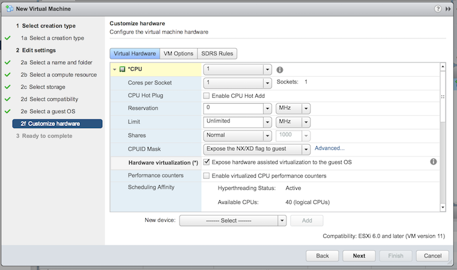
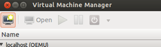
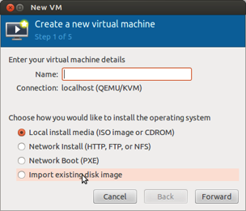
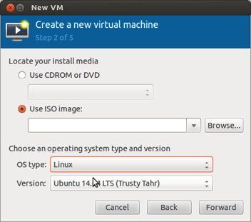
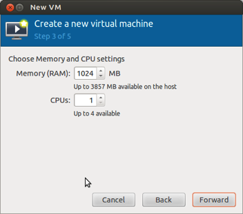
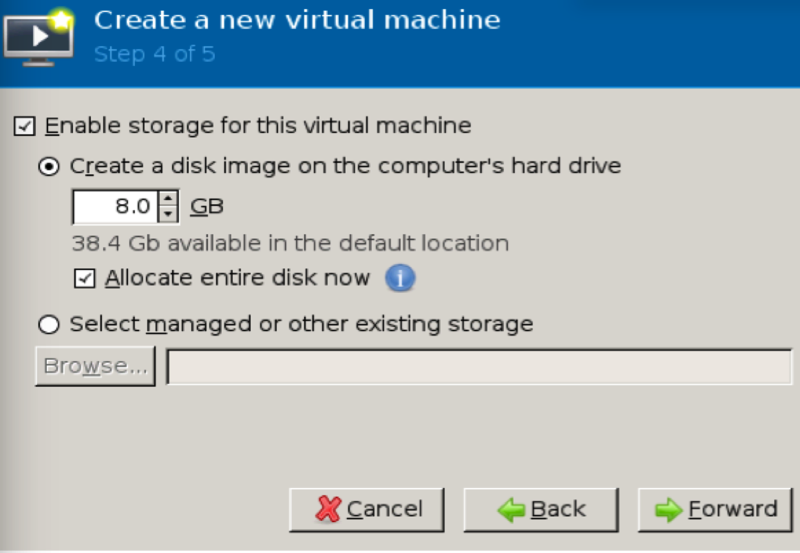
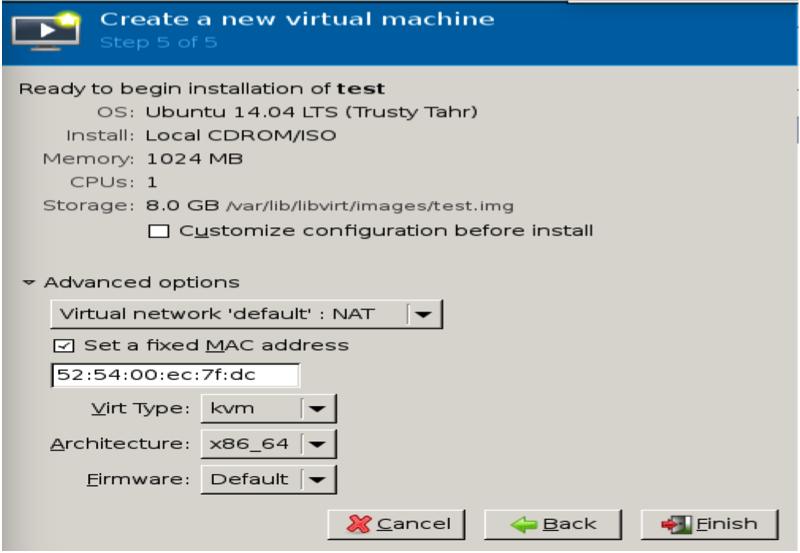

### DevStack

OpenStack is a free and open-source software platform for cloud computing, mostly deployed as an infrastructure-as-a-service (IaaS).

DevStack is a series of extensible scripts used to quickly bring up a complete OpenStack environment based on the latest versions of everything from git master. It is used interactively as a development environment and as the basis for much of the OpenStack project’s functional testing.

More information on DevStack can be read here: <a href="http://docs.openstack.org/developer/devstack/">http://docs.openstack.org/developer/devstack/</a>

Installation of Avi Vantage into DevStack is supported only if the DevStack/Nova-launched virtual machine (VMs) can run in Kernel-based Virtual Machine (KVM) mode, as opposed to Quick Emulator (QEMU) mode. This article describes the steps for installing DevStack before installing Avi Vantage.

### Key Hardware Requirements to Run DevStack

### Enable KVM Support or Hardware Acceleration in the VM

When using virtualization technologies like KVM, one can take advantage of “Nested VMX” (i.e., the ability to run KVM on KVM) so that the VMs in the cloud (Nova guests) can run relatively faster than with plain QEMU emulation. Kernels shipped with Linux distributions don't have this enabled by default.

### The VM has been installed in a vCenter environment

* Enter the following command in the VM you have created 
<code>egrep -c '(vmx|svm)' /proc/cpuinfo</code>
* If 1 or greater is returned, your system is all set; KVM installation may proceed.
* If 0 is returned, then KVM won't work, as the system does not support VMX or SVM hardware virtualization. Follow the steps below to proceed with nested VM support enabled.
* In case the above <code>egrep</code> command doesn’t work on the VM, then enter these commands instead:  If 0 is returned, then hardware virtualization is not supported. If 1 or greater is returned, then hardware virtualization is supported.
<code>apt-get install cpu-checker  kvm-ok</code>

* Some distributions don't support some of the above commands. For those, check if the nested KVM Kernel parameter is enabled using one of the following two approaches, depending on the CPU type. 

###  AMD-based Machines

* Invoke this command: 
<code>cat /sys/module/kvm_amd/parameters/nested  </code>
* If N is returned, then temporarily remove the KVM AMD Kernel module, enable nested virtualization to be persistent across reboots, and add the Kernel module back: 
<code>sudo rmmod kvm-amd  sudo sh -c "echo 'options kvm-amd nested=1' &gt;&gt; /etc/modprobe.d/dist.conf"  sudo modprobe kvm-amd</code>
* Ensure the Nested KVM Kernel module parameter for AMD is enabled on the host. The below command should now return Y. 
<code>cat /sys/module/kvm_intel/parameters/nested</code>
* The VM now should have KVM capabilities, which you can verify by ensuring the <code>/dev/kvm</code> character device is present.
* To make the above value persistent across reboots, add an entry in <code>/etc/modprobe.d/dist.conf</code> so it looks as: 
<code>cat /etc/modprobe.d/dist.confoptions kvm-amd  nested=y</code> 

### Intel-based Machines

* Invoke this command: 
<code>cat /sys/module/kvm_intel/parameters/nested</code>
* If N is returned, then temporarily remove the KVM Intel Kernel module, enable nested virtualization to be persistent across reboots, and add the Kernel module back: 
<code>sudo rmmod kvm-intel  sudo sh -c "echo 'options kvm-intel nested=1' &gt;&gt; /etc/modprobe.d/dist.conf"  sudo modprobe kvm-intel</code>
* Ensure the Nested KVM Kernel module parameter for Intel is enabled on the host. The below command should now return Y. 
<code>cat /sys/module/kvm_intel/parameters/nested</code>
* The VM now should have KVM capabilities, which you can verify that by ensuring the <code>/dev/kvm</code> character device is present.
* To make the above value persistent across reboots, add an entry in <code>/etc/modprobe.d/dist.conf</code> so it looks as: 
<code>cat /etc/modprobe.d/dist.confoptions kvm-intel  nested=y</code> 

### Creating a VM with Nested VM Support

* The Controller and SE require 12 CPUs in total. This is an important consideration before deploying the nested VM.
* Disk requirements for a Controller and Service Engines are between 100 and 110 GB.
* Select Guest OS. In this case, Ubuntu 14.04 was selected. 

 

 

### Ensure DevStack VM is Using KVM

Before invoking stack.sh in the VM, ensure KVM is enabled. This can be verified by checking for the presence of the file /dev/kvm in your VM. If it is present, DevStack will default to using the config attribute virt_type = kvm in /etc/nova.conf; otherwise, it will fall back to virt_type=qemu, i.e., plain QEMU emulation. Optionally, to explicitly set the type of virtualization to KVM by the libvirt driver in nova, the below config attribute can be used in DevStack’s local.conf:

<code>LIBVIRT_TYPE=kvm</code>

Once DevStack is configured successfully (DevStack Installation as shown below in the steps), verify the Nova instances are using KVM by noticing the QEMU CLI that is invoked by Nova using the parameter accel=kvm.

### Install KVM (libvirt and Other Libraries in the Guest OS)

* If <code>libvirt</code> and other libraries are not present in the guest OS, invoke this command. 

<code>    sudo apt-get install qemu-kvm libvirt-bin ubuntu-vm-builder bridge-utils</code>

The above command includes installation of 4 packages: (<code>kvm, libvirt-bin, ubuntu-vm-builder</code> and <code>bridge-utils</code>. The Ubuntu username should be added to the group <code>libvirtd</code>.

<code>    sudo adduser <code>id -un</code> libvirtd</code>

* Install <code>virt-manager</code>which is a GUI tool that aids in setting up a VM on top of the already created VM by invoking this command. 

<code>    sudo apt-get install virt-manager</code>

If there is no desktop support added to the VM, then most likely you would not see anything. Either add GNOME support or use VNC and proceed with the installation. With the virt-manager installed, start the nested VM configuration by invoking this command:

<code>    virt-manager</code>

* A Virtual Machine Manager window should pop up: 

 

 

* Instantiate the creation of a new VM by entering the virtual machine's name. Select an installation media type and click Forward. Then select the ISO image file containing the operating system to be installed in the VM, or select the CD/DVD-ROM to start the installation. In this case, it is Ubuntu 14.04. 

 

 

* With the guest OS chosen, set the amount of RAM and number of CPUs for the VM that will host the Avi Controller and Service Engines. An M1.Xlarge instance created for the Avi Controller should have close to 12 GB RAM and ~110-120 GB disk space. 

 

* A confirmation screen shows the details of the virtual machine where you can select the advanced network options. We will use NAT. ( In case we want to access this DevStack environment it has to be via a VNC to the nested VM only. In case the same has to be in the same network as the underlying VM we could assign it IPs from the same network and access the same as well minus the above approach of doing a VNC). 

### DevStack Installation

* Minimal install of a Linux system. Devstack attempts to support Ubuntu 14.04/16.04, Fedora 23/24, CentOS/RHEL 7, as well as Debian and OpenSUSE. We have used Ubuntu 14.04 in this case.
* Create a user "stack" to run Devstack with and make sure that it has sudo privileges 

<code>    root@cn-01:~# groupadd stack</code>
<code>    root@cn-01:~# useradd -g stack -s /bin/bash -d /opt/stack -m stack</code>
<code>    root@cn-01:~# echo "stack ALL=(ALL) NOPASSWD: ALL" &gt;&gt; /etc/sudoers</code>
<code>    root@cn-01:~# su stack</code>
<code>    stack@cn-01:/home/ubuntu$ cd</code>
<code>    stack@cn-01:~$ pwd</code>
<code>    /opt/stack</code>

* Install git. 

<code>    stack@cn-01:~$apt-get install git</code>

* Download a stable DevStack repository. In this case Mitaka OpenStack release was chosen. 

<code>    stack@cn-01:~$ git clone https://git.openstack.org/openstack-dev/devstack -b stable/mitaka</code>

* Create a <code>local.conf</code> file with contents as below. More information on local.conf can be read here http://docs.openstack.org/developer/devstack/configuration.html#local-conf 

<code>    [[local|localrc]]</code>
<code>    ADMIN_PASSWORD=avi123</code>
<code>    MYSQL_PASSWORD=avi123</code>
<code>    RABBIT_PASSWORD=avi123</code>
<code>    SERVICE_PASSWORD=avi123</code>
<code>    disable_service n-net</code>
<code>    enable_service q-svc</code>
<code>    enable_service q-agt</code>
<code>    enable_service q-dhcp</code>
<code>    enable_service q-l3</code>
<code>    enable_service q-meta</code>
<code>    enable_service neutron</code>
<code>    enable_service q-lbaasv2</code>

* With the LBaaS v2 plugin being installed as a part of the local.conf file, more information on the same can be read here in terms of installation and bringing up of the LBaaS panels in the Horizon dashboard <a href="https://wiki.openstack.org/wiki/Neutron/LBaaS/HowToRun">https://wiki.openstack.org/wiki/Neutron/LBaaS/HowToRun</a> & also at <a href="http://docs.openstack.org/mitaka/networking-guide/config-lbaas.html">http://docs.openstack.org/mitaka/networking-guide/config-lbaas.html</a> 
* Kickstart the installation 

<code>    stack@ip-10-144-9-19:~/devstack$ ./stack.sh</code>

<code>    This should take some time depending on the time it takes to download the dependencies.</code>
<code>    This is your host IP address: X.X.X.X</code>
<code>    This is your host IPv6 address: ::X</code>
<code>    Horizon is now available at http://x.x.x.x/dashboard</code>
<code>    Keystone is serving at http://x.x.x.x:5000/</code>
<code>    The default users are: admin and demo</code>
<code>    The password: avi123</code>
<code>    2016-12-15 10:20:00.780 | stack.sh completed in 588 seconds.</code>

### Login to Horizon Dashboard

* You can login to the horizon dashboard using the above IP/URL that was generated after invoking <code>stack.sh </code>and can then proceed with the AVI controller installation as outlined here <a href="/installing-avi-vantage-for-openstack-16-3/">https://kb.avinetworks.com/installing-avi-vantage-for-openstack-16-3/</a>. 

### DevStack Troubleshooting

* There are instances where <code>./stack.sh</code> might not get invoked and might fail during the installation with a FORCE error being prompted. This could be due to some previous DevStack installs failing or not being able to join back. To overcome the same 

<code>    stack@ip-10-144-9-19:~/devstack$FORCE=yes ./stack.sh</code>

* opt/stack/devstack is the path from where <code>local.conf</code> is to be used. When you make changes into the <code>local.conf</code> file make sure you unstack first and then stack it back in.
* In case there are errors with installation, <code>clean.sh</code> could be invoked. This reverses stack.sh and leaves your git clone files in place, so run clean.sh and then <code>stack.sh</code> to re-do your installation. Note that rejoin stack has been discontinued in the latest devstack releases.
* With Mitaka release, the older way of using component-specific CLIs is getting deprecated and hence the below commands can be looked into : 

<code>    stack@ip-10-144-9-19:~/devstack$ source openrc</code>
<code>    WARNING: setting legacy OS_TENANT_NAME to support cli tools.</code>
<code>    stack@ip-10-144-9-19:~/devstack$ source openrc admin admin</code>
<code>    WARNING: setting legacy OS_TENANT_NAME to support cli tools.</code>
<code>    stack@ip-10-144-9-19:~/devstack$ source openrc demo demo</code>
<code>    WARNING: setting legacy OS_TENANT_NAME to support cli tools.</code>
<code>    stack@ip-10-144-9-19:~/devstack$ neutron subnet-list</code>

* In DevStack, logs of OpenStack services are attached with Linux <code>screen</code>. 

<code>    stack@ip-10-144-9-19:~/devstack$ screen-x stack</code>

There are instances where this might fail and once can get around the same by creating a dummy null script as below
<code>    stack@ip-10-144-9-19:~/devstack$ script /dev/null</code>
<code>    Started script null</code>
<code>    stack@ip-10-144-9-19:~/devstack$ screen-x stack</code>

### Screen in DevStack

### Movement across screen

* To move the previous screen or screen to left use Ctrl + A + P
* To move the next screen or screen to right use Ctrl + A + N 

### Copying the logs from screen

* To start the copy mode, use Ctrl + A + [
* To start copying, press Enter
* Select the text using arrow keys
* Again press Enter to stop selection and copy to clipboard
* To exit the copy mode use Ctrl + A + ] or Ctrl + C 

### Restarting the services

    * After doing any changes in the code, if you wish to restart the services, use Ctrl + C.
    * It will take you to the bash shell prompt.
    * Use the UP arrow key to move to last executed command.
    * Run the last command for the service.
    * To exit the copy mode use Ctrl + A + ] or Ctrl + C 

Except Horizon, all services in the DevStack environment can be restarted with screen.For horizon changes to take effect, you need to restart apache web server.
<code>    stack@ip-10-144-9-19:~/devstack$service apache2 restart</code>

### Multi-Node DevStack Environment

* For a better understanding into the OpenStack environment that comprises controller and compute nodes and are presumed to be in separate nodes we could do multi-node deployment that can be worked upon from here <a href="http://docs.openstack.org/developer/devstack/guides.html">http://docs.openstack.org/developer/devstack/guides.html</a> 