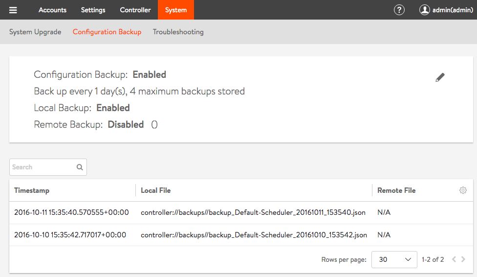
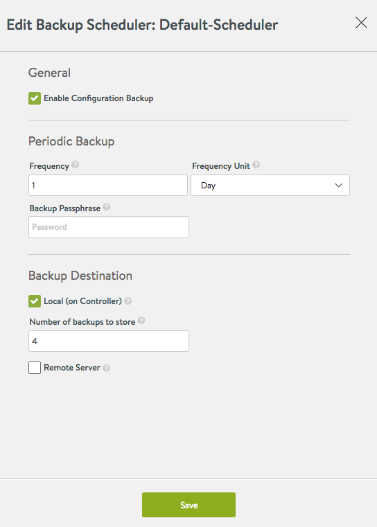

Periodic backup of the Avi Vantage configuration database is recommended. This database defines all clouds, all virtual service, all users, and so on. Any user capable of logging into the admin tenant is authorized to perform a backup. A restore operation spans all the same entities, but can only be performed by the administrator(s) capable of logging into one of the Controllers using SSH or SCP.

It is a best practice to store backups in a safe, external location, in the unlikely event that a disaster destroys the entire Avi Controller (or cluster), with no possibility of remediation. Based on how often the configuration changes, a recommended backup schedule could be daily or even hourly.

## Backing Up the Avi Vantage Configuration

To back up the Avi Vantage configuration, use the UI, CLI commands or API commands shown in this section. Backups can be scheduled or on-demand.

### Scheduled Backup via UI

To view or edit the configuration backup scheduler's current settings, an admin-tenant user first navigates to Administration > System > Configuration Backup as shown below.

To effect changes, one clicks on the pencil icon shown in the above screenshot. The Backup Scheduler editor appears as shown below:

* **Enable Configuration Backup**: Turns scheduled backups on or off.
* **Frequency**: A value from 0 to 60 to combine with Frequency Unit to determine how often backups are to be taken. 0 indicates the backup sequence has no end time.
* **Frequency Unit**: Backups occur daily by default. Use this field to change the units to minutes, hours, weeks or months.
* **Backup Passphrase**: An optional phrase that is used to encrypt all sensitive fields contained within the backup. Choose a phrase that is not easy to guess and guard it carefully. Data can't be restored without it.
* **Local (on Controller)**: On by default, this switch tells Avi Vantage to preserve the number of indicated backups on the Controller. One can choose the local and remote backup options independently.
* **Number of backups to store**: A number ranging from 0 to 20, default is 4. 0 is equivalent to unchecking the **Local** option. The oldest backup is deleted after the most recent backup successfully completes.
* **Remote Server**: This option is off by default. It is recommended that a remote destination be specified in case the Avi Controller cluster fails in a non-recoverable fashion. One can choose the local and remote backup options independently. Turning this option on causes the Controller to log onto the indicated server using SSH user credentials, and then secure copy (scp) the backup data to the indicated directory.<code></code>  
    * ****Server Address**: **An FQDN or IP address reachable from the Controller
    * **User Credentials**: Use the pulldown menu to select from a previously-defined SSH user or accept the option to create one.
    * **Directory**: If a target directory other than the SSH user's home directory is desired, specify an absolute or relative pathname pointing to a directory to which the SSH user has write access.  

### Scheduled Backup via CLI

<code>[admin:10-10-24-52]: &gt; configure scheduler Default-Scheduler</code>
<code>+-------------------+------------------------------------------------+</code>
<code>| Field             | Value                                          |</code>
<code>+-------------------+------------------------------------------------+</code>
<code>| uuid              | scheduler-b5f7e673-8818-44d1-8f74-45238cc08235 |</code>
<code>| name              | Default-Scheduler                              |</code>
<code>| enabled           | True                                           |</code>
<code>| run_mode          | RUN_MODE_PERIODIC                              |</code>
<code>| start_date_time   | 2016-10-09T15:35:46.220623                     |</code>
<code>| frequency         | 1                                              |</code>
<code>| frequency_unit    | SCHEDULER_FREQUENCY_UNIT_DAY                   |</code>
<code>| backup_config_ref | Backup-Configuration                           |</code>
<code>| scheduler_action  | SCHEDULER_ACTION_BACKUP                        |</code>
<code>| tenant_ref        | admin                                          |</code>
<code>+-------------------+------------------------------------------------+</code>

<code>[admin:10-10-24-52]: &gt; configure backupconfiguration Backup-Configuration</code>
<code>+------------------------+----------------------------------------------------------+</code>
<code>| Field                  | Value                                                    |</code>
<code>+------------------------+----------------------------------------------------------+</code>
<code>| uuid                   | backupconfiguration-5d65f12e-5da1-49e0-b703-ec65ae9a39c6 |</code>
<code>| name                   | Backup-Configuration                                     |</code>
<code>| save_local             | True                                                     |</code>
<code>| maximum_backups_stored | 4                                                        |</code>
<code>| tenant_ref             | admin                                                    |</code>
<code>+------------------------+----------------------------------------------------------+</code>

### Scheduled Backup via API

In this example a PUT changes the scheduler frequency to 1 week:

<pre><code class="language-lua">PUT : api/scheduler/
{'_last_modified': u'1476209663670990',
'backup_config_ref': 'https://10.10.24.52/api/backupconfiguration/backupconfiguration-5d65f12e-5da1-49e0-b703-ec65ae9a39c6',
 'enabled': True,
 'frequency': 1,
 'frequency_unit': u'SCHEDULER_FREQUENCY_UNIT_WEEK',
 'name': u'Default-Scheduler',
 'run_mode': u'RUN_MODE_PERIODIC',
 'scheduler_action': u'SCHEDULER_ACTION_BACKUP',
 'start_date_time': u'2016-10-09T15:35:46.220623',
 'tenant_ref': u'https://10.10.24.52/api/tenant/admin',
 'url': 'https://10.10.24.52/api/scheduler/scheduler-b5f7e673-8818-44d1-8f74-45238cc08235',
 'uuid': u'scheduler-b5f7e673-8818-44d1-8f74-45238cc08235'}</code></pre>  

### On-demand Backup via CLI

To back up the Avi Vantage configuration on-demand, at any arbitrary time, use the following CLI command:

<pre class="">: &gt; export configuration file /tmp/avi_config.json full_system
Please enter the passphrase to encrypt configuration: 
Downloaded the attachment to /tmp/avi_config.json
Completed writing the export configuration to /tmp/avi_config.json</pre> 

### On-demand Backup via API

To back up the Avi Vantage configuration on-demand, at any arbitrary time, use the following API request:

<pre>GET https://&lt;controller-ip&gt;/api/configuration/export?full_system=true
</pre> 

To also include a passphrase, use one of the following options:

In versions 16.1.3 and above:

<pre class="">GET https://&lt;controller-ip&gt;/api/configuration/export?full_system=true&amp;passphrase=&lt;passphrase&gt;
</pre> 

In versions 16.2 and above, use the following POST method and include passphrase in the JSON data:

<pre class="">POST https://&lt;controller-ip&gt;/api/configuration/export?full_system=true
JSON data: {"passphrase":"&lt;passphrase&gt;"}</pre> 

Make sure to replace *Avi-Controller-IP* with the IP address of the Avi Controller (if using a single Avi Controller node), or the IP address of the Avi Controller cluster.

### On-demand <code>bash</code> Backup Script Utilizing the API

<pre><code class="language-lua">===========
#!/bin/bash
DATE=$(date "+%Y%m%d")
SCRIPTDIR=/appdata0/conf/avi
AVILIST=$SCRIPTDIR/avilist
COOKIEFILE=$SCRIPTDIR/cookiefile
while read -u10 DEVICE
do
FILENAME=$DEVICE-$DATE.json
/usr/bin/curl -k -c $COOKIEFILE -X POST -H 'Content-Type: application/json' -d '
{"username":"admin","password":"password123"}
' https://$DEVICE/login
/usr/bin/curl -k -b $COOKIEFILE -X GET https://$DEVICE/api/configuration/export?full_system=true &gt; $SCRIPTDIR/$FILENAME
CSRFTOKEN=$(/bin/grep csrftoken $COOKIEFILE | awk '
{ print $7 }
')
/usr/bin/curl -k -b $COOKIEFILE -X POST -H "X-CSRFToken: $CSRFTOKEN" -H "Referer: https://$DEVICE" https://$DEVICE/logout
/bin/rm -f $SCRIPTDIR/cookiefile
/usr/local/bin/gzip $SCRIPTDIR/$FILENAME
/bin/chown fimtacs:uxusers $SCRIPTDIR/$FILENAME.gz
done 10&lt; "$AVILIST"
    1. Clean up files older than 60 days on the server
       /usr/bin/find $SCRIPTDIR/*json.gz -type f -mtime +60 -exec rm {} \;
       ===========</code></pre>  

## Restoring the Avi Vantage Configuration

If the unlikely should occur and a disaster completely destroys the Avi Controller (or entire cluster), the device/VM hosting the Avi Controller(s) should first be restored to factory default using <code>flushdb.sh</code>. Failure to do so can prevent the Controller from coming up. To restore the Controller to the factory default, run the script <code>/opt/avi/scripts/flushdb.sh</code>. Note: If it exists, the <code>/var/lib/avi/etc/flushdb.done</code> file should be removed before running the <code>flushdb.sh</code> script.

Thereafter, the following script can be used to automate the configuration recovery process:

<pre>/opt/avi/scripts/restore_config.py
</pre> 

Note: If running an Avi Vantage version earlier than 16.2, please contact Avi Networks support for help restoring the configuration.

This script imports the backup configuration onto the Avi Controller. If restoring an Avi Controller cluster, this script restores the configuration and also re-adds the other two nodes to the cluster.
<ol> 
 <li>Create three new Avi Controllers with the same IP address as the original cluster members. (Avi Vantage currently supports only static IP addresses.) At this point, other than having an IP address, each Avi Controller node should be in its factory default state.</li> 
 <li>Log onto one of the Avi Controller node using SSH or SCP. Use the default credentials admin, admin.</li> 
 <li>Run the restore command or script: 
  <ul> 
   <li>If using SCP: <pre crayon="false"><code class="language-cli">scp /var/backup/avi_config.json admin@&lt;controller-ip&gt;://tmp/avi_config.json</code></pre> </li> 
   <li>If using SSH: <pre crayon="false"><code class="language-cli">/opt/avi/scripts/restore_config.py --config /tmp/avi_config.json --passphrase &lt;passphrase&gt; --username &lt;admin&gt; --password &lt;admin password&gt;</code></pre> </li> 
   <li>Optionally, user may choose to delete all configuration before restoring. This can be achieved by passing --flushdb argument to restore_config.py</li> 
  </ul> </li> 
</ol> 