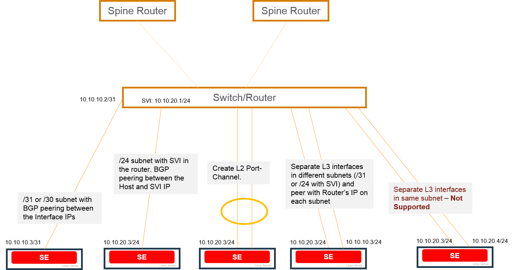
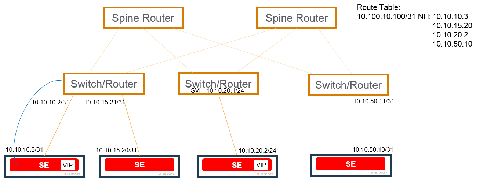
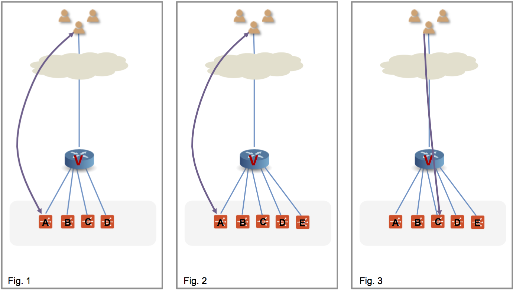
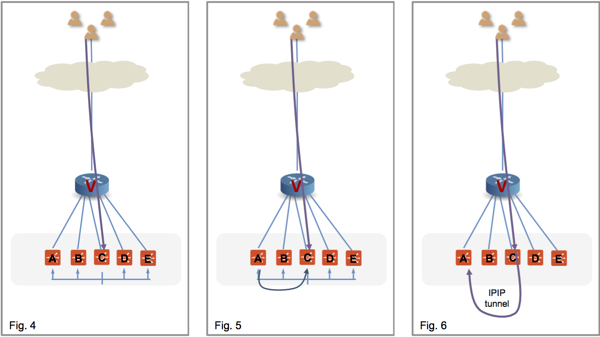
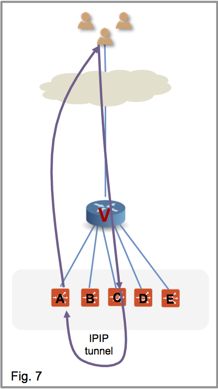
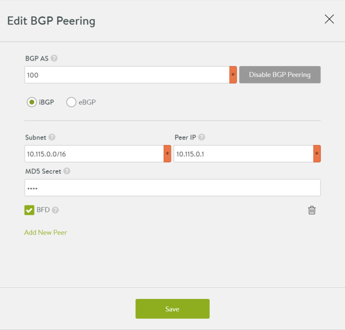

One of the ways Avi Vantage can add load balancing capacity for a virtual service is to place the virtual service on additional Service Engines (SEs). For example, capacity can be added for a virtual service when needed by scaling out the virtual service onto additional SEs within the SE group, then removing (scaling in) the additional SEs when no longer needed. In this case, the primary SE for the virtual service coordinates distribution of the virtual service traffic among the other SEs, while also continuing to process some of the virtual service's traffic.

An alternative method for scaling a virtual service is to use a Border Gateway Protocol (BGP) feature, route health injection (RHI), along with a layer 3 routing feature, equal cost multi-path (ECMP). Using RHI with ECMP for virtual service scaling avoids the managerial overhead placed upon the primary SE to coordinate the scaled out traffic among the SEs.

Avi Vantage's native SE scaling method allows a virtual service to be scaled out to a maximum of 5 SEs, its primary SE and 4 additional scale-out SEs. Using BGP, a virtual service enabled for RHI can be placed on up to 32 SEs within the SE group. Each SE uses RHI to advertise a /32 host route to the virtual service's VIP address, and is able to accept the traffic. The upstream router uses ECMP to select a path to one of the SEs.

Note: The limit on SE count is imposed by the ECMP support on the upstream router. If the router supports up to 32 ECMP paths, then a virtual service enabled for RHI can be supported on up to 32 SEs. Likewise, if the router supports only up to 16 paths, then the virtual service enabled for RHI can be supported on up to 16 SEs.

## BGP-based Scaling

Beginning in version 16.1, Avi Vantage supports use of the following routing features to dynamically perform virtual service load balancing and scaling:

* **Route health injection (RHI):** RHI allows traffic to reach a VIP that is not in the same subnet as its SE. The Avi Service Engine (SE) where a virtual service is located advertises a host route to the VIP for that virtual service, with the SE's IP address as the next-hop router address. Based on this update, the BGP peer connected to the Avi SE updates its route table to use the Avi SE as the next hop for reaching the VIP. The peer BGP router also advertises itself to its upstream BGP peers as a next hop for reaching the VIP.
* **Equal cost multi-path (ECMP):** Higher bandwidth for the VIP is provided by load sharing its traffic across multiple physical links to the SE(s). If an Avi SE has multiple links to the BGP peer, the Avi SE advertises the VIP host route on each of those links. The BGP peer router sees multiple next-hop paths to the virtual service's VIP, and uses ECMP to balance traffic across the paths. If the virtual service is scaled out to multiple Avi SEs, each SE advertises the VIP, on each of its links to the peer BGP router. 

When a virtual service enabled for BGP is placed on its Avi SE, that SE establishes a BGP peer session with each of its next-hop BGP peer routers. The Avi SE then performs RHI for the virtual service's VIP, by advertising a host route (/32 network mask) to the VIP. The Avi SE sends the advertisement as a BGP route update to each of its BGP peers. When a BGP peer receives this update from the Avi SE, the peer updates its own route table with a route to the VIP that uses the SE as the next hop. Typically, the BGP peer also advertises the VIP route to its other BGP peers.

The BGP peer IP addresses, as well as the local Autonomous System (AS) number and a few other settings, are specified in a BGP profile on the Avi Controller. RHI support is disabled (default) or enabled within the individual virtual service's configuration. If an Avi SE has more than one link to the same BGP peer, this also enables ECMP support for the VIP. The Avi SE advertises a separate host route to the VIP on each of the Avi SE interfaces with the BGP peer.

If the Avi SE fails, the BGP peers withdraw the routes that were advertised to them by the Avi SE.

## BGP Profile Modifications

Prior to Avi Vantage 16.2.2, any operation that modified/added/deleted the BGP peer configuration in the BGP profile would disrupt traffic because it would take effect only if the virtual service was disabled and re-enabled. As of 16.2.2, BGP peer changes are handled gracefully.

* If a new peer is added to the BGP profile, the virtual service IP is advertised to the new BGP peer router without needing to disable/enable the VS. 
* If a BGP peer is deleted from the BGP profile, any VS IPs that had been advertised to the BGP peer will be withdrawn. 
* When a BGP peer IP is updated, it is handled as an add/delete of the BGP peer.  

## SE-Router Link Types Supported with BGP

The following figure shows the types of links that are supported between Avi Vantage and BGP peer routers.

BGP is supported over the following types of links between the BGP peer and the Avi SEs:

* Host route (/30 or /31 mask length) to the VIP, with the Avi SE as the next hop.
* Network route (/24 mask length) subnet with switched virtual interface (SVI) configured in the router.
* Layer 2 port channel (separate physical links configured as a single logical link on the next-hop switch or router).
* Multiple layer 3 interfaces, in separate subnets (/31 or /24 with SVI). Separate BGP peer session is set up between each Avi SE layer 3 interface and the BGP peer. 

Each SE can have multiple BGP peers. For example, an SE with interfaces in separate layer 3 subnets can have a peer session with a different BGP peer on each interface.

> Note: Currently, connection between the Avi SE and the BGP peer on separate layer 3 interfaces that are in the same subnet and same VLAN is not supported.
 

Using multiple links to the BGP peer provides higher throughput for the VIP. The virtual service also can be scaled out for higher throughput. In either case, a separate host route to the VIP is advertised over each link to the BGP peer, with the Avi SE as the next hop address.

## Bidirectional Forwarding Detection (BFD)

BFD is supported for fast detection of failed links. BFD enables networking peers on each end of a link to quickly detect and recover from a link failure. Typically, BFD detects and repairs a broken link much more quickly than would occur by waiting for BGP to detect the down link.

For example, if an Avi SE fails, BFD on the BGP peer router can quickly detect and correct the link failure.

## Scaling

Scaling out/in of virtual services is supported. In this example, a virtual service placed on the Avi SE on the 10.10.10.x network is scaled out to 3 additional Avi SEs.

## Flow Resiliency During Scale Out/In

A flow is a 5-tuple: src-IP, src-port, dst-IP, dst-port and protocol. Routers do a hash of the 5-tuple to pick which equal cost path to use. When an SE scale out occurs, the router is given yet another path to use, and its hashing algorithm may make different choices, thus disrupting existing flows. To gracefully cope with this BGP-based scale-out issue, Avi Vantage 16.3 supports resilient flow handling using IPIP tunneling. The following sequence shows how this is done.

Figure 1 shows the virtual service placed on four SEs, with a flow ongoing between a client and SE-A. In figure 2, there is a scale out to SE-E. This changes the hash on the router. Existing flows get rehashed to other SEs. In this particular example, suppose it is SE-C.

In the Avi Vantage implementation SE-C sends a flow probe to all other SEs (figure 4). Figure 5 shows SE-A responding to claim ownership of the depicted flow. In figure 6, SE-C uses IPIP tunneling to send all packets of this flow to SE-A.

 

In figure 7 SE-A continues to process the flow and sends its response directly to the client.

 

 

 

 

 

 

 

 

 

 

 

## Mesos Support

BGP is supported for north-south interfaces in Mesos deployments. The SE container that is handling the virtual service will establish a BGP peer session with the BGP router configured in the BGP peering profile for the cloud. The SE then injects a /32 route (host route) to the VIP, by advertising the /32 to the BGP peer.

The following requirements apply to the BGP peer router:

* The BGP peer must allow the SE's IP interfaces and subnets in its BGP neighbor configuration. The SE will initiate the peer connection with the BGP router.
* For eBGP, the peer router will see the TTL value decremented for the BGP session. This could prevent the session from coming up. This issue can be prevented from occuring by setting the eBGP multi-hop TTL. For example, on Juniper routers, the eBGP multi-hop TTL must be set to 64. 

## Enabling BGP Features in Avi Vantage

Configuration of BGP features in Avi Vantage is accomplished by configuring a BGP profile, and by enabling RHI in the virtual service's configuration.

* Configure a BGP profile. The BGP profile specifies the local Autonomous System (AS) ID that the Avi SE and each of the peer BGP routers is in, and the IP address of each peer BGP router.
* Enable the Advertise VIP using BGP option on the Advanced tab of the virtual service's configuration. This option advertises a host route to the VIP address, with the Avi SE as the next hop. 

### Web Interface

To configure a BGP profile:
<ol> 
 <li>Navigate to Infrastructure &gt; Clouds.</li> 
 <li>Click on the cloud name. (If the cloud is the one that was set up during initial installation of the Avi Controller using the setup wizard, the cloud name is "Default-Cloud.")</li> 
 <li>Click on BGP Peering, then click the edit icon to open the configuration popup.</li> 
 <li>Enter the following information: 
  <ul> 
   <li>AS number</li> 
   <li>BGP type: iBGP or eBGP</li> 
   <li>Subnet or placement network where the local (Avi SE) interface will be located</li> 
   <li>Peer BGP router's IP address</li> 
   <li>Remote AS (applicable only to eBGP)</li> 
   <li>MD5 secret</li> 
   <li>BFD (enables very fast link failure detection)</li> 
  </ul> </li> 
 <li>Click Save.</li> 
</ol> 

### CLI

The following commands configure the BGP profile. The BGP profile is included under Avi Vantage's virtual routing and forwarding (VRF) settings.

: > configure vrfcontext global
 : vrfcontext > bgp_profile
 : vrfcontext:bgp_profile > local_as 100
 : vrfcontext:bgp_profile > ibgp
 : vrfcontext:bgp_profile > peers peer_ip 10.115.0.1 subnet 10.115.0.0/16 md5_secret abcd
 : vrfcontext:bgp_profile:peers > save
 : vrfcontext:bgp_profile > save
 : vrfcontext > save
 : >
This profile enables iBGP with peer BGP router 10.115.0.1/16 in local AS 100. The BGP connection is secured using MD5 with shared secret "abcd."

The following commands enable RHI for a virtual service (vs-1):

: > configure virtualservice vs-1
 : virtualservice > enable_rhi
 : virtualservice > save
 : >

The following command can be used to view the virtual service's configuration:

: > show virtualservice 

 

Starting with release 16.3, two configuration knobs have been added to configure per-peer “advertisement-interval” and “connect” timer in Quagga BGP:

<pre><code><strong>advertisement_interval</strong></code>: Minimum time between advertisement runs, default = 5 seconds<

<code><strong>connect_timer</strong></code>: Time due for connect timer, default = 10 seconds
</pre>

Usage is illustrated in this CLI sequence:


 [admin:controller]:> configure vrfcontext global
 [admin:controller]: vrfcontext> bgp_profile
 [admin:controller]: vrfcontext:bgp_profile> peers index 1
 [admin:controller]: vrfcontext:bgp_profile:peers> advertisement_interval 10
 Overwriting the previously entered value for advertisement_interval
 [admin:controller]: vrfcontext:bgp_profile:peers> connect_timer 20
 Overwriting the previously entered value for connect_timer
 [admin:controller]: vrfcontext:bgp_profile:peers> save
 [admin:controller]: vrfcontext:bgp_profile> save
 [admin:controller]: vrfcontext> save

