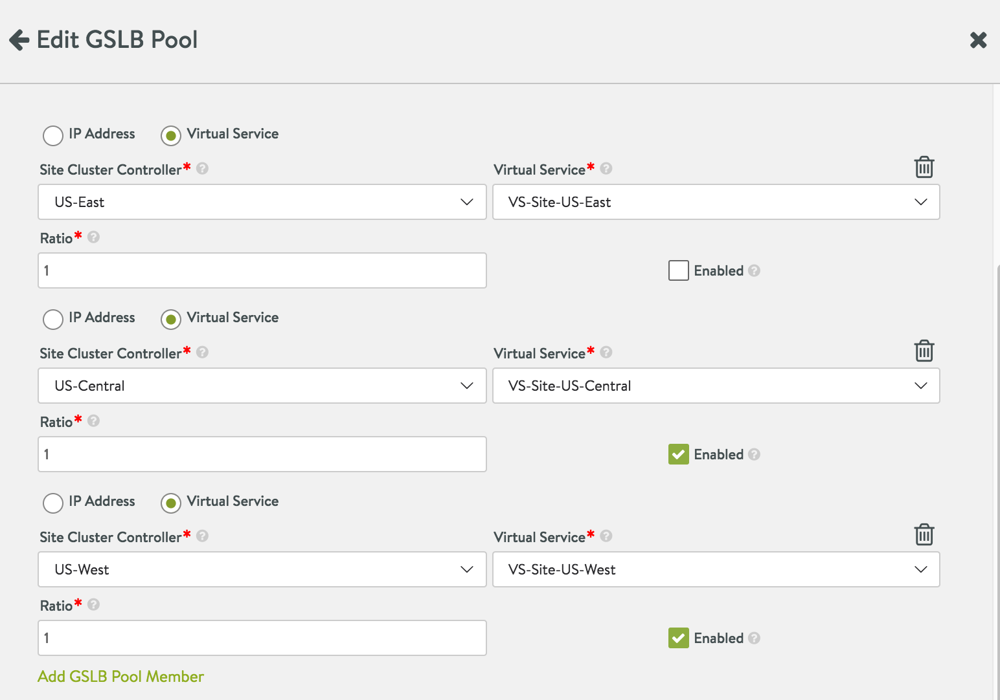

It is both possible and reasonable to locally administer components of a GSLB application deployment. For example, a local site administrator may choose to change the virtual IP of a local VS member of some GSLB pool. When doing so, the global application arrives to a state wherein the *configured* and *operational* GSLB pool member VIPs are out of sync (inconsistent). This inconsistency is a natural consequence of the loosely-coupled design of Avi GSLB, and is automatically detected by Avi Vantage. This article details the inconsistency and offers steps by which to return to a consistent state.

### How the Inconsistency Can Arise

An Avi GSLB pool member can be — and typically is— an Avi virtual service (with associated VIP:port_number). Configuration of such a member requires the user to uniquely identify the site-id, the virtual service within the site, and the corresponding VIP of the virtual service. The relevant parameters are: GslbPoolMember.site-cluster-uuid, GslbPoolMember.virtual-service-uuid and GslbPoolMember.ip in the GslbPoolMember object. [Refer to <a href="/docs/latest/api-guide/gslbservice.html">this page</a> of the REST API Guide.] 

Now consider this scenario:

DAY 1: The member's three parameters are set to site-cluster-uuid-W, virtual-service-uuid-X and ip-Y. This trio of values represent the configured as well as operational state of the virtual service. Avi Vantage's GSLB configuration (a global entity) is in sync with the virtual service locally defined by and operational at site W.

DAY 2. For whatever reason, the administrator of site W changes Avi Vantage's local configuration of the particular virtual service such that its VIP is now ip-Z.

The situation: Whereas local VIP ip-Z is *operational*, its address is not (yet) known to the GSLB configuration; it is *no longer* advertised as part of the global app; references to ip-Y are invalid. The GSLB leader and active members detect the discrepancy between the DAY 1 VIP (ip-Y) and the DAY 2 VIP (ip-Z). Avi Vantage then disables the GslbPoolMember in question and notifies the administrator that the "Configured and Operational VIPs are out of Sync".

Though the notification may appear to be an error, it describes a normal situation that can be corrected as described below.

### Returning to Consistency

### Method 1: via Avi CLI:

The below sketch of a command sequence shows DAY 1 and DAY 2 steps in which the GslbPoolMember object is first configured, and then re-configured. "W," "X," "Y," and "Z" are unrealistic-looking dummy values that correspond to the above-described scenarios.

<pre><code class="language-lua">[admin:10-10-24-207]: &gt; configure gslbservice gs-1
[admin:10-10-24-207]: gslbservice&gt; groups
New object being created
[admin:10-10-24-207]: gslbservice:groups&gt; name gs-11
[admin:10-10-24-207]: gslbservice:groups&gt; members
New object being created
[admin:10-10-24-207]: gslbservice:groups:members&gt; 
[admin:10-10-24-207]: gslbservice:groups:members&gt; cluster_uuid W 
[admin:10-10-24-207]: gslbservice:groups:members&gt; vs_uuid X
[admin:10-10-24-207]: gslbservice:groups:members&gt; ip Y
[admin:10-10-24-207]: gslbservice:groups:members&gt; save
[admin:10-10-24-207]: gslbservice:groups&gt;</code></pre>  

To remove the inconsistency caused by locally changing ip-Y to ip-Z ...

<pre><code class="language-lua">[admin:10-10-24-207]: &gt; configure gslbservice gs-1
[admin:10-10-24-207]: gslbservice&gt; groups index 1
members index 1
[admin:10-10-24-207]: gslbservice:groups:members&gt; 
[admin:10-10-24-207]: gslbservice:groups:members&gt; ip Z
[admin:10-10-24-207]: gslbservice:groups:members&gt; save</code></pre>  

### Method 2: via the Avi UI

The Avi UI exposes us to many, but not all of the parameters open to CLI users. In particular, there is no direct way to reset the changed VIP of the disabled member VS. Instead, using the GSLB Pool editor, one must click the trash can to first delete the member VS (e.g., VS-Site-US-East in the below screenshot) and then add it back. The act of re-specifying values for the Site Cluster Controller and Virtual Service fields will cause Avi Vantage to query the Avi site for the new IP address.

