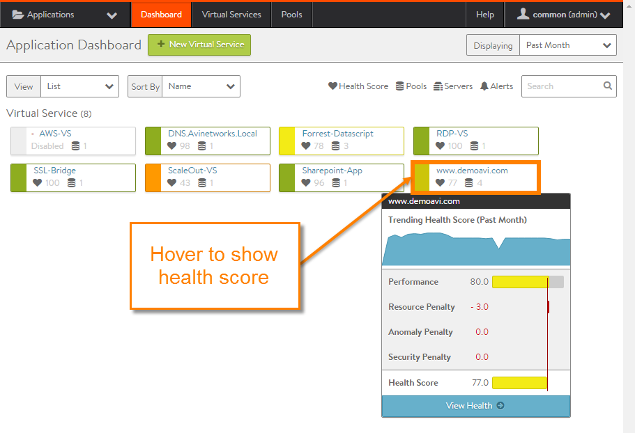
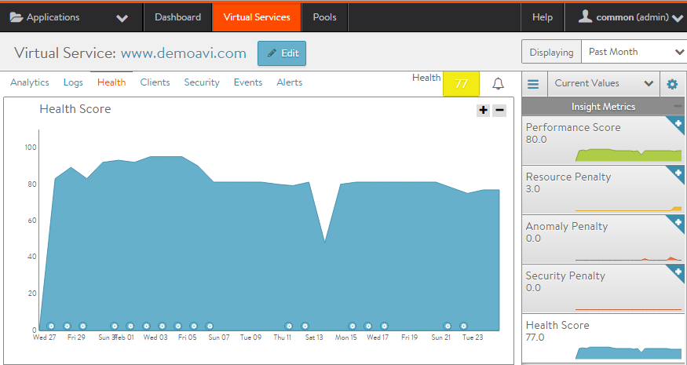
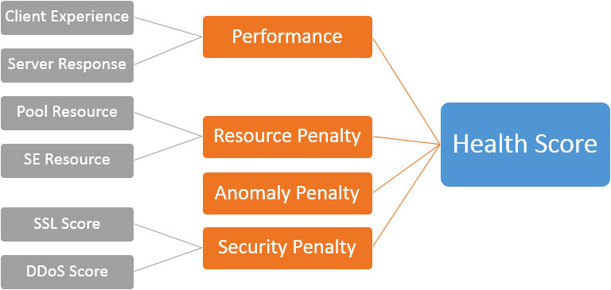

The Health tab presents a detailed breakdown of health score information for a virtual service. The health score is a pervasive concept throughout the Avi Vantage web interface.

## Displaying Virtual Service Health

Health information for a virtual service can be viewed in summary form by hovering over the virtual service icon. Detailed health information is available on the Health tab for the virtual service.

### Summary Health Scores

On the application dashboard, hovering over a virtual service icon displays the health score for the virtual service:

### Health Details

Navigating to the Health tab for the virtual service provides a more robust view into the components that comprise the score, along with their historical trends.
<ol> 
 <li> 
Navigate to Application &gt; Virtual Services.
 </li> 
 <li> 
Click on the virtual service name.
 </li> 
 <li> 
Click on Health.
 </li> 
</ol> 

## Health Score Codes

The health score of a virtual service is a composite of several scores. The final score denotes both the responsiveness of the virtual service ***and*** any vulnerabilities.

Vantage uses health score colors to show the health range of the object:

* **Green:** (health score 85 to 100).
* **Yellow:** (health score 65 to 84)
* **Orange:** (health score 1 to 64)
* **Red:** (health score '!', or the server is down)
* **Gray:** Dash '-'; object is not available to use, such as disabled. 

### Health Score Composition

* **Performance:** Performance is comprised of end user's experience and server response. The performance score is a positive number from 0 (down) to 100 (ideal).  
    * **Client Experience:** Based on the end to end timing, this determines if the client sees the site as fast or slow. The Analytics profile can be used to determine the window of time for a satisfactory response. 
    * **Server Response:** This will lower the score if the server is sending back errors such as TCP resets or HTTP 500 (busy). 
* **Resource Penalty:** Any penalty assessed because of resource availability issues is assigned a score, which is then subtracted from the performance score. A penalty score of 0 is ideal, meaning there are no obvious resource constraints on Vantage or virtualization orchestrator connected servers.  
    * **Pool Resource:** If the Controller is able to gather resource metrics from servers, such as via read or write access modes to vCenter, then servers saturating their CPU, memory, or disk IO may incur a penalty to the pool. The resource utilization is based on the average of a five minute polling interval. Thresholds may be determined within the Analytics Profile. 
    * **Service Engine Resource:** If an SE is experiencing high CPU or memory utilization for an average five minute period, it will result in an SE penalty. 
* **Anomaly Penalty:** *Anomaly* is defined as traffic that is outside the statistical norm for the time period. The algorithm takes into account seasonality for the virtual service. While anomalies in traffic are not necessarily bad, they may denote potential risk. 
* **Security Penalty:** The security penalty shows risks due to configuration settings that leave a site vulnerable, as well as vulnerability to attacks such as DDoS.  
    * **SSL Score:** Configuration of SSL settings for an SSL-enabled virtual service will affect this score. This could be due to settings within the SSL/TLS profile (such as enabling an insecure cipher), due to the associated certificate (which may be expired or self-signed), or due to other SSL settings (such as not enabling HSTS in the HTTP profile). 
    * **DDoS Score:** If the virtual service is experiencing a DoS attack, it will increase the security penalty depending on the severity of the attack. 
* **Health Score:** The final health score for the virtual service equals the performance score minus the various penalty scores. The score may change depending on the window of time selected.  

The sidebar tiles show the scores of each of the four subcomponents of the health score, plus the total score. To determine why an object such as a virtual service has a low health score, select one of the first tiles that is showing a subpar score.

This may bring up additional sub-components for the top level metric, such as Pools, connection Apdex, Response Apdex, or others. Select the tile that is showing the worst score. Some tiles may have additional information shown in the main chart section.

The chart pane of the tab shows a timeline graph of the selected metric. Hover the mouse over the chart to display the most significant issue causing degradation of the health score. (This is displayed at the top left of the chart.)
 