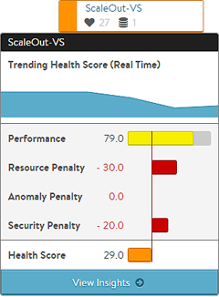
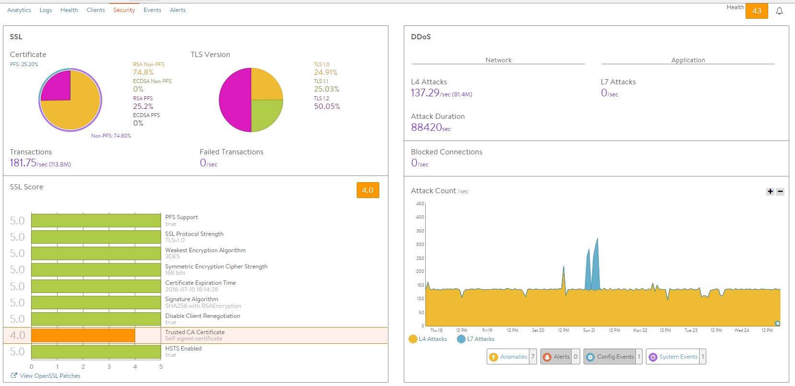
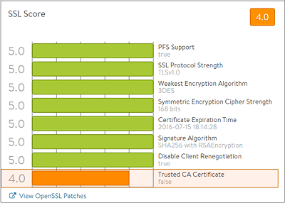
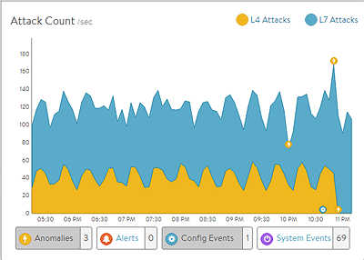

Avi Vantage continually assesses the health of each virtual service. This health information is available for viewing in both summary and detailed form.

Each virtual service has a health score, which shows the virtual service health as both a color code and a set of numeric scores. The final health score is comprised of a positive performance score and three penalties.

The security penalty provides insight into a current security related issue (such as a current DoS attack) or potential risk (such as SSL configuration which leaves the site vulnerable to the POODLE attack).

Ideally, the security penalty should be zero, which means it is not detracting from the health or risk of a virtual service. A non-zero security penalty may be due to an issue with SSL or a DDoS attack event. This article explores the components that could generate a security penalty.

### View Security Insights

To view a security insights for a virtual service:
<ol> 
 <li>Click the icon of the virtual service shown on the Dashboard.</li> 
 <li>Click the virtual service name.</li> 
 <li>Click Security on the menu bar.</li> 
</ol> 

Detailed security information for the virtual service is shown in two panes:

* SSL information (left pane)
* DDoS information (right pane) 

Security Insights for the virtual service are organized into the following main categories:

* SSL Distribution
* SSL Score
* DDoS 

The following sections describe the data fields listed for each category.

### SSL Distribution Insights

The SSL section on the top left of the default security page shows in detail the most relevant SSL data about client connections terminated on Avi Service Engines (SEs) within the selected period of time. If SSL termination is not being performed on the virtual service, this section will have no data.

* **Certificate:** Breaks down the certificate types used by clients during the negotiation phase of SSL session setup. A virtual service can be configured to accept both RSA and EC certificates. Avi Vantage will negotiate whichever type the client supports, with EC as the preference for clients that support both. Depending on the cipher negotiated by the client, RSA and EC may be negotiated with or without Perfect Forward Secrecy.
* **TLS Version:** Breaks down the TLS versions negotiated by clients. Vantage supports TLS, but not the older and less secure SSLv2 or SSLv3.
* **Transactions:** The average transactions per second (TPS) for new connections negotiated within the indicated time period. This metric includes both new and reused transactions. This metric is further broken down via the Transactions metric tile from the SSL section of the sidebar tiles.
* **Failed Transactions:** Number of unsuccessful transactions. Typically, transactions may fail either due to clients terminating the negotiation midstream, or because the client and Vantage could not agree on a mutually supported cipher or TLS version. To view individual failed transactions, access the Logs page for the virtual service. 

### SSL Insights

The SSL Score section on the bottom left of the default security page shows in detail the major factors affecting the SSL Score.

* **PFS Support:** Negatively impacts the virtual service’s security score by reducing it if PFS capable ciphers are not enabled in the SSL profile for the virtual service.
* **SSL Performance Strength:** Reduces the score if an insecure SSL/TLS version is enabled.
* **Weakest Encryption Algorithm:** Reduces the score if a weak encryption algorithm is enabled in the SSL profile.  See the SSL Profile’s security score for more on this.
* **Symmetric Encryption Cipher Strength:** Reduces the score if the cipher suite uses an encryption algorithm with considered insecure.
* **Certificate Expiration Time:** Reduces the score if the certificate is about to expire or has already expired.
* **Signature Algorithm:** Reduces the score if weak hashing algorithms (such as md5 or SHA1) are enabled in the virtual service’s SSL profile.
* **Disable Client Renegotiation:** As a best practice, Vantage turns off client SSL renegotiation. This field is non-configurable and therefore does not impact the security score.
* **Trusted CA Certificate:** Reduces the score if the virtual service is using a self-signed certificate. 

### DDoS Insights

The DDoS section on the right of the default security page breaks down distributed denial of service data for the virtual service into the most relevant layer 4 and layer 7 attack data. See additional documentation on network <a href="/ddos-attacks-mitigated/">attack mitigation</a>.

* **L4 Attacks:** The number of network attacks per second, such as IP fragmentation attacks or TCP SYN flood. For the example shown here, each unacknowledged SYN is counted as an attack. (This is the classic signature of the TCP SYN flood attack, a large volume of SYN requests that are not followed by the expected ACKs to complete session setup.)
* **L7 Attacks:** The number of application attacks per second, such as HTTP SlowLoris attacks or request floods. For the example shown here, every request that exceeded the configured request throttle limit is counted as an attack. (See the application profile's DDoS tab for configuring custom layer 7 attack limits.)
* **Attack Duration:** The length of time during which an attack occurred.
* **Blocked Connections:** If an attack was blocked, this is the number of connection attempts blocked.
* **Attack Count:** Shows attacks plotted in a graph over time.  