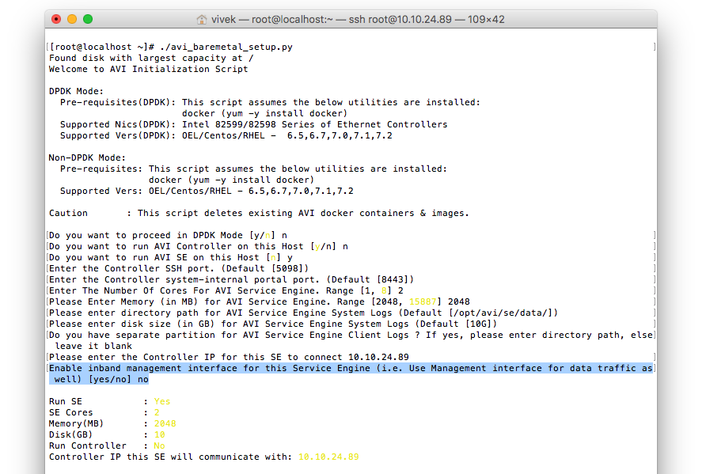
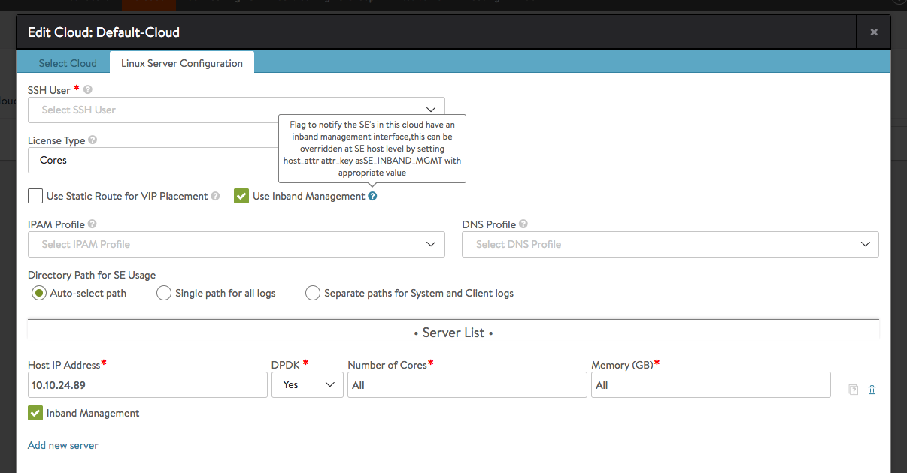
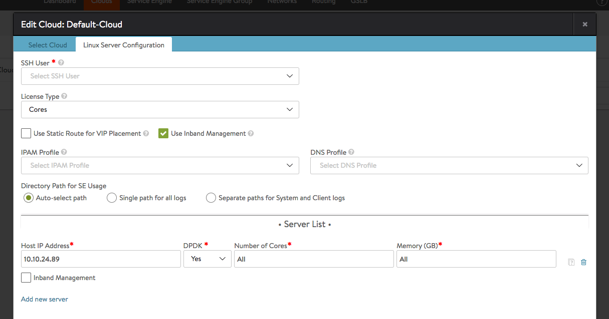
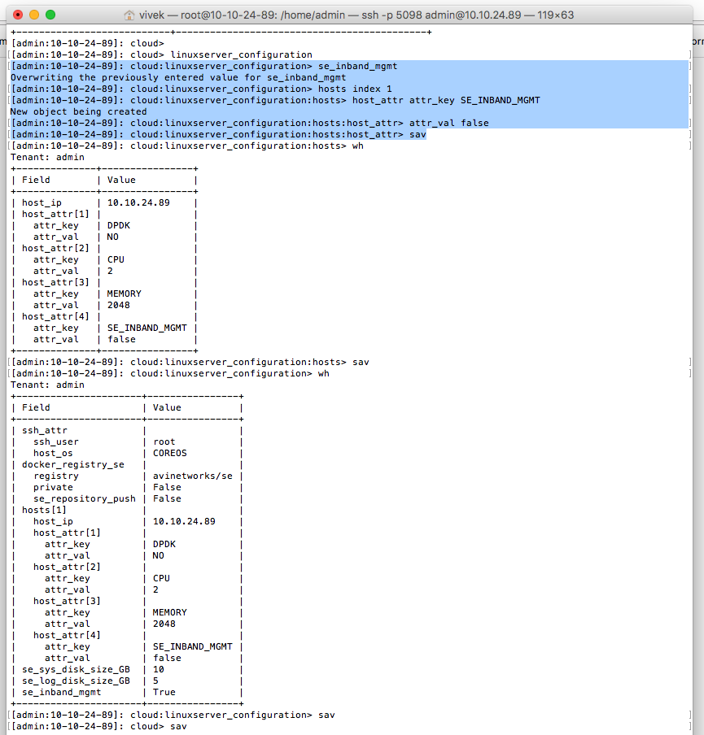

Occasionally it is required to have the SE interface used to communicate with the Avi Controller cluster also be used for its data plane traffic. This article explains how to enable/disable the in-band management attribute on an SE.

*Note: *

* *If in-band management is enabled on an SE, that SE will not support multiple VRFs.*
* *To enable multiple VRFs on an SE, it must be deployed with in-band management disabled. The caveat with disabling in-band management is that the management interface will not be used for data plane traffic, and hence no VS will be placed on this interface and this interface will not be used to communicating with back-end servers.* 

 

## **SE In-band Management Configuration Using Bare-Metal Script**

This section details deployment of a Service Engine with in-band management enabled or disabled using the avi_baremetal_setup.py script.

<figure class="thumbnail wp-caption aligncenter">   
<figcapture> Figure. Option to disable/enable in-band management in the avi_baremetal_setup.py script interactive mode 
</figcapture>
</figure> 

## **SE In-band Management Configuration Using Linux Server Cloud**

The section details deployment of an SE with in-band management enabled or disabled using the Linux Server Cloud configuration on the Avi Controller UI.<a href="img/Screen-Shot-2016-10-12-at-6.39.56-PM.png">  </a>

A new server added to the Linux Server Configuration will inherit the cloud-level in-band management property. This property can be explicitly modified per host to override the cloud-level value.

<figure class="thumbnail wp-caption aligncenter">   
<figcapture> Figure.  In-band management enabled at the cloud and host level 
</figcapture>
</figure> 
<figure class="thumbnail wp-caption aligncenter">   
<figcapture> Figure. In-band management enabled at cloud level, but disabled at host level 
</figcapture>
</figure> 
<figure class="thumbnail wp-caption aligncenter">   
<figcapture> Figure. In-band management setting enabled at cloud and disabled at host level from the CLI 
</figcapture>
</figure> 