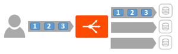
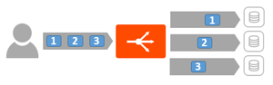
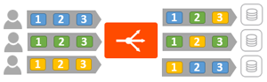

### Overview

Connection multiplexing, configured via the *Templates > Profiles > HTTP application profile*, controls the behavior of HTTP 1.0 and 1.1 request switching and server TCP connection reuse. This feature decouples the client TCP and HTTP connection from the server side TCP and HTTP connection.  Multiplexing provides three important benefits to improve the efficacy and performance of servers.
<ol> 
 <li>Reduces the number of connections to the server that must be opened and closed in a given period.</li> 
 <li>Reduces the number of concurrently open connections to the server relative to the number of open client connections.</li> 
 <li>Allows load balancing and distribution of HTTP requests across servers using any open server side connection.</li> 
</ol> 

For HTTP/2 and SPDY, only the third benefit applies.  These newer versions of HTTP provide the functionality outlined in 1 and 2 natively.

The exact reduction of connections to servers will depend on a few factors:

* How long lived the client connections are
* Client latency and time connection is idle
* The HTTP version negotiated 

### New Connections

With a one to one mapping of client connections to server connections, the load on a server can be extreme.  With multiplexing enabled, when a client closes connection, Vantage intercepts the client connection close event and closes the client connection, but keeps the connection open on the server side.  When the next client needs to open a connection, Vantage opens the client side connection but forwards the client's request over the open, idle server side connection.  The statistics of new connections per second may be significantly higher on the client side (the virtual service) than the server side (the pool).  The number of requests per second will be the same, baring other features such as caching.

### Concurrent Connections

The majority of the all connections to Vantage from a client will be in an idle state.  With HTTP 1.0 and 1.1, only a single request or response may be in flight over the connection at a time.  When a server sends a response, it is done with the response yet it cannot use the connection for other purposes.  It must wait till the client has received the response, which may be a while with typical Internet latency.  It must wait for the client to decide to send another request and for that request to be received.  Actual data transmission or receipt by the server tends to be a very small percentage of time.

With multiplexing enabled, Vantage receives the server response, buffers the response, acknowledges receipt to the server, then transmits the response to the client.  In the meantime, if another client request has been received, Vantage can send it over the now idle server connection.  For typical HTTP sites, particularly with typical latency, the number of open concurrent connections to the servers will be significantly less than the number of open concurrent connections from clients.

### Load Balance Requests

<table class=" table table-bordered table-hover">  
<tbody>   
<tr>   
<td></td>
<td></td>
</tr>
<tr>   
<td><em>Without multiplexing:  Request distribution from traffic originating from one client connection</em></td>
<td><em>With multiplexing:  Request distribution from traffic originating from one client connection</em></td>
</tr>
</tbody>
</table> 

 

When an SE receives multiple connections from a single client, or from multiple clients, requests are eligible for load balancing across any server.  This ensures a server that is slow to respond to a particular request may be bypassed when the next client request is received by Vantage.  With load balancing algorithms such as round robin, they would skip a server's connection for the next request if that connection is currently busy with a request/response.  So a server processing a complicated and slow database query may receive less requests than other servers processing faster requests.

It is important to understand that "connection" refers to a TCP connection, whereas "request" refers to an HTTP request and subsequent response. HTTP 1.0 and 1.1 allow only a single request/response to go over an open TCP connection at a time. Many browsers attempt to mitigate this bottleneck by opening around six concurrent TCP connections to the destination web site.

HTTP/2 uses a different connection methodology and does not utilize or require the connection multiplex feature.

### Impact on Other Features

Multiplexing often distorts the expected view of an administrator's world.  For instance, viewing connection counts from clients and to servers is typically very different.  Static load balancing algorithms such as round robin or least connections may exhibit different behavior.

* **Preserve Source IP**:  Multiplexing explicitly decouples the client connection from the equation when sending traffic to destination servers.  When Preserve Source IP is enabled in conjunction with using the Service Engine as a default gateway of the servers, HTTP traffic cannot be multiplexed.
* **NTLM**:  NTLM authentication is generally incompatible with multiplexing. Applications that rely on NTLM, such as SharePoint or StoreFront should be configured with connection multiplexing disabled.  See the <a href="/issues-with-ntlm-authentication/">Issues with NTLM Authentication KB </a>for more help on this.
* **Persistence**:  Persistence has a significant role to play in the behavior of multiplexing, described below. 

### Multiplex Plus Persistence

Multiplexing behavior changes when server persistence is enabled:

* **Multiplex enabled, Persistence disabled:** Client connections and their requests are decoupled from the server side of the Service Engine. Requests are load-balanced across the servers in the pool using either new or pre-existing connections to those servers. The connections to the servers may be shared by requests from any clients.
* **Multiplex enabled, Persistence enabled:** Client connections and their requests are sent to a single server. These requests may share connections with other clients who are persisted to the same server. Load balancing of HTTP requests is not performed.
* **Multiplex disabled, Persistence enabled:** Vantage opens a new TCP connection to the server for each connection received from the client. Connections are not shared with other clients. All requests received through all connections from the same client are sent to one server. HTTP client browsers may open many concurrent connections, and the number of client connections will be the same as the number of server connections.
* **Multiplex disabled, Persistence disabled:** Connections between the client and server are one-to-one. Requests remain on the same connection they began on. Multiple connections from the same client may be distributed among the available servers. 