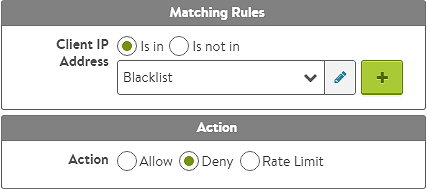

### Description

Stick a client to a server for a custom duration of time based on user-defined criteria.

This use case is configured via a DataScript which provides flexible options by which to find a custom bit of data for the persistence.

### DataScript

A DataScript may be used to close the client's connection.  This may be done via a TCP RST or a graceful TCP FIN.  This is determined by a flag in the <a href="/datascript-avi-http-close_conn/">avi.http.close_conn</a> command..

<table class="table table-hover table table-bordered table-hover">  
<tbody>   
<tr>   
<td><strong>Example 1</strong></td>
<td>Persist clients based on their source IP and port.  
<!-- Crayon Syntax Highlighter v2.7.1 --> <pre><code class="language-lua">-- HTTP Request Event --
pool = "my_pool"
client = avi.vs.client_ip() .. avi.vs.client_port()
server = avi.vs.table_lookup(client)
timeout = "300"

if server then
   avi.pool.select(pool, client)
end

-- HTTP Response Event --
if not server then
   avi.vs.table_insert(client, avi.pool.server_ip(), timeout)
end</code></pre> 
<!-- [Format Time: 0.0015 seconds] --></td>
</tr>
<tr>   
<td><strong>Example 2</strong></td>
<td>Persist clients based on the referer header in the client request.  
<!-- Crayon Syntax Highlighter v2.7.1 --> <pre><code class="language-lua">-- HTTP Request Event --
pool = "my_pool"
timeout = "300"
client = avi.http.get_header("referer")
server = avi.vs.table_lookup(client)

if server then
   avi.pool.select(pool, client)
end

-- HTTP Response Event --
if not server then
   if 
   avi.vs.table_insert(avi.vs.client_ip(), avi.pool.server_ip(), timeout)
end</code></pre> 
<!-- [Format Time: 0.0013 seconds] --></td>
</tr>
</tbody>
</table> 

### Policy

The <a href="/docs/architectural-overview/applications/vs-policies/">Network Security</a> and the <a href="/http-security-policy/">HTTP Security</a> policies may be used to discard a client based on its IP address.  The following illustrations show creating a configured policy rule which refers to an IP group called Blacklist.  When this policy is triggered, a significant log will be generated, indicating the policy dropped this client.  With enough frequency, this may also incur a penalty on the health score's security row.

 

### IP Group

The IP group is configured and maintained separately from the DataScript or policy referencing it.  The group may contain lists of addresses or country codes.  See the <a href="/templates-groups-ip-group/">IP Group KB</a> for more detail on this feature.

 
