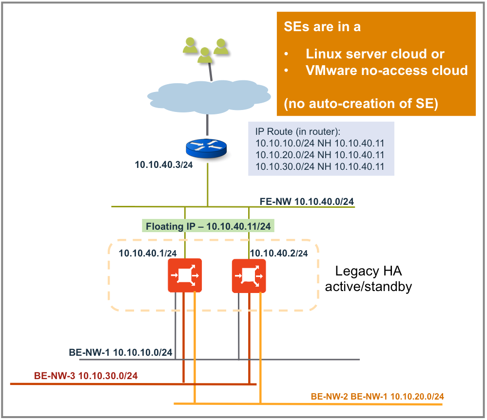
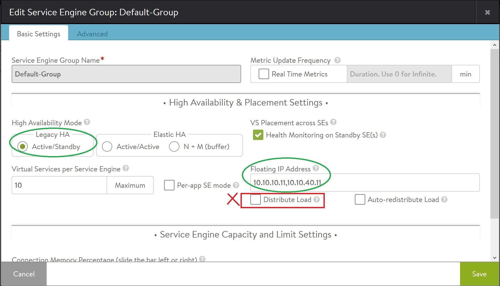
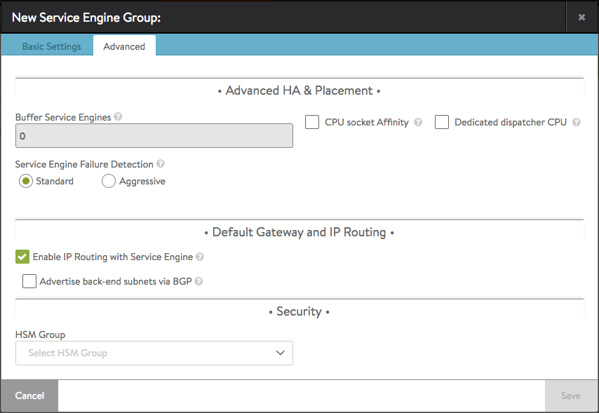
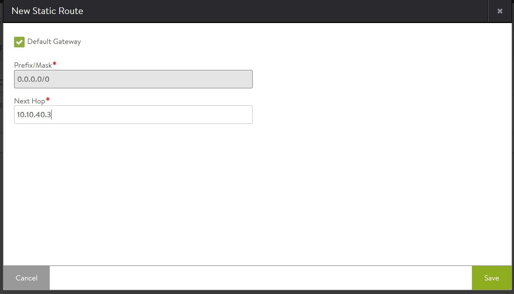
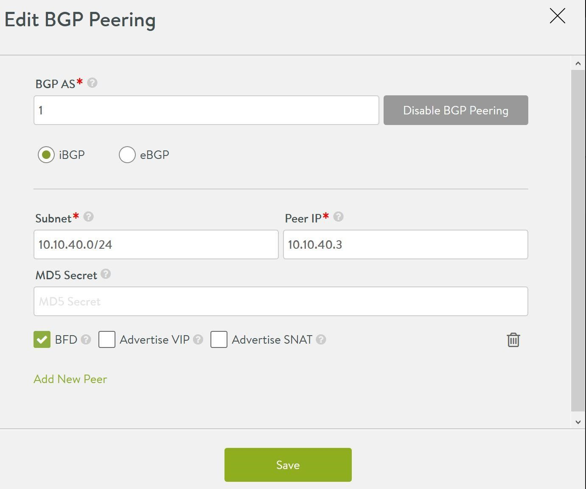
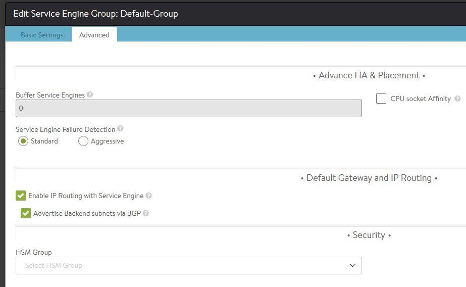

## Overview

There are multiple use cases for enabling IP routing on Avi Service Engines.

When new application servers are deployed, the servers need external connectivity for manageability. In the absence of a router in the server networks, the Avi SE can be used for routing the traffic of server networks.

Another use case is when virtual services use an application profile with the <a href="/preserve-client-ip/">preserve client IP</a> option enabled, back-end servers receive traffic with the source IP set to the IP of the originating clients. The Avi SE’s IP needs to be configured as the default gateway for these servers to route all traffic back through the SEs to the clients.

### Suggested Additional Reading

* <a href="/enable-a-virtual-service-vip-on-all-interfaces/">Enable a Virtual Service VIP on All Interfaces</a>
* <a href="/mac-masquerade/">MAC Masquerade</a>

## Scope

The following features are supported In the Avi Vantage 16.3 release:

* IP routing is supported only on **two-armed, no-access** configurations of **Linux server clouds.**
* The HA mode must be l**egacy HA (active/standby)**only for SE groups, with the enable IP routing option set.
* IP routing cannot be enabled in conjunction with the distribute load option set in the SE group configuration.
* IP routing is enabled on only one (global) VRF.
* IP routing is supported only on **DPDK-**based SEs. 

Back-end servers must be on a directly-connected network (no router in between SE and servers) using all **static IPs**(no DHCP or DHCP relay).

## Example Use Case

Briefly, enabling IP routing requires the following configurations to be done at various points in the network:

* On the Avi Controller, enable “Enable IP Routing” in the SE group Advanced tab configuration
* On the front-end router, configure static routes to the back-end server networks with the nexthop as floating IP in front-end network . 
* If BGP is enabled in the network and BGP peers configured on the SEs, then enable “Advertise back-end subnets via BGP” for the SE group.
* On the back-end servers, configure the SE’s floating IP in back-end server network as the default gateway. 

## Configure IP Routing (Without BGP Peer)

Consider a simple two-leg setup with the server(s) in the 10.10.10.0/24 back-end network (always a **directly connected network**) and front-end router in 10.10.40.0/24 network. Steps to configure IP routing (a.k.a default gateway) feature are listed below.  UI and CLI in each step are just the two different ways of configuring the same step.
<ol> 
 <li>Navigate to Infrastructure -&gt; Service Engine Group -&gt; Edita. Configure the HA mode in the SE group to<b> legacy HA (Active/Standby)</b>.  
  <!-- Crayon Syntax Highlighter v2.7.1 --> <pre><code class="language-lua">: &gt; configure serviceenginegroup Default-Group
: serviceenginegroup&gt; active_standby
Overwriting the previously entered value for active_standby
: serviceenginegroup&gt; ha_mode ha_mode_legacy_active_standby
Overwriting the previously entered value for ha_mode
: serviceenginegroup&gt;save</code></pre> 
  <!-- [Format Time: 0.0008 seconds] --> b. Ensure <b>Distribute Load</b> is not enabled.   c. Configure <b>Floating IP Addresses</b> (for e.g., 10.10.10.11), one on <b>each back-end network</b>. These IP addresses will get configured on the active SE and will be taken over by the standby SE (new-active) upon failover.  
  <!-- Crayon Syntax Highlighter v2.7.1 --> <pre><code class="language-lua">: &gt; configure serviceenginegroup Default-Group
: serviceenginegroup&gt; floating_intf_ip 10.10.10.11
: serviceenginegroup&gt; save</code></pre> 
  <!-- [Format Time: 0.0005 seconds] --> d. If there are no BGP peers configured, then configure<b> Floating IP address </b>for front-end networks too (for example, 10.10.40.11).  
  <!-- Crayon Syntax Highlighter v2.7.1 --> <pre><code class="language-lua">: &gt; configure serviceenginegroup Default-Group
: serviceenginegroup&gt; floating_intf_ip 10.10.40.11
: serviceenginegroup&gt; save</code></pre> 
  <!-- [Format Time: 0.0005 seconds] --> </li> 
 <li>Navigate to Infrastructure -&gt; Service Engine Group -&gt; Edit -&gt; Advanced. Check <b>Enable IP Routing with Service Engine </b>to enable IP routing on all SEs in the SE group<b>.</b>  
  <!-- Crayon Syntax Highlighter v2.7.1 --> <pre><code class="language-lua">: &gt; configure serviceenginegroup Default-Group
: serviceenginegroup&gt; enable_routing
Overwriting the previously entered value for enable_routing
: serviceenginegroup&gt; save</code></pre> 
  <!-- [Format Time: 0.0006 seconds] -->  

 

</li> 
 <li>The above steps completes the SE group configuration to enable routing. However, the network is incomplete without the front-end routers and back-end servers being configured accordingly.</li> 
 <li>Front-end router configuration (if no BGP peers are configured on SE)  a. Configure the the front-end router with a static route to the back-end server network (with next-hop pointing to floating interface IP of SE in front-end network). For example:

 
  <!-- Crayon Syntax Highlighter v2.7.1 --> <pre><code class="language-lua">route add -net 10.10.10.0/24 gw 10.10.40.11.</code></pre> 
  <!-- [Format Time: 0.0003 seconds] --> 
 
</li> 
 <li>Back-end server configuration.  a. Configure the default gateway of back-end server(s) to point to floating interface IP of SE (the one in server network)  

 
  <!-- Crayon Syntax Highlighter v2.7.1 --> <pre><code class="language-lua">route add default gw 10.10.10.11</code></pre> 
  <!-- [Format Time: 0.0002 seconds] --> 
 This ensures that all the traffic including return (VIP) traffic from the back-end network uses SE for all northbound traffic.
</li> 
 <li>Configure the default gateway of SE to front-end as needed:  Navigate to Infrastructure -&gt; Routing -&gt; Static Route -&gt; Create</li> 
</ol> 

## Configure IP-Routing (With BGP Peer)

For configuring IP routing without BGP peers, follow the five steps detailed above with the following exceptions:

* If the front-end supports BGP peering, then there is no necessity to configure floating IPs on the front-end interface (skip step 1.d above).
* Also, there is also no need to configure static routes in the front-end router (skip step 3 above). 

After performing the above steps, follow the instructions below:

<ol> 
 <li>Navigate to Infrastructure -&gt; Routing -&gt; BGP Peering -&gt; Edit  On the Avi Controller, configure BGP Peers network and IP Address.  
  <!-- Crayon Syntax Highlighter v2.7.1 --> <pre><code class="language-lua">: &gt; configure vrfcontext global
: vrfcontext&gt; bgp_profile ibgp local_as 1
: vrfcontext:bgp_profile	&gt;
: vrfcontext:bgp_profile&gt; peers peer_ip 10.10.40.3
New object being created
: vrfcontext:bgp_profile:peers&gt;
: vrfcontext:bgp_profile:peers&gt; subnet

IP4 Prefix format 
     
    <x.x.x.x>
      (required) Subnet providing reachability for ... : vrfcontext:bgp_profile:peers&gt; subnet 10.10.40.0/24 : vrfcontext:bgp_profile:peers&gt; bfd : vrfcontext:bgp_profile:peers&gt; save : vrfcontext:bgp_profile&gt; save : vrfcontext&gt; save 
    </x.x.x.x></code></pre> 
  <!-- [Format Time: 0.0021 seconds] --> </li> 
 <li>Navigate to Infrastructure -&gt; ServiceEngine Group -&gt; Edit -&gt; Advanced  Enable Advertise back-end subnets via BGP. This UI knob will appear only if Enable IP Routing option is selected.  
  <!-- Crayon Syntax Highlighter v2.7.1 --> <pre><code class="language-lua">: &gt; configure serviceenginegroup Default-Group
: serviceenginegroup&gt; advertise_backend_networks
Overwriting the previously entered value for advertise_backend_networks
: serviceenginegroup&gt; save</code></pre> 
  <!-- [Format Time: 0.0006 seconds] --> </li> 
 <li>Configure the application profile to preserve client IPs for associated virtual service(s). This step is to be performed before any virtual service using the given application profile is enabled.  
  <!-- Crayon Syntax Highlighter v2.7.1 --> <pre><code class="language-lua">: &gt; configure applicationprofile System-HTTP
: applicationprofile&gt; preserve_client_ip
Overwriting the previously entered value for preserve_client_ip
: applicationprofile&gt; save</code></pre> 
  <!-- [Format Time: 0.0006 seconds] --> This configuration won't succeed if enable_routing is not yet configured. This configuration works in mutual exclusion with “connection multiplexing” option for L7 application profiles.</li> 
 <li>Create a virtual service with an application profile for which preserve client IP is enabled.</li> 
</ol> 