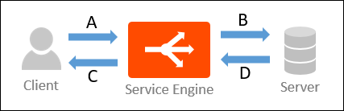

The term *throughput* appears throughout the Avi Vantage web interface and documentation. Every vendor has a slightly different definition of throughput, and the definition may even change depending on context. In Vantage, throughput is defined based on the traffic paths through virtual services, pools, and Service Engine (SEs):

**A** - Client request to SE 

**B** - SE request to server 

**C** - SE response to client 

**D** - Server response to SE 

### Throughput Calculations

Vantage calculates throughput as follows:

* For virtual service traffic, throughput is calculated as: A + C 
* For pool traffic, throughput is calculated as: B + D 
* For SE traffic, throughput is calculated as: A + B + C + D   

### Why Throughput Numbers May Differ

An SE's throughput value may be higher than the combined throughput values of the virtual service and pool.  This can occur due to any of the following conditions:

* Management traffic load while communicating with Controllers. 
* Health monitoring traffic to the pool servers. 
* Multiple virtual services and pools hosted by the SE. (The throughput number includes all virtual services and pools hosted by the SE.)  

Throughput numbers may differ between a virtual service and its pool due to network or application headers, SSL offload, compression, caching, multiplexing, or many other features.  

