This article walks through the configuration of Avi Vantage's native DNS hosting solution. The Avi Vantage DNS solution is available for the following clouds:

* Containers (Mesos, OpenShift, Docker UCP, Rancher)
* Linux server
* VMware
* No Access
* OpenStack
* <a href="/dns-provider-avi-vantage-16-3/#Avi_Vantage_DNS_With_AWS_Cloud">Amazon Web Services</a>
* Google Cloud Platform 

See also: <a href="/service-discovery-using-ipam-and-dns-16-3/">Service Discovery Using IPAM and DNS</a>

### DNS Configuration

<ol> 
 <li>Navigate to Templates -&gt; IPAM/DNS Profile and create a DNS profile.</li> 
 <li>Add one or more DNS Service Domain names. Avi Vantage will be the authoritative DNS server for these domains.</li> 
 <li>Configure a TTL value for all records for a particular domain, or leave the Record TTL field blank to accept the default TTL of 300 seconds.</li> 
 <li>Click Save.</li> 
</ol> 

<a href="img/avi-dns-profile.png">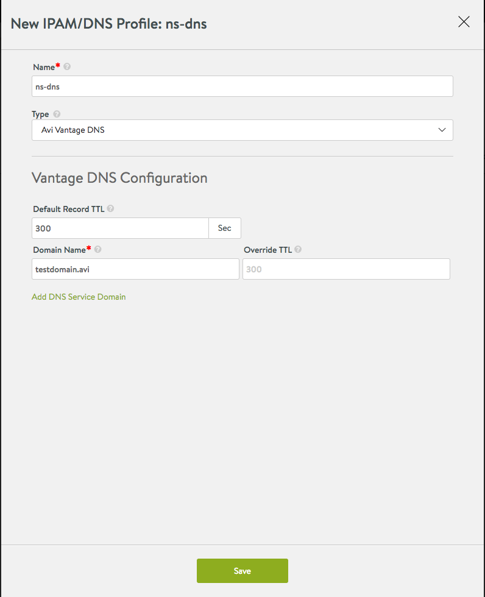</a>

 

**Using Avi Vantage DNS**

After configuring a DNS profile (above) with a set of domains for which Avi Vantage DNS will be serving records, configure a DNS virtual service in Avi Vantage. DNS high availability and Interoperability with other DNS providers (Mesos-DNS, for example) are two big advantages of using a DNS VS.

Setting up DNS virtual service:
<ol> 
 <li><strong>(Optional) Create a DNS Pool</strong> with DNS server members as shown below. This will make Avi DNS handle all DNS requests for which it does not host domains natively. For example, if the Avi Vantage DNS profile contains authoritative domain "test.avi," then this DNS VS will host all the records for this domain and additionally with a pool configured as below, it can relay the requests to DNS server members for non-authoritative domains like "google.com".</li> 
</ol> 

<a href="img/dns-pool-config.png">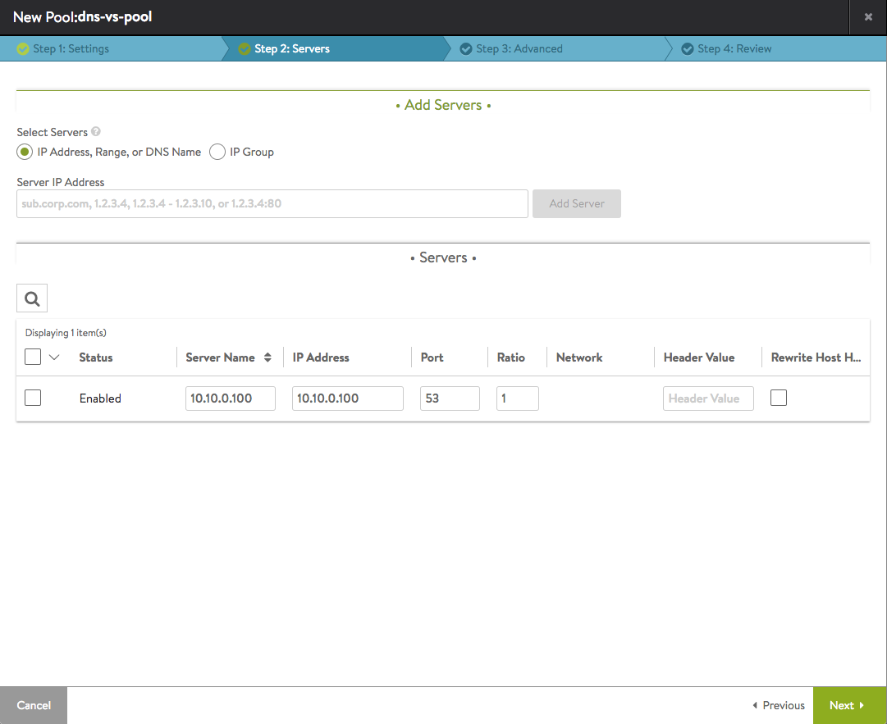</a>

 

**2. Create DNS Virtual Service**

* Provide a publicly-accessible virtual IP address.
* Choose "System-DNS" in the Application Profile pulldown.
* Check "Ignore network reachability constraints for the server pool." 

<a href="img/dns-vs-config-1.png">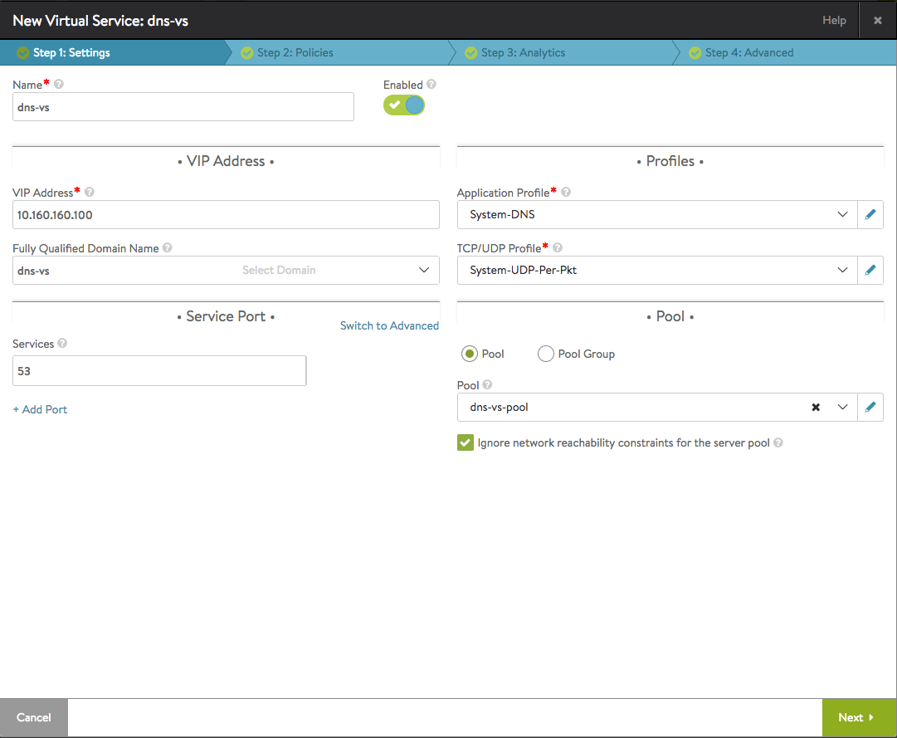</a>

If the corporate DNS server is on an external network (requires routing for SE data traffic to reach the DNS server), then add a static route to the external network as shown below (if a default route is not already configured):

Navigate to Infrastructure > Routing > Create and add a Default-Gateway IP address for the cluster. After this configuration and if the DNS virtual service was down, it should now be up.

<a href="img/static-route-1.png">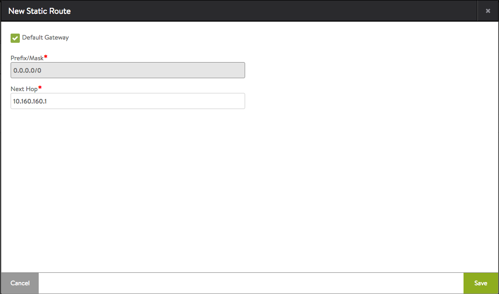</a>

 

**3. Navigate to Administration > Settings > DNS Service** and enable this DNS virtual service to start hosting application records. Multiple DNS virtual services can be configured for redundancy in the cluster.

<a href="img/dns-sys-config.png">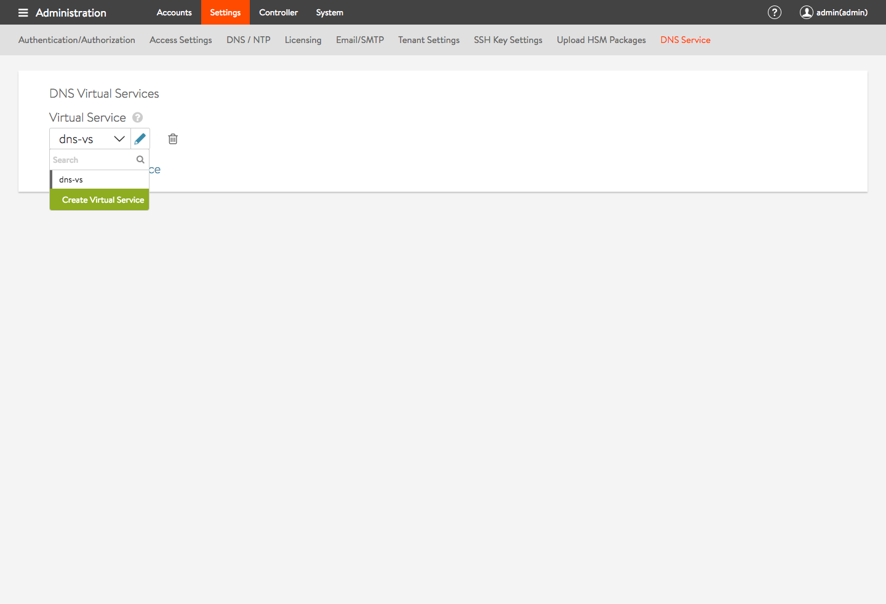</a>

 

**4. Enable Avi DNS service** in your data center using one of the following two options.

    * Add DNS VIPs ("10.160.160.100" as configured above) to the nameservers' list in /etc/resolv.conf on all nodes requiring service discovery. Create applications and verify resolution works for the application's FQDN by issuing "dig app.testdomain.avi" anywhere in the cluster. 
* Add DNS VIP in the corporate DNS server as the nameserver for serving domain names configured in the DNS profile above. Any requests to "testdomain.avi" will be redirected to and serviced by the Avi DNS service. Alternately, Avi DNS server can be the main front-end DNS server and the corporation DNS servers can be configured as Avi DNS pool members. 

 

----

### Avi Vantage DNS With AWS Cloud

From Avi Vantage 16.3 release onward, when creating an AWS cloud, users can choose Avi Vantage's native DNS provider along with AWS Route53. Route53 had been the only option supported in releases prior to 16.3.

### **Configuration**

Avi Vantage native DNS can be configured as explained in the above section (<a href="/dns-provider-avi-vantage-16-3/#DNS_Configuration">DNS Configuration</a>) or can be created directly while creating the AWS cloud.
<ol> 
 <li>Navigate to Infrastructure-&gt;Clouds, and create a new AWS cloud by clicking "Create button."  <a href="img/Create-AWS-cloud.png">  </a><a href="img/Create-AWS-cloud.png">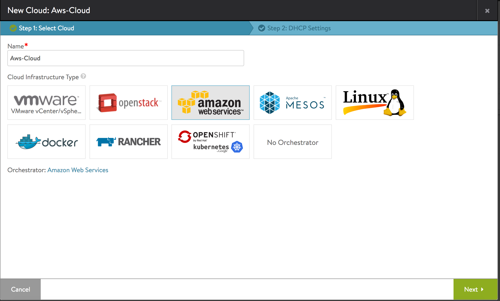</a>  <a href="img/Create-AWS-cloud-1-1.png">  </a><a href="img/Create-AWS-cloud-1-1.png">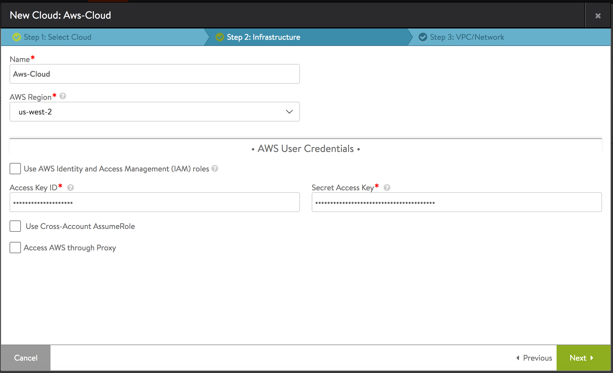</a><a href="img/Create-AWS-cloud-1.png">  </a></li> 
 <li>The AWS VPC and Availability Zones configuration page has the new DNS profile option, as highlighted below.  <a href="img/AWS-cloud-AVI-DNS-option.png">  </a><a href="img/AWS-cloud-AVI-DNS-option.png">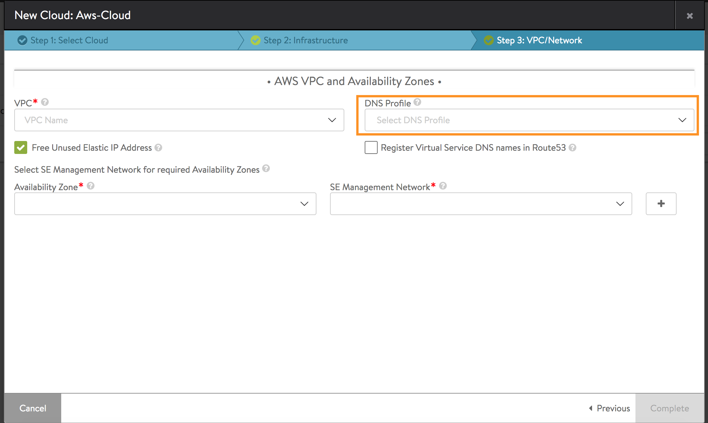</a></li> 
 <li>Choose from an existing Avi Vantage native DNS provider or create a new Avi Vantage native DNS provider and assign it to the AWS cloud being created.<a href="img/AWS-cloud-avi-dns-configuration.png">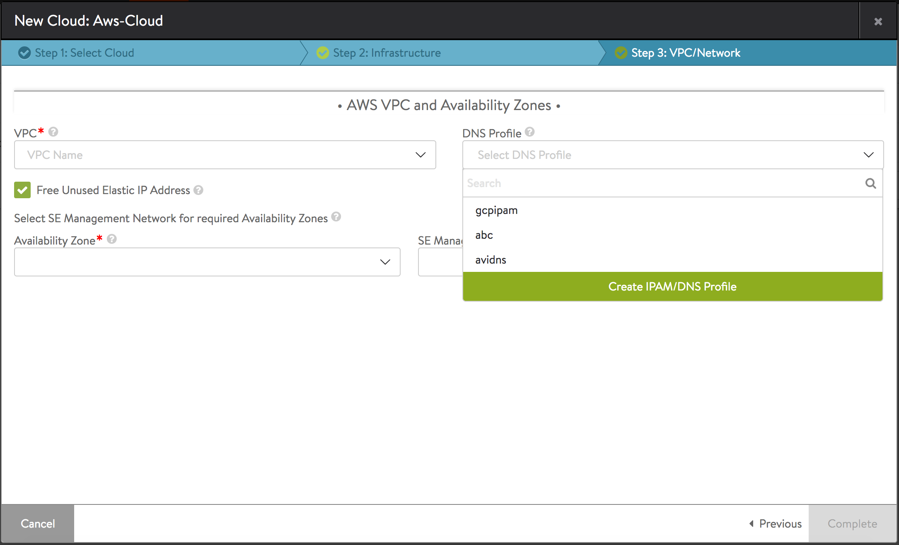</a></li> 
 <li>If required, create a new Avi Vantage native DNS profile, and assign it to the AWS cloud being created. Complete the AWS cloud creation with other appropriate parameters, such as VPC network and SE management network.  <a href="img/AWS-cloud-new-avi-dns-profile.png">  </a><a href="img/AWS-cloud-new-avi-dns-profile.png">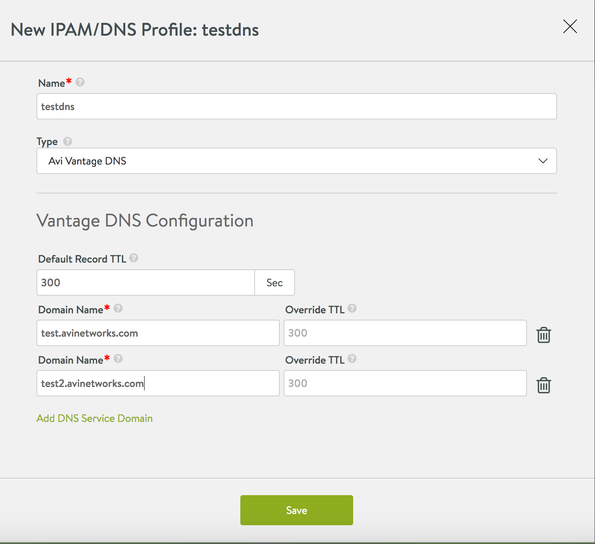</a>  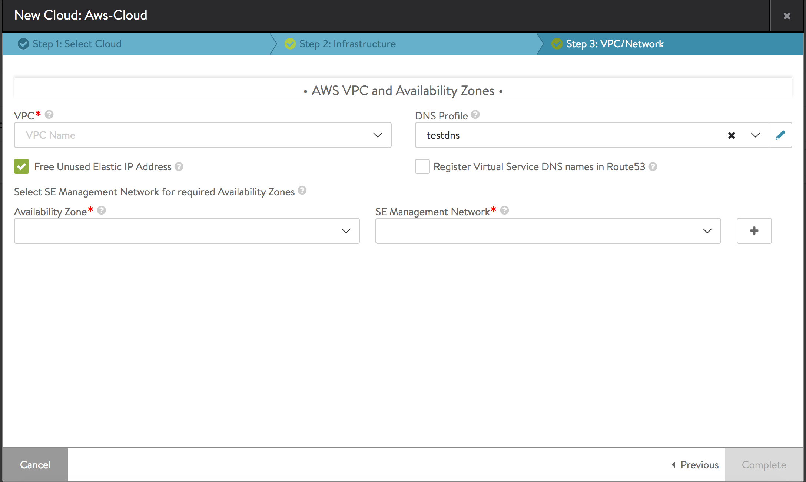This completes the configuration of an AWS cloud with Avi Vantage native DNS provider.</li> 
</ol> 

### **Using Avi Vantage DNS With AWS Cloud in Virtual Service Creation**

Having completed the configuration described above, when creating any virtual services in this cloud, FQDNs specified will be resolved by the Avi Vantage native DNS provider attached to the AWS cloud.

<a href="img/AWS-cloud-VS-with-FQDN-option.png">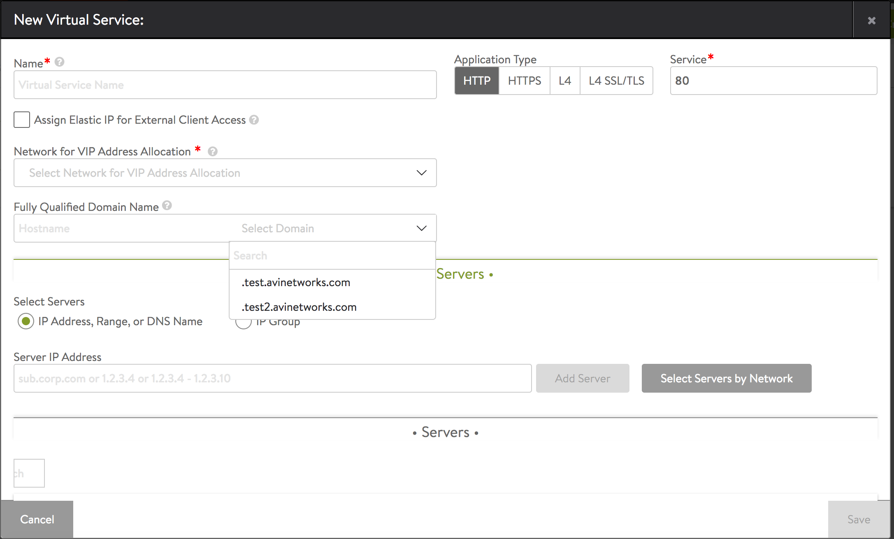</a>

### Limitations and Restrictions of Using Avi Vantage DNS in AWS cloud

<ol> 
 <li>Both Route53 and Avi Vantage native DNS cannot be configured/enabled at the same time on the AWS cloud.</li> 
 <li>When the AWS cloud has a virtual service with FQDNs resolved by either Avi Vantage DNS or Route53, 
  <ul> 
   <li>Removal of the cloud is not allowed until the existing  virtual service with FQDN is removed from the cloud.</li> 
   <li>Changing the DNS provider (i.e., either removal of existing or changing from existing Avi Vantage DNS provider to Route53 or vice versa) is not allowed until the existing virtual service with FQDN is removed from the cloud.</li> 
  </ul> </li> 
</ol> 