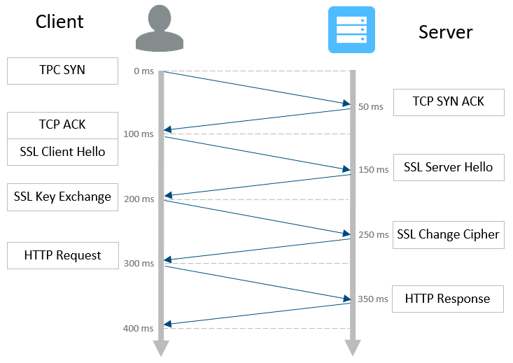
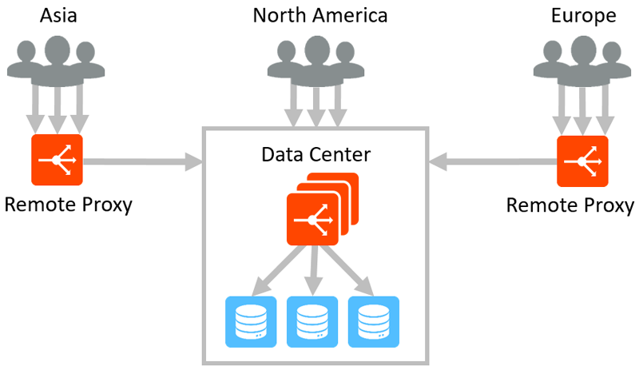
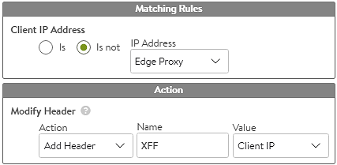

### Edge Proxy Use Case

Provide application proxy services adjacent to clients to improve performance and security.

### Challenge

Typically applications are hosted in one or two data centers with clients connecting over the Internet to interact with the apps. For some applications though, it is imperative to minimize the latency. The best way to do this is to move the applications closer to the clients. Since the databases that underpin the apps must remain in the primary data centers, options are somewhat limited.

### Solution

The applications remain unchanged, residing in the primary data centers.  Deploy application proxies close to where the clients reside.  The forward proxies have minimal latency between the clients, which significantly accelerates connection establishment and data transfer.  Features such as TCP and HTTP fully proxy, SSL termination, caching, compression, and security white/black listing enable better performance for clients and better, distributed security for the applications.  In the example latency diagram, with 100 ms of latency, it will take at least 400 ms for a client to receive the first html file.  By moving content closer to the client with an edge proxy, if the RTT is 30 ms, the first html file will be received within 120 ms.  The time delta grows significantly as additional and larger objects are requested, which require further TCP ACKs and more round trips.

**Use Case 1:**  This use case is relevant for dynamic surges in client demand.  For instance, a temporary event may draw numerous clients to a geographic area, such as a conference or sporting event such as the Olympics.  A temporary data center can be spun up quickly, with a couple of Avi Service Engines provisioned on virtual infrastructure in a public cloud.  After the event, the edge proxies may be easily deprovisioned.  The primary intent in this variation is acceleration of client experience.

**Use Case 2:**  Another variation is for static clients that will regularly access applications.  Since these clients are known and trusted, such as remote offices, a proxy can be installed on their premise.  When they access the application, their request is routed through the local proxy, which provides an initial authentication prior to sending client requests through an encrypted tunnel back to the central data center via an SD-WAN.  The primary intent of this variation is security, with acceleration a secondary benefit.

Alternatives

For acceleration of the applications, content delivery networks (CDNs) are the most common alternative.  However they generally require SSL certificates, which is a non-starter for the financial industry.  They often have significant long term costs.

For the security use case, each connecting client may be configured with a VPN or given a dedicated WAN link.

### Architecture

The architecture of the existing data centers remain the same.  For use case 1, a new data center is brought online.  This is most often a public cloud such as AWS or GCP.  Two new Service Engines are provisioned to provide proxy services.  These SEs are managed by the existing Controllers in the primary data center.  Each edge proxy is separated as a unique cloud in the Controller.

**Virtual Service:**  A new virtual service is created for each application to be proxied through the edge proxies.  These virtual services can be configured for SSL termination, HTTP caching, access control lists, client authentication, custom DataScripts or any other feature that might normally be used.

**Pool:**  The proxy virtual services are configured with a pool that contains the virtual service IP address from the primary and secondary data centers.  Using priority load balancing, traffic is sent to the primary data center, or to the secondary when the primary is down or inaccessible.  If multiple active data centers may be used, then fastest load balancing algorithm may be preferable.

**DC to DC Traffic**:  Requests forwarded from the edge proxies to the data center virtual services should always be secure and encrypted.  Within the proxy VS pool, enable server-side SSL to ensure wire to wire encryption.

**Object reuse:**  Objects such as SSL certificates can be used by any cloud.  So updating an SSL cert (or similar shared object) will update all edge proxies that are using the object.

**HTTP Compression:**  If compression is desired, it should be disabled on the edge proxies and enabled on the data center virtual service.  This way the compression is only performed once.  Once content is compressed at the data center, the compressed content will be forwarded back to the clients connected to the edge proxies.

**X-Forwarded-For:**  If application servers require the client's IP addresses, the edge proxies should be configured (via the HTTP application profile) to insert XFF headers.  If the VS at the primary data center also has XFF header insertion enabled, it will embed the edge proxy's SNAT IP address.  To resolve this, the primary data center VS should use a DataScript or HTTP Request policy to selectively add the XFF header based on the source address.  If the source is an edge proxy and the XFF already exists, don't add an XFF.  If the source is not an edge proxy, add an XFF.  For large numbers edge proxies, put their IP addresses in an IP Group to keep the policy or DataScript cleaner as shown in the illustration.

**Attracting Traffic**:  On the public Internet, traffic is attracted to the edge proxies via DNS.  This can be done via a global load balancer using a dynamic algorithm such as geographic location or IP Anycast.  In private environments such as for use case 2, DNS may be used, though often static routing may be required instead.

**Return Traffic:**  By default, Avi Service Engines will SNAT traffic at the edge proxy and again at the data center.  Responses will flow through the same path.  For use case 2, an SD-WAN may be used to create connections from the central data center to each remote location,  Vantage will send all responses back to the MAC address which sent the request to the Service Engine.
