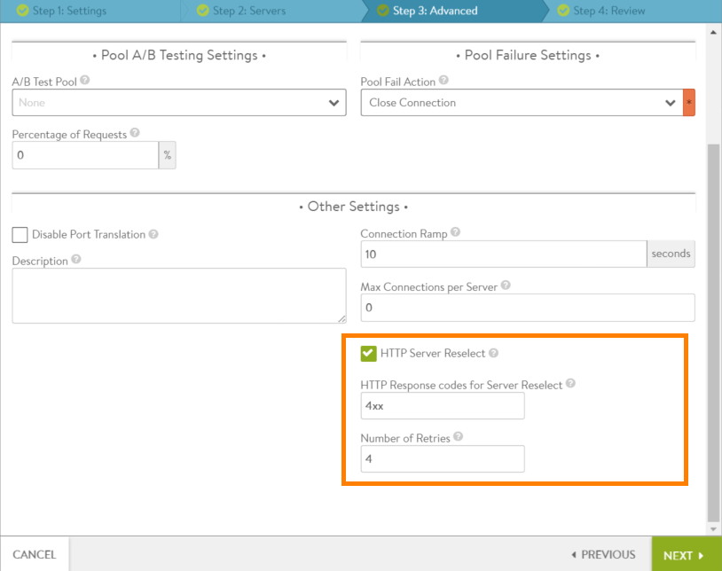

Avi Vantage 16.2 and later can be configured to retry an HTTP request that results in a 4*xx* or 5*xx* error code from the back-end server. Normally, Vantage forwards these error messages back to the client.

## Configurable Options

HTTP server reselect is disabled by default. The feature can be configured within individual pools. When enabling the HTTP server reselect feature, the error codes that trigger the feature will need to be specified. The other options have defaults but can be changed if needed.

### Error Codes

The pool configuration specifies the HTTP error response codes that will result in server reselection. The error codes can be specified in any of the following ways:

* Explicit code number(s): Enter one or more individual error codes (for example, 404).
* Range of codes: Enter a range within 400-499 or 500-599 (for example, 501-503).
* Entire block of codes: 4*xx* or 5*xx* (for example, 4*xx*). 

### Maximum Retries

The default maximum retry setting is 4. Following the first error response, Vantage will resend the request to the pool up to 4 more times, for a total of 5 attempts. Each retry is sent to a different server, and each server can receive only one attempt.

If the setting for maximum retries is higher than the number of enabled and up servers within the pool, each of those servers still receives only one attempt. For example, if maximum retries is set to 4 but the pool has only 3 servers, the maximum number of retries is actually 2. The initial attempt that fails goes to one of the servers, leaving 2 more servers to try. If the second server also sends a 4*xx* or 5*xx* error code in response to the request, the request is sent to the last server in the pool. If the last server also sends a 4*xx* or 5*xx*, the response from the server is sent back to the client.

### Server Reselection for Idempotent Requests

Currently, HTTP server reselect applies only to idempotent request methods, since a given request of this type always has the same result, even if an identical request is received multiple times by a server. Multiple identical requests of non-idempotent request methods (POST, LOCK, PATCH, and CONNECT) are by definition not guaranteed to have the same effect as a single such request. For this reason, HTTP server reselect is not performed for these request methods.

## Configuring HTTP Server Reselect

HTTP server reselect can be enabled on the Advanced tab of the pool configuration.
<ol> 
 <li>Navigate to Applications &gt; Pools.</li> 
 <li>Open the configuration popup for the pool: 
  <ul> 
   <li>If enabling the feature in an existing pool, click the edit icon next to the pool name.</li> 
   <li>If creating a new pool, click Create, then click on the cloud name and click Next. Enter a name for the pool on the Settings tab, then select the servers on the Servers tab.</li> 
  </ul> </li> 
 <li>Select Advanced to display the tab of advanced options.</li> 
 <li>Select (check) the HTTP Server Reselect checkbox.</li> 
 <li>Enter the error response codes that will trigger server reselection.</li> 
 <li>Save the changes: 
  <ul> 
   <li>If creating a new pool, click Next to review the settings, then click Save.</li> 
   <li>If editing an existing pool, click Save.</li> 
  </ul> </li> 
</ol> 

The following example enables HTTP server reselection for all 4*xx* error codes:

Based on this configuration, if a server in this pool responds to a client request with a 4*xx* error code, Vantage retries the request by sending it to another server in the pool. Vantage will retry the request up to 4 times (to 4 different servers).
