This article provides the steps for installing Avi Vantage on Cisco's CSP-2100.  Vantage may be deployed on CSP-2100 in either no orchestrator mode or Linux server cloud mode.  This article covers both. For documentation on installing Avi Vantage on Linux servers using non-CSP-2100 hardware, 
<a href="/docs/16.2.2/installation-guides/installing-avi-vantage-for-a-linux-server-cloud">click here</a> instead.

## Topology

The topology shown below consists of an Avi Controller and some Avi Service Engines (SEs) installed in a Linux server cloud and connected to the back-end server pool by a CSP-2100 router. To leverage the DPDK capabilities of the physical NICs, the SEs are connected to the enp7s0fx pNICs of the CSP-2100 in passthrough (pcie) mode.

<a href="img/Installing-AVI-Vantage-for-CSP-2100-1.png">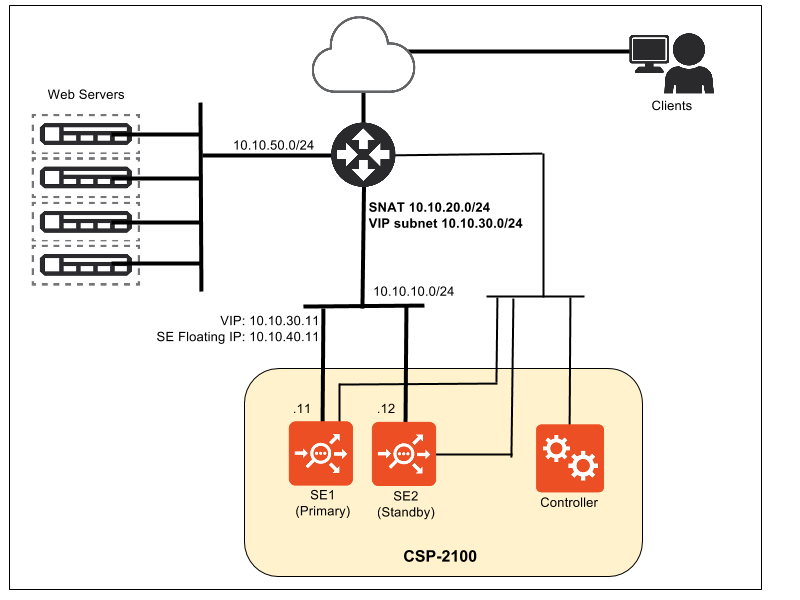</a>

## Networking Interfaces for CSP-2100

The following table shows the names of physical interfaces (pNICs) on the CSP-2100, along with their supported speeds.

<table class="table table table-bordered table-hover">  
<tbody>          
<tr>   
<th>Name
</th>
<th>Speed
</th>
</tr>
<tr>   
<td>enp1s0f0</td>
<td>1 Gbps</td>
</tr>
<tr>   
<td>enp1s0f1</td>
<td>1 Gbps</td>
</tr>
<tr>   
<td>enp4s0f0</td>
<td>1 Gbp</td>
</tr>
<tr>   
<td>enp4s0f1</td>
<td>1 Gbps</td>
</tr>
<tr>   
<td>enp4s0f2</td>
<td>1 Gbps</td>
</tr>
<tr>   
<td>enp4s0f3</td>
<td>1 Gbps</td>
</tr>
<tr>   
<td>enp7s0f0</td>
<td>10 Gbps</td>
</tr>
<tr>   
<td>enp7s0f1</td>
<td>10 Gbps</td>
</tr>
</tbody>
</table> 

 

The pNIC named enp1s0f0 can be connected to the management network. This provides access to the CSP dashboard. The 10-Gbps interfaces (enp7s0f0 and enp7s0f1) can be used as data NICs and must be connected to the corresponding data VLANs.

## Deploying the Avi Controller

### Upload the Avi Controller Image

<ol> 
 <li> Log on to the CSP dashboard using a browser.</li> 
 <li> Navigate to Configuration &gt; Repository.  <a href="img/linux-server-cloud-csp2100.png">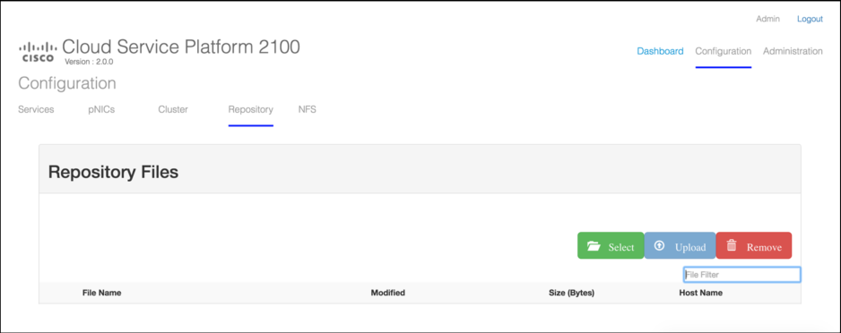</a></li> 
 <li>Click on Select, and browse to and select the Avi Controller qcow2 image obtained from the <a href="/docs/16.2.2/access-to-avi-portal">avinetworks.com/portal</a> site. </li> 
 <li>Click Upload.</li> 
</ol> 

### Deploy the Avi Controller

This section describes how to deploy Avi Controller using both the CSP UI and the REST API.

### Deploy Using CSP UI

Use the following steps to deploy the Avi Controller using the CSP UI:
<ol> 
 <li>Navigate to Configuration &gt; Services.  <a href="img/linux-server-cloud-csp2100-2.png">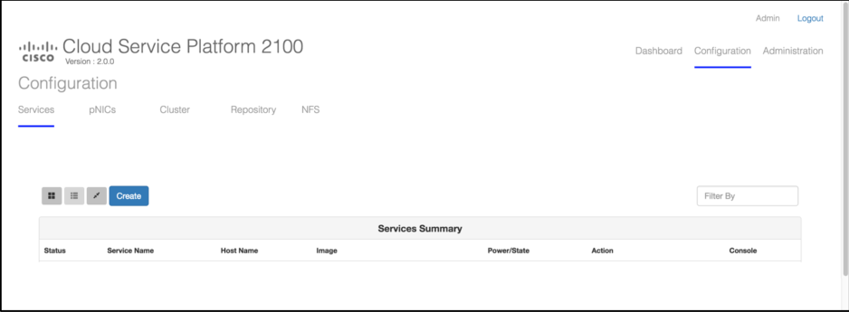</a></li> 
 <li>Click on Create.</li> 
 <li>Enter “Controller” in the Service Name field and press enter.</li> 
 <li>Click on Target Host Name and select the host from the list.</li> 
 <li>Click on Image Name and select the controller.qcow2 image from the list.</li> 
 <li>Click on vNIC &gt; vNIC1 &gt; External Network &gt; enp1s0f0.  <a href="img/linux-server-cloud-csp2100-3.png">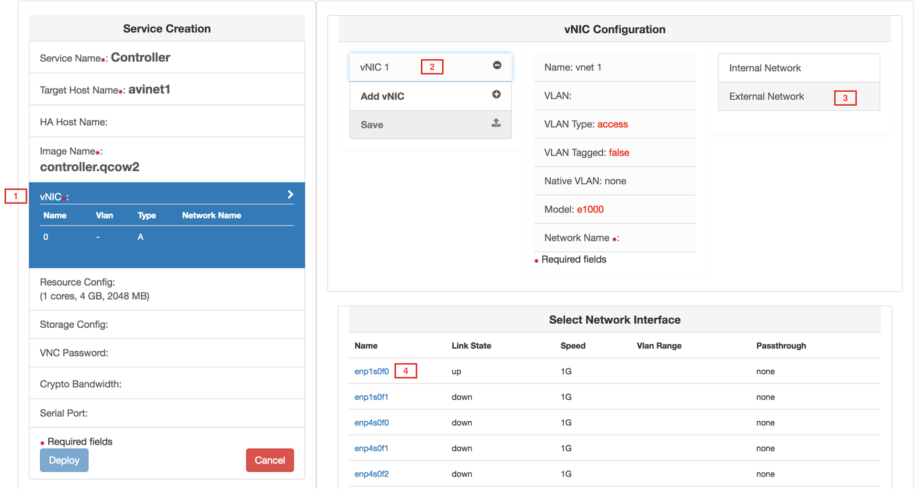</a>Note: If the management network is on a  different VLAN, specify the VLAN number in the VLAN field, and click on VLAN Tagged to enable tagging. </li> 
 <li>Click on Resource Config and set the resource allocations. The minimum requirement is 4 cores, 12 GB of memory,  and 64 GB of disk. </li> 
 <li><em>(optional) </em>Click on VNC Password and specify a password for console login using VNC.</li> 
 <li>Click on Deploy.</li> 
</ol> 

### Deploy Using REST API

CSP uses basic authentication for the REST API. Use the following
**curl** command to create the Controller service:

<pre><code class="language-lua">curl -X POST --user csp-username:csp-password -H "Content-Type: application/json" -d '{
    "service":{
      "disk_size": "70",
      "name": "Controller",
      "power": "on",
      "iso_name": "controller.qcow2",
      "numcpu": 4,
      "memory": 12288,
      "vnics": {
        "vnic": [
                {
                    "nic":"0",
                    "type":"access",
                    "tagged":"false",
                    "network_name":"enp1s0f0"
                }
        ]
      }
    }
}' "https:///api/running/services/"</code></pre>  

### Controller IP Address

Use the steps in either of the following sections to assign a management IP address to the Avi Controller.

### DHCP Addressing

If DHCP is enabled on the management network, the Avi Controller should get an IP address upon power up. After the Avi Controller is deployed, log in to the console to get the IP address of the Avi Controller:
<ol> 
 <li>Click on the VNC icon to launch the console.  <a href="img/linux-server-cloud-csp2100-4.png">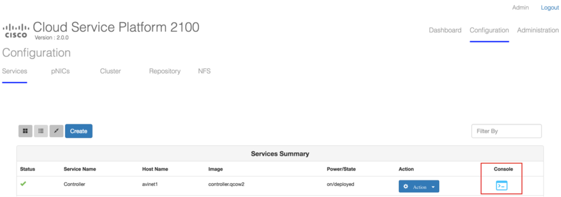</a></li> 
 <li>Wait for the Avi Controller to completely boot up and present the login prompt.</li> 
 <li>Log in using the default credentials (admin/admin).</li> 
 <li>Run the <strong>ifconfig</strong> command to find the IP address for eth0.</li> 
</ol> 

### Static Addressing

If DHCP is not configured on the management network, configure a static IP address for the Avi Controller:
<ol class="md-ignore"> 
 <li>From the console, log in using the default credentials (admin/admin).</li> 
 <li>Edit the /etc/network/interfaces file to read as shown below. (Make sure to use the IP addresses that apply to  your deployment. These addresses are only an example.)  
  <!-- Crayon Syntax Highlighter v2.7.1 --> <pre><code class="language-lua">sudo vi /etc/network/interfaces

auto lo
iface lo inet loopback

auto eth0
iface eth0 inet static
            address 10.128.2.20
	netmask 255.255.255.0
	gateway 10.128.2.1
            netserver 8.8.8.8</code></pre> 
  <!-- [Format Time: 0.0020 seconds] --> </li> 
 <li>Save and exit.</li> 
 <li>Reboot the Avi Controller.</li> 
</ol> 

## Initial Setup of Avi Controller for No Orchestrator

Use a browser to navigate to the Avi Controller IP address, and follow the below steps to perform initial setup:
<ol> 
 <li>Configure the Administrator account and click on Create Account.<a href="img/Screen-Shot-2016-08-05-at-4.23.39-PM.png">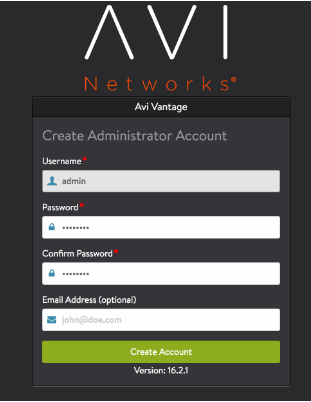</a></li> 
 <li>Configure the DNS and NTP settings and click "Next."<a href="img/Screen-Shot-2016-08-05-at-4.29.04-PM.png">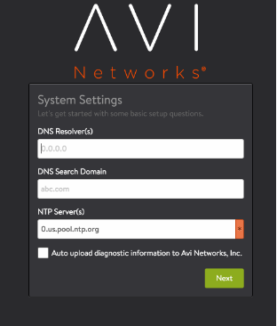</a></li> 
 <li>Select "No Orchestrator" for the cloud type and click "Next."<a href="img/Screen-Shot-2016-08-05-at-4.30.37-PM.png">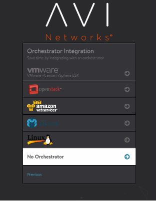</a></li> 
 <li>Download the SE qcow2 image from the Controller. Vantage will spin up Avi SEs using this image. Note: To establish the correct parent-child relationship that Controllers and their SEs have, an Avi SE must be spun up using the SE qcow2 image downloaded from the particular Avi Controller to which it is to connect.<a href="img/Screen-Shot-2016-08-05-at-4.34.11-PM.png">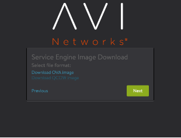</a></li> 
 <li>To create an Avi SE on Cisco CSP, we need to configure a ‘day0’ yml file. Day0 files are used to insert configuration data into the Avi SE. That data includes details such as the SE management IP, Controller IP, token the SE uses to authenticate with the Avi Controller, etc.    5a. Generate a token for the SE from the Avi Controller by navigating to Infrastructure &gt; Clouds and clicking on the ‘key’ icon. Note : A token needs to be generated<em> per Avi SE</em>. Since the token expires one hour from the time it is generated, an Avi SE needs to be created within 1 hour of token generation.    <a href="img/Screen-Shot-2016-08-05-at-4.48.43-PM.png">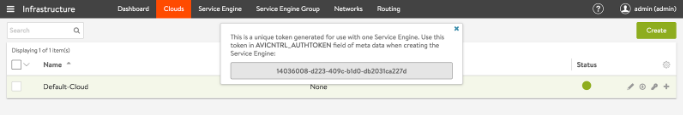  </a>5b. Use the token generated to create the Avi SE ‘day0’ file. The ‘day0’ file needs to be a valid  ‘yml’ file whose name starts with ‘avi_meta_data’. Sample configuration of the SE day0 file is shown here. Details  include the management IP of the Avi SE and netmask, Avi SE management gateway, Avi Controller IP and the token that  we generated in step 5a from the Avi Controller.  <a href="img/Screen-Shot-2016-08-05-at-5.13.45-PM.png">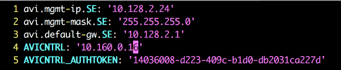</a>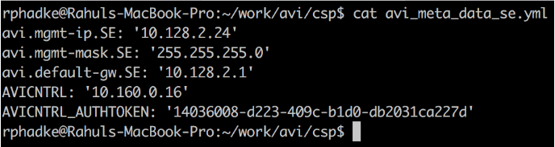</li> 
 <li>Log into the CSP dashboard and navigate to Configuration &gt; Repository to upload the Avi SE qcow2 image and the Avi SE day0 file. </li> 
 <li>Configure an Avi SE service :7a. Enter the name of the Avi SE service in the ‘Service Name’ field and hit enter. Choose the server on which the SE would be deployed in the ‘Target Host Name’ field and hit enter.<a href="img/Screen-Shot-2016-08-05-at-5.17.11-PM.png">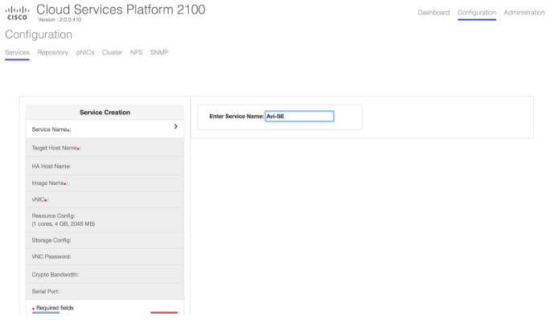  </a>7b. In the ‘Image Name’ section, choose the Avi SE qcow2 image and the corresponding Avi SE day0 yml file.<a href="img/Screen-Shot-2016-08-05-at-5.19.23-PM.png">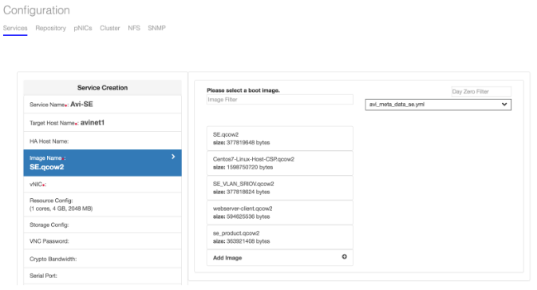</a>  7c. Configure SE interfaces. Note: This installation guide deploys an Avi SE with 3 interfaces. One of the interfaces would be used for Avi SE management and the other two interfaces would be used for servicing the traffic. The Avi SE management interface needs to have connectivity to the Avi Controller. The Avi SE management interface would be configured with the information contained in the Avi SE ‘day0’ file.  

 
 7ci. From the ‘vNIC’ section click on ‘vNIC 1’ and then click on ‘Network Name &gt; External Network’ and then choose the management network (enp1s0f0 in this example). Click on ‘Model and choose ‘virtio.’<a href="img/Screen-Shot-2016-08-05-at-5.21.41-PM.png">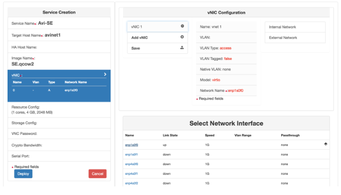  </a>
 
 7cii. Configure an Avi SE data interface in passthrough SR-IOV mode with VLAN. From the ‘vNIC’ section click on ‘Add  vNIC.’ Next, click on ‘vNIC 2,’ and then click on ‘Network Name &gt; External Network.’ Finally, choose a  passthrough SR-IOV interface (enp7s0f1 in this example). Note : Avi supports a VLAN configured on a SR-IOV Virtual  Function. To add a VLAN to the SR-IOV Virtual Function, click on ‘VLAN’ and enter the VLAN ID.  <a href="img/Screen-Shot-2016-08-05-at-5.25.14-PM.png">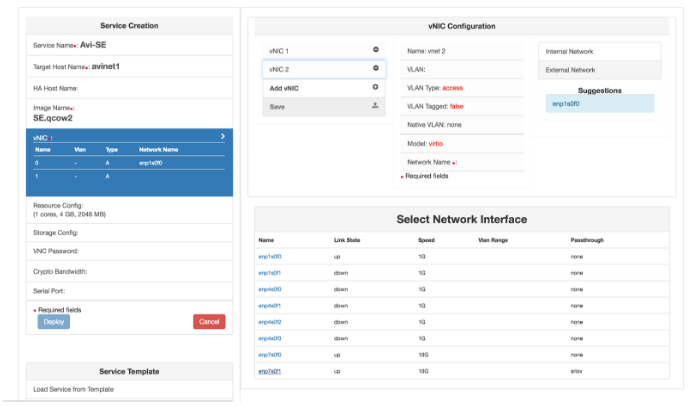</a>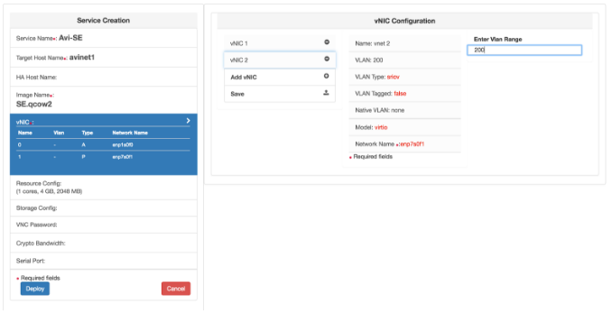
 
 7ciii. Configure an Avi SE data interface in non-passthrough mode with ‘virtio’ ( ‘e1000’ is also supported ). From  the ‘vNIC’ section click on ‘Add vNIC’ and then click on ‘vNIC 3’ and then click on ‘Network Name &gt; External  Network’ and then choose a non passthrough interface (enp7s0f0 in this example)  <a href="img/Screen-Shot-2016-08-05-at-5.28.57-PM.png">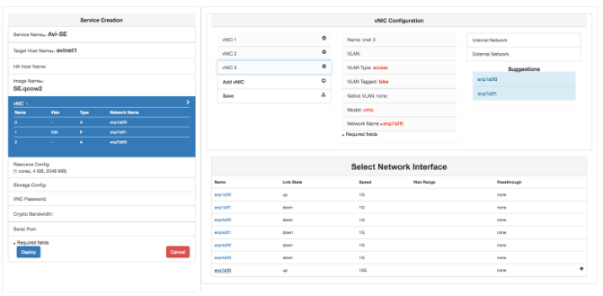</a>
</li> 
 <li>From the ‘Resource Config’ section, enter the SE memory in MB, number of CPUs and the disk size in GB and click deploy. An Avi SE service should be deployed on the CSP server. The Avi SE will boot up using the Avi SE qcow2 image that was uploaded, configure itself with the metadata inserted through the Avi SE ‘day0’ yml file, and finally connect to the Avi Controller specified in the Avi SE ‘day0’ yml file.<a href="img/Screen-Shot-2016-08-05-at-5.31.34-PM.png">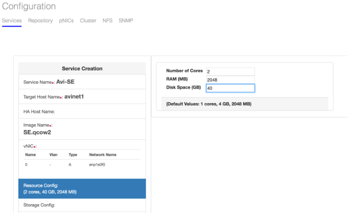</a>  </li> 
 <li>Log in to the Avi Controller and navigate to the ‘Infrastructure’ page. From the Dashboard click on the Avi SE once it is up, and assign static IPs to the data interfaces. This completes the deployment of an Avi SE.    <a href="img/Screen-Shot-2016-08-03-at-6.35.21-PM.png">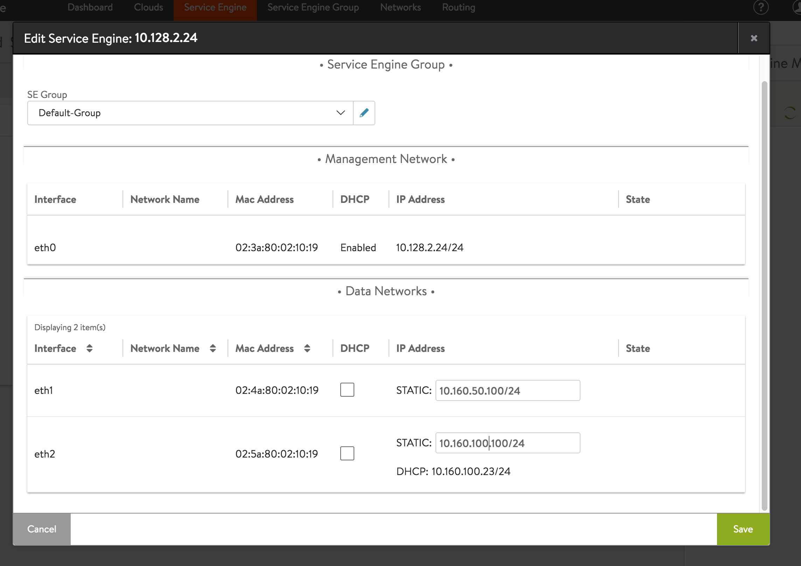  </a><a href="img/Screen-Shot-2016-08-05-at-5.35.27-PM.png">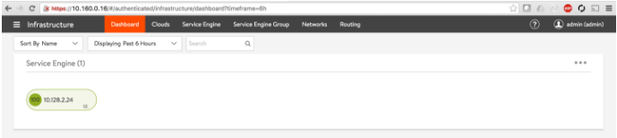</a> <a href="img/Screen-Shot-2016-08-05-at-5.36.26-PM.png">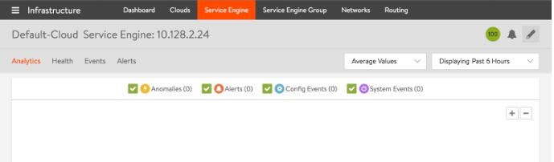</a></li> 
</ol> 

 

 

## Initial Setup of Avi Controller for Linux Cloud

Use a browser to navigate to the Avi Controller IP address, and follow the below steps to perform initial setup:
<ol> 
 <li>Configure an administrator password and enter DNS information: 
  
 
   
 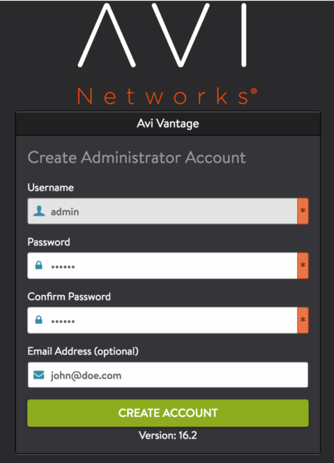 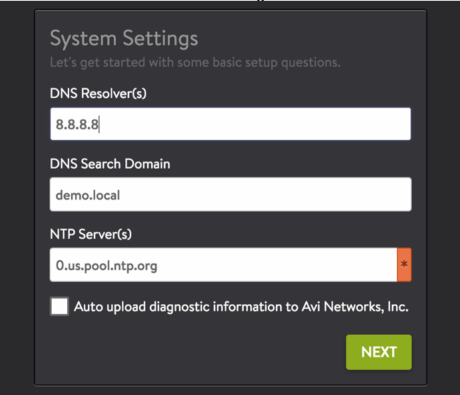
 
   
 
 
  
 </li> 
 <li>Choose Linux as the infrastructure type:  </li> 
 <li>On the Tenant Settings wizard page, select No.</li> 
</ol> 

## Deploy Linux Host

This section walks through the workflow for deploying a Linux host on CSP, with an interface connected in passthrough mode. The Avi Service Engine will be installed on top of Linux.
<ol> 
 <li>Upload the Linux ISO image from the local drive to the CSP repository.</li> 
 <li>Navigate to Configuration &gt; Services.  <a href="img/linux-server-cloud-csp2100-5.png">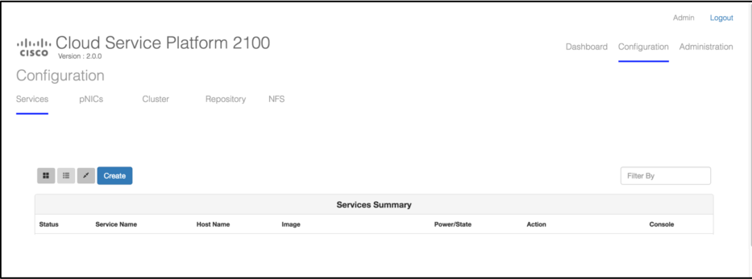</a></li> 
 <li>Click on Create.</li> 
 <li>Enter “SE1” in the Service Name field and press Enter.</li> 
 <li>Click on Target Host Name and select the host from the list.</li> 
 <li>Click on Image Name and select the RHEL ISO image from the list.</li> 
 <li>Click on vNIC &gt; vNIC1 and select External Network &gt; enp7s0f0, VLAN Type &gt; Passthrough &gt; PCIE. (This is  a data vNIC.) </li> 
 <li>Click Add vNic &gt; vNIC2 and select External Network &gt; enp1s0f0. (This is the management vNIC.) Click on Mode  to change it to virtio. </li> 
 <li>Under Resource Config, set the number of cores to 4, set the RAM to 12288 MB, and set the disk space to 30 GB. </li> 
 <li>Click on Deploy.</li> 
 <li>The final configuration should look something like this:  <a href="img/linux-server-cloud-csp2100-6.png">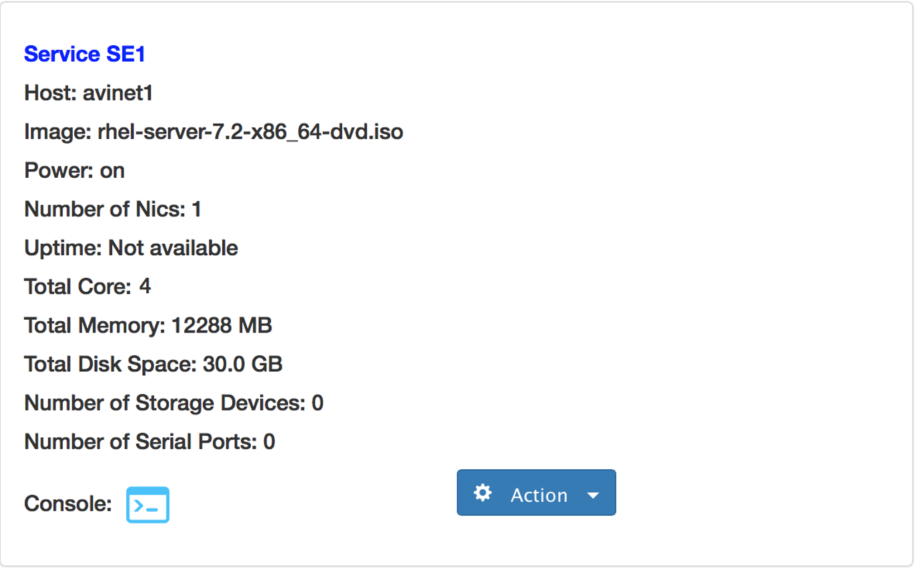 </a><a href="img/linux-server-cloud-csp2100-7.png">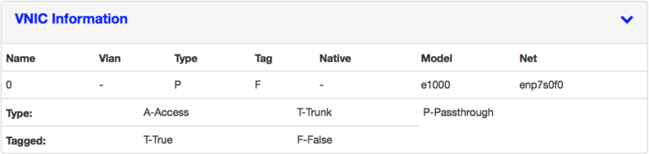</a></li> 
 <li>Open the console and walk through the Linux installation wizard.</li> 
</ol> 

 

## Linux Host Static IP Configuration

<ol class="md-ignore"> 
 <li>Login to the Linux host from the console (credentials root/default).</li> 
 <li>List the interfaces.  
  <!-- Crayon Syntax Highlighter v2.7.1 --> <pre><code class="language-lua">[root@centos-host ~]# ip a</code></pre> 
  <!-- [Format Time: 0.0011 seconds] --> eth0 is the management interface and ens3 is the data interface. </li> 
 <li>Edit/create the config file for the management interface to read as below:  
  <!-- Crayon Syntax Highlighter v2.7.1 --> <pre><code class="language-lua">[root@centos-host ~]# sudo vi /etc/sysconfig/network-scripts/ifcfg-eth0

DEVICE="eth0"
BOOTPROTO="static"
ONBOOT="yes"
TYPE="Ethernet"
USERCTL="yes"
PEERDNS="yes"
IPV6INIT="no"
PERSISTENT_DHCLIENT="1"
IPADDR=10.128.2.18
NETMASK=255.255.255.0
GATEWAY=10.128.2.1</code></pre> 
  <!-- [Format Time: 0.0035 seconds] --> In above example, 10.128.2.18 is the management IP and 10.128.2.1 is the gateway IP. </li> 
 <li>Edit/create the config file for the data interface to read as below:  
  <!-- Crayon Syntax Highlighter v2.7.1 --> <pre><code class="language-lua">[root@centos-host ~]# sudo vi /etc/sysconfig/network-scripts/ifcfg-ens3

DEVICE="ens3"
BOOTPROTO="static"
ONBOOT="yes"
TYPE="Ethernet"
USERCTL="yes"
PEERDNS="yes"
IPV6INIT="no"
PERSISTENT_DHCLIENT="1"
IPADDR=10.128.12.62
NETMASK=255.255.255.0</code></pre> 
  <!-- [Format Time: 0.0032 seconds] --> In above example 10.128.12.62 is the data interface IP. Do not configure the gateway IP; this will be configured  from the Controller UI. </li> 
 <li>Restart network for the configuration to take effect. This may take some time.  
  <!-- Crayon Syntax Highlighter v2.7.1 --> <pre><code class="language-lua">[root@centos-host ~]#  sudo systemctl network restart</code></pre> 
  <!-- [Format Time: 0.0011 seconds] --> </li> 
 <li>Check if default gateway is configured correctly. (E.g., 10.128.2.1 is the management default gateway in the below  output.)  
  <!-- Crayon Syntax Highlighter v2.7.1 --> <pre><code class="language-lua">[root@centos-host ~]# routel|grep default

       default         10.128.2.1                                       eth0
       default        unreachable                   kernel              lo unspec
       default        unreachable                   kernel              lo unspec</code></pre> 
  <!-- [Format Time: 0.0036 seconds] --> Note: If the gateway is not configured, restart network again. </li> 
 <li>List the interfaces and check the IPs.  
  <!-- Crayon Syntax Highlighter v2.7.1 --> <pre><code class="language-lua">[root@centos-host ~]# ip a

1: lo: &lt;LOOPBACK,UP,LOWER_UP&gt; mtu 65536 qdisc noqueue state UNKNOWN
   link/loopback 00:00:00:00:00:00 brd 00:00:00:00:00:00
   inet 127.0.0.1/8 scope host lo
      valid_lft forever preferred_lft forever
   inet6 ::1/128 scope host
      valid_lft forever preferred_lft forever
2: eth0: &lt;BROADCAST,MULTICAST,UP,LOWER_UP&gt; mtu 1500 qdisc pfifo_fast state UP qlen 1000
   link/ether 02:4a:80:02:10:4a brd ff:ff:ff:ff:ff:ff
   inet 10.128.2.18/24 brd 10.128.2.255 scope global eth0
      valid_lft forever preferred_lft forever
   inet6 fe80::4a:80ff:fe02:104a/64 scope link
      valid_lft forever preferred_lft forever
3: ens3: &lt;BROADCAST,MULTICAST,UP,LOWER_UP&gt; mtu 1500 qdisc mq state UP qlen 1000
   link/ether 90:e2:ba:ac:12:91 brd ff:ff:ff:ff:ff:ff
   inet 10.128.12.62/24 brd 10.128.12.255 scope global ens3
      valid_lft forever preferred_lft forever
   inet6 fe80::92e2:baff:feac:1291/64 scope link
      valid_lft forever preferred_lft forever
4: docker0: &lt;NO-CARRIER,BROADCAST,MULTICAST,UP&gt; mtu 1500 qdisc noqueue state DOWN
   link/ether 02:42:23:fb:10:cb brd ff:ff:ff:ff:ff:ff
   inet 172.17.0.1/16 scope global docker0
      valid_lft forever preferred_lft forever</code></pre> 
  <!-- [Format Time: 0.0183 seconds] --> </li> 
</ol> 

## Install Docker

Avi Vantage for Linux server cloud is distributed as a Docker image. If Docker is not already installed on the Linux host, use the following steps to install it. Internet access may be required for this step. If deploying onto multiple hosts, repeat the applicable installation procedure on each host.

### Centos 7

<ol class="md-ignore"> 
 <li>Log in to the Linux host.</li> 
 <li>Update yum packages:  <pre crayon="false" class="command-line language-bash" data-prompt=": >"><code>sudo yum update -y</code></pre> </li> 
 <li>Add the yum repo:  
  <!-- Crayon Syntax Highlighter v2.7.1 --> <pre><code class="language-lua">sudo tee /etc/yum.repos.d/docker.repo &lt;&lt;-'EOF'
[dockerrepo]
name=Docker Repository
baseurl=https://yum.dockerproject.org/repo/main/centos/$releasever/
enabled=1
gpgcheck=1
gpgkey=https://yum.dockerproject.org/gpg
EOF</code></pre> 
  <!-- [Format Time: 0.0023 seconds] --> </li> 
 <li>Install Docker:  <pre crayon="false" class="command-line language-bash" data-prompt=": >"><code>sudo yum install -y docker-engine</code></pre> </li> 
 <li>Start Docker:  <pre crayon="false" class="command-line language-bash" data-prompt=": >"><code>sudo service docker start</code></pre> </li> 
 <li>To start Docker on boot, run the following command:  <pre crayon="false" class="command-line language-bash" data-prompt=": >"><code>sudo systemctl enable docker</code></pre> </li> 
 <li>Enter the <strong>docker version</strong> command to verify the Docker version that is installed and running.  
  <!-- Crayon Syntax Highlighter v2.7.1 --> <pre><code class="language-lua">docker version
             Client:
 Version:      1.11.1
 API version:  1.23
 Go version:   go1.5.4
 Git commit:   5604cbe
 Built:        Wed Apr 27 00:34:42 2016
 OS/Arch:      linux/amd64

Server:
 Version:      1.11.1
 API version:  1.23
 Go version:   go1.5.4
 Git commit:   5604cbe
 Built:        Wed Apr 27 00:34:42 2016
 OS/Arch:      linux/amd64</code></pre> 
  <!-- [Format Time: 0.0047 seconds] --> </li> 
</ol> 

For the latest Docker installation instructions, please refer to <a href="https://docs.docker.com/engine/installation/linux/centos/">https://docs.docker.com/engine/installation/linux/centos/</a>.

### Red Hat Enterprise Linux 7

<ol> 
 <li>Register the Linux server with Red Hat:  <pre crayon="false" class="command-line language-bash" data-prompt=": >"><code>subscription-manager register</code></pre> </li> 
 <li>Enable the repository for extra services:  <pre crayon="false" class="command-line language-bash" data-prompt=": >"><code>subscription-manager –enable=rhel-7-server-extras-rpms</code></pre> </li> 
 <li>Install updates to Red Hat:  <pre crayon="false" class="command-line language-bash" data-prompt=": >"><code>sudo yum update</code></pre> </li> 
 <li>Run the following command to add Docker to the yum repository:  <pre crayon="false" class="command-line language-bash" data-prompt=": >"><code>cat &gt;/etc/um.respos.d/docker.repo &lt;</code></pre> </li> 
 <li>Install Docker:  <pre crayon="false" class="command-line language-bash" data-prompt=": >"><code>sudo yum install -y docker-engine</code></pre> </li> 
 <li>Start Docker services:  <pre crayon="false" class="command-line language-bash" data-prompt=": >"><code>sudo systemctl start docker</code></pre> </li> 
 <li>Enable Docker services:  <pre crayon="false" class="command-line language-bash" data-prompt=": >"><code>sudo systemctl enable docker</code></pre> </li> 
 <li>Enter the <strong>docker version</strong> command to verify the Docker version that is installed and running. In  this example, the version is 1.8.1:  
  <!-- Crayon Syntax Highlighter v2.7.1 --> <pre><code class="language-lua">docker version
             Client:
             Version:      1.8.1
             API version:  1.20
             Go version:   go1.4.2
             Git commit:   d12ea79
             Built:        Thu Aug 13 02:35:49 UTC 2015
             OS/Arch:      linux/amd64
             Server:
             Version:      1.8.1
             API version:  1.20</code></pre> 
  <!-- [Format Time: 0.0032 seconds] --> </li> 
</ol> 

Note: The latest installation instructions can be found at <a href="https://docs.docker.com/v1.8/installation/rhel/">https://docs.docker.com/v1.8/installation/rhel/</a>.

## Linux Cloud Configuration

This section walks through the workflow to create an SSH user to access the Linux VMs on which the SE image will be created, and the procedure for adding the SEs to the Linux cloud.

### Create SSH User

If an SSH user was not created during initial Avi Controller configuration, use the following steps to create one:
<ol> 
 <li>On the Avi Controller, navigate to Administration &gt; Settings &gt; SSH Key Settings and click Create.  <a href="img/linux-server-cloud-csp2100-ctlr2.png">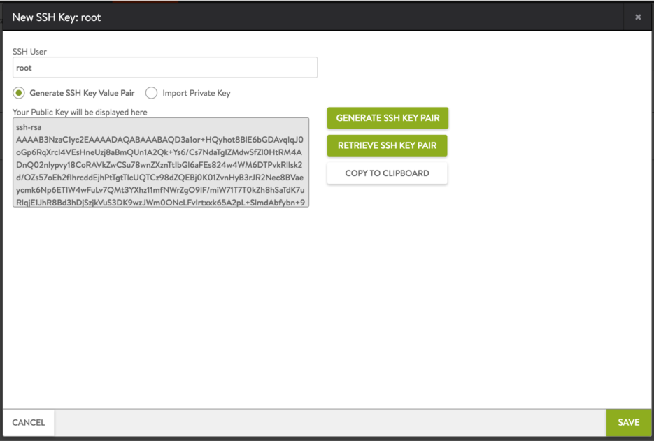  </a></li> 
 <li>In the SSH User field, enter "root" and click Generate SSH Key Pair. This step must be done via the root  account. </li> 
 <li>Click on Copy To Clipboard and save the copied key to a text file.</li> 
 <li>Click Save.</li> 
</ol> 

Note: Alternatively, you can download the key as a text file, after saving the user configuration. Click the download icon to download the file.
<a href="img/linux-server-cloud-csp2100-ctlr3.png">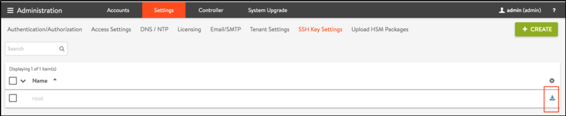</a>

### Create Linux Server Cloud

<ol> 
 <li>Navigate to Infrastructure &gt; Clouds.</li> 
 <li>Edit Default-Cloud.</li> 
 <li>Select Linux as the cloud type and click Next.  <a href="img/linux-server-cloud-csp2100-ctlr4.png">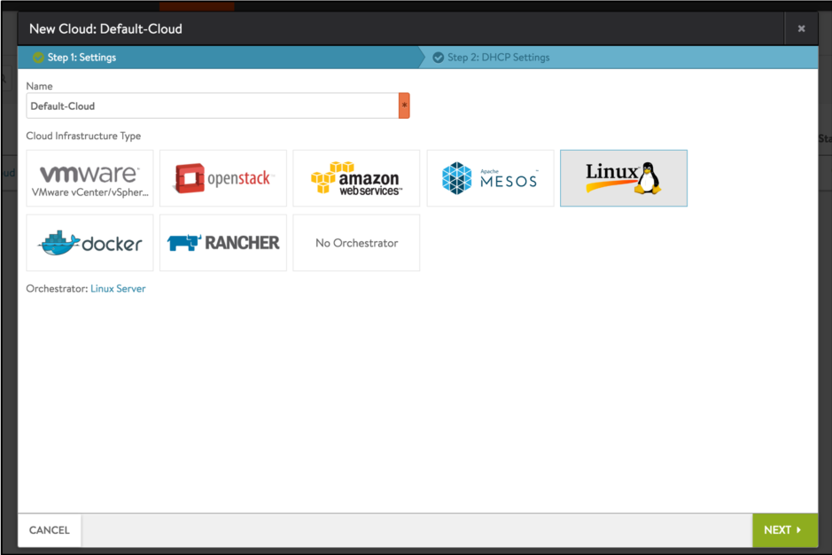  </a></li> 
 <li>From the pull-down list, select the previously created user (root) and click Complete.  <a href="img/linux-server-cloud-csp2100-ctlr5.png">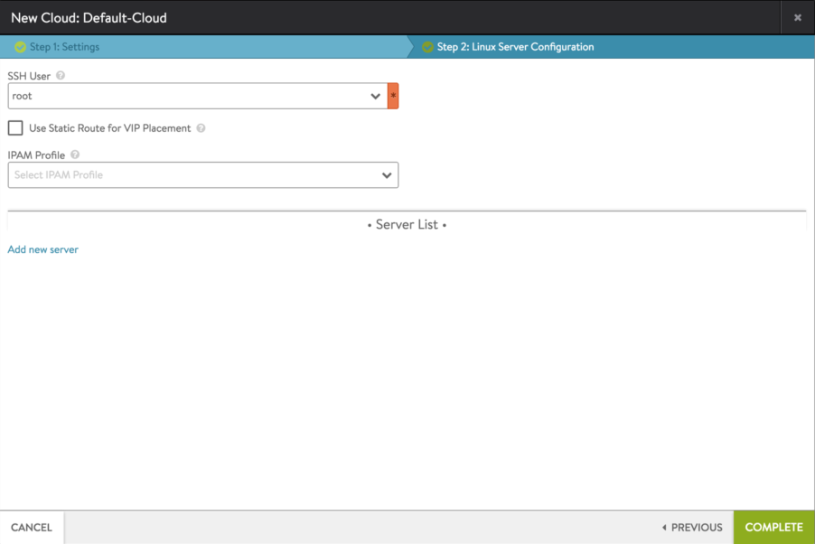  </a></li> 
 <li>The status icon becomes yellow upon completion of the above configuration. It may take about 5-10 minutes for the  Avi Controller to create the Avi SE image. Once the cloud is ready, the status icon turns green.  <a href="img/linux-server-cloud-csp2100-ctlr6.png">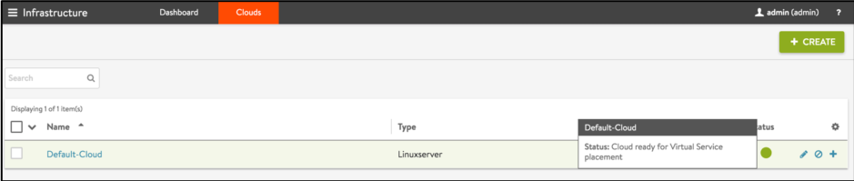</a></li> 
</ol> 

### Linux Public Key Management

The public key created in the section above needs to be copied to each Linux host so that the Avi Controller can have passwordless access to the Linux hosts. This is required by the Avi Controller to log onto the Linux host, transfer the SE image onto the host, and start the SE within the Docker container.
<ol> 
 <li>Log into the Linux host as root.</li> 
 <li>Create the .ssh directory and change to it.  <pre crayon="false" class="command-line language-bash" data-prompt=": >"><code>mkdir .ssh &amp;&amp; chmod 700 .ssh &amp;&amp; cd .ssh</code></pre> </li> 
 <li>Add the Avi Controller’s public key to the authorized key file by pasting the key obtained in the above section  into the following command line:  <pre crayon="false" class="command-line language-bash" data-prompt=": >"><code>echo "paste-key-string-copied-from-Controller" &gt;
    ./authorized_keys</code></pre> </li> 
 <li>Set the proper permissions for the key file:  <pre crayon="false" class="command-line language-bash" data-prompt=": >"><code>chmod 644 authorized_keys</code></pre> </li> 
</ol> 

Repeat these steps on each Linux host.

### Adding an SE to the Linux Cloud

<ol> 
 <li>Navigate to Infrastructure &gt; Clouds.</li> 
 <li>Edit the Default-Cloud created in the section above.</li> 
 <li>Click on Add New Server and enter the management IP address of the Linux host.</li> 
 <li>Select DPDK (set to Yes).</li> 
 <li>Enter the number of cores (2) and amount of memory (4, for 4 GB).  <a href="img/linux-server-cloud-csp2100-ctlr7.png">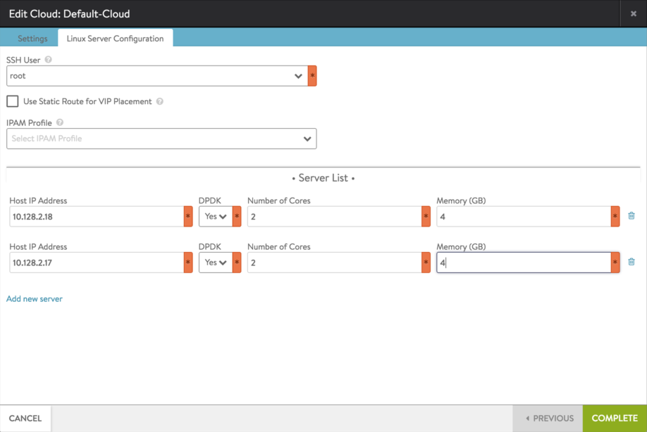  </a></li> 
 <li>Repeat for each additional Linux host.</li> 
 <li>Click Complete.</li> 
</ol> 

### Verifying SE Creation

<ol> 
 <li>In the Avi Controller web interface, navigate to Infrastructure &gt; Clouds.</li> 
 <li>Click on the row for Default-Cloud. Information for each of the Linux hosts in the cloud is displayed.  <a href="img/linux-server-cloud-csp2100-ctlr8.png">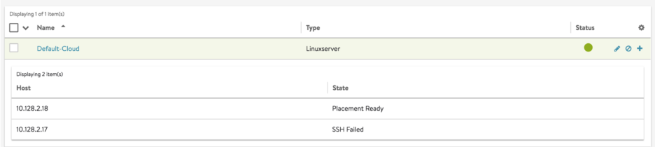  </a></li> 
</ol> 

The state information for host 10.128.2.17 in this example is “SSH Failed.” This may be the most common issue encountered during Linux server cloud installation. It indicates that the Avi Controller tried to log into the Linux host with the SSH user account and corresponding key specified during setup, but could not successfully negotiate the handshake. To resolve this issue, check the SSH key copied to the host for correctness and file permissions, and re-add the Linux host to the cloud.

If the Avi Controller is able to log onto the Linux host, the Avi SE is installed on it and the status goes through the following phases:

* Image in Progress
* Image Complete
* Start in Progress
* Started
* In Progress
* Placement Ready 

Once the status is Placement Ready, the Avi SE is ready for virtual service creation.

### Default Gateway Configuration

A default gateway needs to be configured so that the SE can reach the back-end pool members.
<ol> 
 <li>Log in to the Avi Controller and navigate to Infrastructure &gt; Cloud &gt; Default-Cloud, click on the cloud  name, and select Static Route. </li> 
 <li>Click on Create Static Route.</li> 
 <li>Select the Default Gateway checkbox.</li> 
 <li>Enter the IP address of the default gateway used to reach the back-end pool members (servers).  <a href="img/linux-server-cloud-csp2100-ctlr9.png">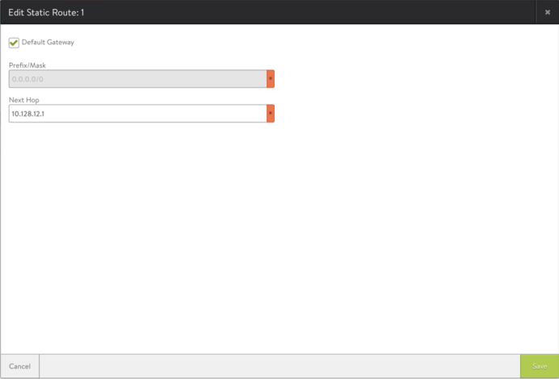  </a></li> 
 <li>Click Save.</li> 
</ol> 

### Virtual Floating IP Configuration for SE (Optional)

Creating a floating IP address for SEs is option, and should be considered when using the Legacy Active/Standby high availability mode. For other HA modes, it is not required.
<ol> 
 <li>To configure a floating IP for the SE interface, navigate to Infrastructure &gt; Cloud &gt; Select Linux Cloud  &gt; Service Engine Group. </li> 
 <li>Edit the Default-Group.</li> 
 <li>Select Legacy Active/Standby HA.</li> 
 <li>Enter the floating IP address in the Floating IP Address field.  <a href="img/linux-server-cloud-csp2100-ctlr10.png">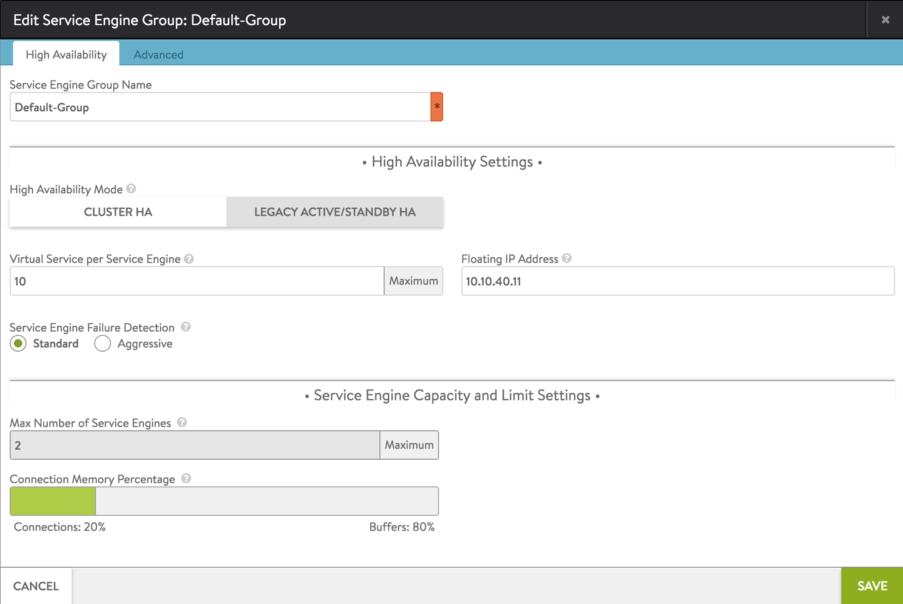  </a></li> 
</ol> 

Note: If any virtual service is configured before this step, it will need to be disabled before beginning with the configuration, then re-enabled after configuring HA and the floating IP.

## Create Virtual Service

This section walks through the steps for configuring a basic HTTP virtual service. Steps for configuring a source NAT IP address (optional) also are included.
Note: This workflow uses the basic virtual service configuration popup, which is adequate for most deployments. These steps also can be performed by selecting New Virtual Service &gt; Advanced Setup to create the virtual service.
<ol> 
 <li>Navigate to Applications &gt; Virtual Services.</li> 
 <li>Click New Virtual Service &gt; Basic Setup.</li> 
 <li>Enter the name “VS_HTTP.”</li> 
 <li>Select HTTP as the application type.</li> 
 <li>Enter the VIP address.</li> 
 <li>Enter the back-end pool member (server) IP addresses in the Server IP Addresses field, in comma separated format,  and click Add Servers. </li> 
 <li>The final configuration should look similar to the one shown below. Click Save.  <a href="img/linux-server-cloud-csp2100-ctlr11.png">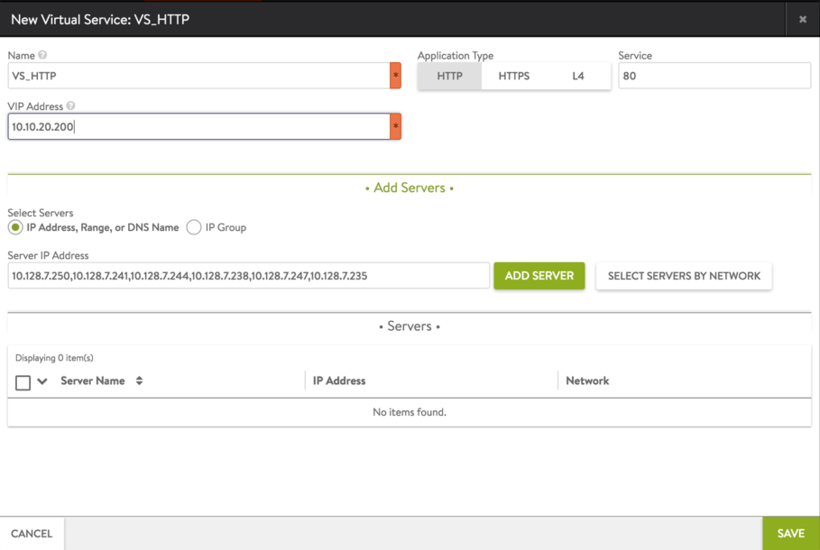  </a></li> 
</ol> 

### Per Virtual Service SNAT Configuration

To configure a SNAT IP for the virtual service:
<ol> 
 <li>Access the edit popup for the virtual service created in the previous section.  <a href="img/linux-server-cloud-csp2100-ctlr12.png">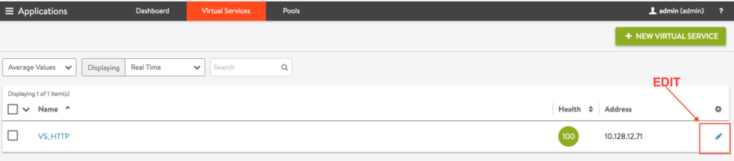  </a></li> 
 <li>Navigate to the Advanced tab and enter the SNAT IP address in the SNAT IP Address field.  <a href="img/linux-server-cloud-csp2100-ctlr13.png">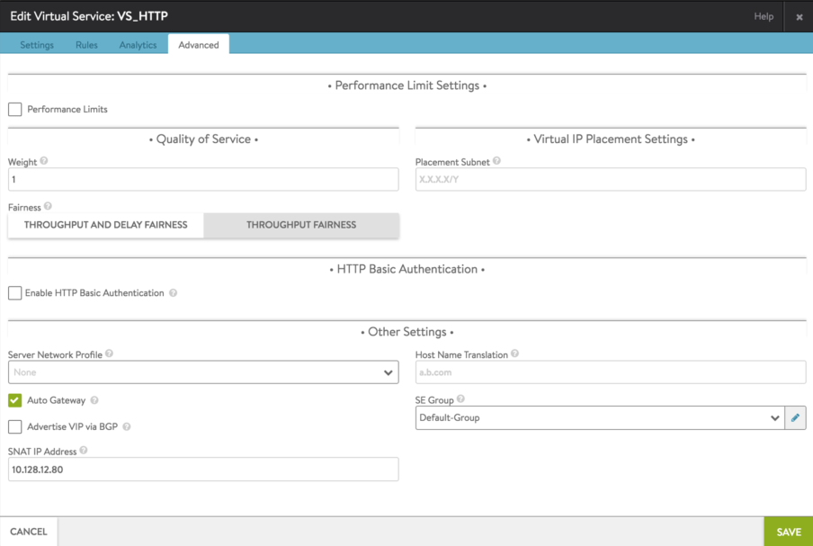  </a></li> 
</ol> 