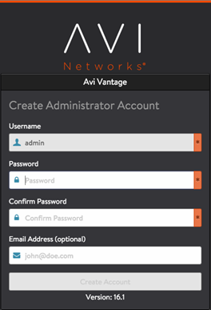

This guide describes how to install Avi Vantage into an on-premises (private) Mesos cloud. The instructions in this guide can be used for installing Avi Vantage 16.1.*x*.

Avi Vantage integrates with Mesos and Marathon to provide the following services:

* Full-featured service proxy (distributed load balancing)
* Service discovery
* Autoscaling
* Application map and visibility 

Note: This guide applies to installation within an on-premises cloud. If you are deploying into a Mesos cluster within Amazon Web Services (AWS), go <a href="/docs/16.3/installation-guides/installing-mesos-in-aws-using-the-cli/">here</a> instead.

Here is how Avi Vantage integrates into a Mesos cloud:

As shown here, Avi Vantage consists of the Avi Controller cluster and multiple Service Engines (SEs). The Avi Controller analyzes traffic and can request spin-up/spin-down of SEs to load balance traffic. In a Mesos deployment, the Avi Controller works with Marathon to spin up/down SEs.

## Deployment Prerequisites

### Physical Node Requirements

The main components of the Avi Vantage solution, Avi Controllers and Service Engines (SEs), run as containers on Mesos nodes. For production deployment, a 3-node Avi Controller cluster is recommended, with the each of the Avi Controller nodes running on separate nodes. Each Avi SE is deployed as a container on one of the 3 Mesos nodes. Each Mesos node can run 1 SE container. The node on which the Avi Controller runs must meet at least the following minimum system requirements:

* 8 vCPUs
* 24 GB memory
* 64 GB disk space 

### System Time (NTP) Requirement

The system time on all nodes must be synchronized. Use of a Network Time Protocol (NTP) server is recommended.

### Software Requirements

For deployment of SEs, the following system-level software is required:

* Each node host OS must be a Linux distribution running systemd.
* One of the following is required for SE spin up/down:  
    * Fleet: Optional cluster management service for Mesos. If Fleet is installed, the Avi Controller can use it to schedule spin-up and spin­-down of SEs based on service health.
    * SSH: The Avi Controller uses passwordless sudo SSH to access all the Mesos nodes in the cluster and create SEs on those nodes. The SSH user must have passwordless sudo access to all the Mesos nodes in the Avi Vantage cluster. The SSH method requires a public-private key pair.You can import an existing private key onto the Avi Controller or generate a new key pair. In either case, the public key must be in the “/home/ssh_user/.ssh/authorized_keys” file, where ssh_user is the SSH username on all Mesos nodes. The Avi Controller setup wizard automatically stores the private key on the Avi Controller node when you import or generate the key. 

## Installing the Avi Controller

To install the Avi Controller:
<ol class="md-ignore"> 
 <li>Copy the .tgz package onto the Mesos node that will host the Avi Controller: <pre crayon="false" class="command-line language-bash" data-prompt=": >" data-output="1-100"><code>scp controller_docker.tgz username@remotehost.com:/some/local/directory</code></pre> Note: Replace <em>username</em>@<em>remotehost.com</em> with your write-access username and password and the IP address or hostname for the host node.</li> 
 <li>Log onto the Mesos node: <pre crayon="false" class="command-line language-bash" data-prompt=": >" data-output="1-100"><code>ssh username@remotehost.com</code></pre></li> 
 <li>Unzip the Avi Controller image: <pre crayon="false" class="command-line language-bash" data-prompt=": >" data-output="1-100"><code>gunzip controller_docker.tgz</code></pre></li> 
 <li>Load the Avi Controller image into the host's local Docker repository: <pre crayon="false" class="command-line language-bash" data-prompt=": >" data-output="1-100"><code>sudo docker load -i controller_docker.tar</code></pre></li> 
 <li>As a best practice, clean up any data that may be lingering from a previous run: <pre crayon="false" class="command-line language-bash" data-prompt=": >" data-output="1-100"><code>sudo rm -rf /var/lib/controller/*</code></pre></li> 
 <li>Use the vi editor to create a new file for spawning the Avi Controller service: <pre crayon="false" class="command-line language-bash" data-prompt=": >" data-output="1-100"><code>sudo vi /etc/systemd/system/avicontroller.service</code></pre></li> 
 <li>Copy the following lines into the file: <pre crayon="false" pre="" class="command-line language-bash" data-output="1-100"><code>[Unit]
Description=AviController
After=docker.service
Requires=docker.service

[Service]
Restart=always
RestartSec=0
TimeoutStartSec=0
TimeoutStopSec=120
StartLimitInterval=0
ExecStartPre=-/usr/bin/docker kill avicontroller
ExecStartPre=-/usr/bin/docker rm avicontroller
ExecStartPre=/usr/bin/bash -c "/usr/bin/docker run --name=avicontroller --privileged=true -p 5054:5054 -p 53:53/udp -p 161:161 -p 9080:9080 -p 9443:9443 -p 5098:5098 -p 8443:8443 -d -t -e NUM_CPU=8 -e NUM_MEMG=24 -e DISK_GB=80 -e HTTP_PORT=9080 -e HTTPS_PORT=9443 -e MANAGEMENT_IP=$(ip -o -4 addr list $interface | grep global | awk '{print $4}' | cut -d/ -f1) -v /:/hostroot -v /var/lib/controller:/vol -v /var/run/fleet.sock:/var/run/fleet.sock -v /var/run/docker.sock:/var/run/docker.sock avinetworks/controller:$tag"
ExecStart=/usr/bin/docker logs -f avicontroller
ExecStop=/usr/bin/docker stop avicontroller

[Install]
WantedBy=multi-user.target
</code></pre> </li> 
 <li>Edit the following values in the file: 
  <ul> 
   <li>NUM_CPU: Sets the number of CPU cores/threads used by the Controller (8 in this example).</li> 
   <li>NUM_MEMG: Sets the memory allocation (24 GB in this example).</li> 
   <li>DISK_GB: Sets the disk allocation (80 GB in this example).</li> 
   <li>$interface: Name of the default Ethernet interface. For example, for CoreOS, replace “eth0” with "ens03."</li> 
   <li>$tag: Tag value of the Avi Vantage image in the Docker repository. For example, “16.1-5000-20160212.235510”.</li> 
  </ul> </li> 
 <li>Save and close the file.</li> 
</ol> 

### Starting the Avi Controller Service

To start the Avi Controller, enter the following command at the OS shell prompt on the node where you installed the Avi Controller service:

<pre class="command-line language-bash" data-prompt=": >" data-output="1-100"><code>sudo systemctl start avicontroller</code></pre> 

Initial startup and full system initialization takes around 5 minutes.

### Accessing the Avi Controller Web Interface

To access the Avi Controller web interface, navigate to the following URL:

<pre class="command-line language-bash" data-prompt=": >" data-output="1-100"><code>https://mesos-ip-or-hostname:9443</code></pre> 

The following section provides steps for initial configuration of the Avi Controller.

## Setting Up the Avi Controller

This section shows how to perform initial configuration of the Avi Controller using its deployment wizard. You will configure the following settings.

### Setup Parameters

<ol class="md-ignore"> 
 <li>Administrator account: Initial configuration of the Avi Controller begins with creation of an administrator account.</li> 
 <li>DNS and NTP servers: 
  <ul> 
   <li>DNS: If your deployment uses Mesos DNS, set the Avi Controller to use the Mesos Master as its DNS server. Otherwise, set the Avi Controller to use your network’s DNS.</li> 
   <li>NTP: Can use the default or your local NTP server. The Avi Controller does not require use of the Mesos Master for network time.</li> 
  </ul> </li> 
 <li>Infrastructure settings for the Mesos cloud, and configuration settings for SEs: 
  <ul> 
   <li>Mesos URL: IP address or hostname of the Mesos Master.</li> 
   <li>Marathon URL: IP address or hostname of the Marathon instance in DCOS.</li> 
   <li>Marathon username and password.</li> 
  </ul> </li> 
 <li>SE creation settings: Fleet or SSH. (See Software Infrastructure Requirements.)</li> 
 <li>Docker registry for SE creation: Access information for the Docker Registry. Enter the IP address or hostname, and the access credentials. You can use either Docker Hub or your cloud’s private Docker Registry. You can change or customize settings following initial deployment using the Avi Controller’s web interface.</li> 
</ol>  

### Setup Procedure

To start, use a browser to navigate to the Avi Controller.
<ol class="md-ignore"> 
 <li>Configure basic system settings: 
  <ul> 
   <li>Administrator account</li> 
   <li>DNS and NTP server information</li> 
  </ul> 
  
 
   
  
 
   
 
 
  
 </li> 
 <li>Select Mesos as the infrastructure type:</li> 
 <li>Configure Mesos infrastructure settings: 
  <ul> 
   <li>Mesos URL: IP address or hostname of the Mesos Master</li> 
   <li>Marathon URL: IP address or hostname of the Marathon instance in DCOS</li> 
   <li>Marathon username and password</li> 
  </ul> </li> 
 <li>Configure settings for SE deployment. 
  <ul> 
   <li>If using Fleet:</li> 
  </ul> 
  
 
   
 
 
   
 
 
  
 
  <ul> 
   <li>If using SSH:</li> 
  </ul> 
  
 
   
 
 
   
 
 
  
 
 Note: The Avi Controller requires root access to the OS on the SE node in order to start the SE process on the node.
 
  <ul> 
   <li>If the key pair already exists, use Import Private Key to import the private key for each SE node into the Avi Controller.</li> 
   <li>To instead generate a new key pair for SE creation, select Generate SSH Key Pair. Click Copy to clipboard, then copy the public key generated by the option into the following file on each of the SE nodes: /home/ssh_user/.ssh/authorized_keys</li> 
  </ul> </li> 
 <li>Configure Docker registry settings: 
  
 
   
 
 
   
 
 
  
 </li> 
</ol> 

After you click Next, your Mesos deployment and initial Avi Controller configuration are complete.

## Creating and Testing Applications

This section provides steps for creating and testing virtual services for the following deployment scenarios:

* East-west: VIP and client are both in the same Mesos cluster.
* North-south with inside VIP: VIP is in the Mesos host network but client is outside the network.
* North-south with outside VIP: VIP and client are both outside the Mesos host network. 

For each deployment scenario, the process is the same:

<ol> 
 <li>Create a Docker image file for the application.</li> 
 <li>Start the application.</li> 
 <li>Generate traffic.</li> 
</ol> 

The details for each deployment differ slightly, mainly in regard to network address information.

### East-west Application

Use these steps if the VIP and the client are both in the same Mesos cluster.
<ol> 
 <li>Create a Docker image file such as the following for the application: 
  
 
   <pre crayon="false" pre="" class="command-line language-bash" data-output="1-100"><code>
{
  "id": "webappew1",
  "cpus": 0.5,
  "mem": 64.0,
  "instances": 2,
  "container": {
    "type": "DOCKER",
    "docker": {
      "image": "avinetworks/server",
      "network": "BRIDGE",
      "portMappings": [
        { "containerPort": 80, "hostPort": 0, "servicePort": 0, "protocol": "tcp" }
    ]
  }
},
"labels": {
  "avi_proxy": "{\"virtualservice\": {\"analytics_policy\": {\"metrics_realtime_update\": {\"duration\": 0, \"enabled\":true}, \"client_insights\": \"NO_INSIGHTS\", \"full_client_logs\": {\"enabled\":true}}}}"
  },
  "healthChecks": [
   {
     "protocol": "HTTP",
     "portIndex": 0,
     "path": "/",
     "gracePeriodSeconds": 5,
     "intervalSeconds": 20,
     "maxConsecutiveFailures": 3
   }
  ]
}
</code></pre> 
   

 
  
 </li> 
 <li>Start the application to create a virtual service for it in Vantage:  <pre crayon="false" class="command-line language-bash" data-prompt=": >" data-output="1-100"><code>curl -H "Content-Type: application/json" -X POST -d@Docker.json http://marathon-ip-or-hostname:8080/v2/apps</code></pre> The H and X options are required. The H option inserts a Content­Type header for the Avi SE application. The X option changes the HTML method of the request from GET (the default) to POST. Replace marathon-ip-or-hostname with the IP address or hostname of Marathon.</li> 
 <li>Start a client container on the VM:  <pre crayon="false" class="command-line language-bash" data-prompt=": >" data-output="1-100"><code>sudo docker run -d --name=aviclient avinetworks/server</code></pre></li> 
 <li>Connect to the client container that you just started:  <pre crayon="false" class="command-line language-bash" data-prompt=": >" data-output="1-100"><code>sudo docker exec -it aviclient bash</code></pre></li> 
 <li>Generate test traffic:  <pre crayon="false" class="command-line language-bash" data-prompt=": >" data-output="1-100"><code>ab -n 100 http://172.17.0.1:10001/100kb.txt</code></pre>This command sends 100 requests for the specified file to the virtual service. The port number (10001 in this example) is the service port number assigned to the virtual service.</li> 
</ol> 

To view the service port number for the application, select the Configuration tab in the Marathon web interface. The virtual service service port number is specified in the Docker file by the servicePort parameter:  

### North-south Application with Inside VIP

Use these steps if the VIP is in the same Mesos cluster as the application but the client is outside the cluster. In this example, the Mesos host and the VIP (10.10.10.100) are both in subnet 10.10.10.0/24.
<ol class="md-ignore"> 
 <li>Create a Docker image file such as the following for the application. In the file, edit the FE-Proxy­VIP to match the address of your VIP. 
  
 
   <pre crayon="false" pre="" class="command-line language-bash" data-output="1-100"><code>
{
  "id": "webapp",
  "cpus": 0.5,
  "mem": 64.0,
  "instances": 2,
  "container": {
    "type": "DOCKER",
    "docker": {
      "image": "avinetworks/server",
      "network": "BRIDGE",
      "portMappings": [
        { "containerPort": 80, "hostPort": 0, "servicePort": 0, "protocol": "tcp" }
      ]
    }
},
"labels": {
  "FE-Proxy": "yes",
  "avi_proxy": "{\"virtualservice\": {\"ip_address\": {\"addr\": \"10.90.28.250\", \"type\": \"V4\"}, \"services\": [{\"port\": 80}], \"analytics_policy\": {\"metrics_realtime_update\": {\"duration\": 0, \"enabled\":true}, \"client_insights\": \"NO_INSIGHTS\", \"full_client_logs\": {\"enabled\":true}}}}"
  },
  "healthChecks": [
   {
      "protocol": "HTTP",
      "portIndex": 0,
      "path": "/",
      "gracePeriodSeconds": 5,
      "intervalSeconds": 20,
      "maxConsecutiveFailures": 3
    }
  ]
}</code></pre> 
  
 </li> 
 <li>Start the application to create a virtual service for it in Avi Vantage:  <pre crayon="false" class="command-line language-bash" data-prompt=": >" data-output="1-100"><code>curl -H "Content-Type: application/json" -X POST -d@Docker.json http://marathon-ip-or-hostname:8080/v2/apps</code></pre> The H and X options are required. The H option inserts a Content­Type header for the Avi SE application. The X option changes the HTML method of the request from GET (the default) to POST. Replace marathon-ip-or-hostname with the IP address or hostname of Marathon.</li> 
 <li>To generate traffic to the application, open an SSH connection to another VM that is located in the same network as the host, and enter the following command:  <pre crayon="false" class="command-line language-bash" data-prompt=": >" data-output="1-100"><code>ab -n 100 http://10.10.10.100/100kb.txt</code></pre></li> 
</ol> 

This command sends 100 requests for the specified file to the application VIP (10.10.10.100 in this example).

### North-south Application with Outside VIP

Use these steps if neither the VIP nor the client is in the same Mesos cluster as the application. In this example, the VIP is 20.20.20.20.
<ol class="md-ignore"> 
 <li>Create a Docker image file such as the following for the application. In the file, edit the FE-Proxy­VIP to match the address of your VIP. 
  
 
   <pre crayon="false" pre="" class="command-line language-bash" data-output="1-100"><code>
{
  "id": "webapp",
  "cpus": 0.5,
  "mem": 64.0,
  "instances": 2,
  "container": {
    "type": "DOCKER",
    "docker": {
      "image": "avinetworks/server",
      "network": "BRIDGE",
      "portMappings": [
        { "containerPort": 80, "hostPort": 0, "servicePort": 0, "protocol": "tcp" }
      ]
    }
},
"labels": {
  "FE-Proxy": "yes",
  "avi_proxy": "{\"virtualservice\": {\"ip_address\": {\"addr\": \"20.20.20.20\", \"type\": \"V4\"}, \"subnet\": {\"ip_addr\": {\"addr\": \"172.17.0.0\", \"type\": \"V4\"}, \"mask\": 16}, \"services\": [{\"port\": 80}], \"analytics_policy\": {\"metrics_realtime_update\": {\"duration\": 0, \"enabled\":true}, \"client_insights\": \"NO_INSIGHTS\", \"full_client_logs\": {\"enabled\":true}}}}"
  },
  "healthChecks": [
   {
      "protocol": "HTTP",
      "portIndex": 0,
      "path": "/",
      "gracePeriodSeconds": 5,
      "intervalSeconds": 20,
      "maxConsecutiveFailures": 3
    }
  ]
}</code></pre> 
  
 </li> 
 <li>Start the application to create a virtual service for it in Avi Vantage:  <pre crayon="false" class="command-line language-bash" data-prompt=": >" data-output="1-100"><code>curl -H "Content-Type: application/json" -X POST -d@Docker.json http://marathon-ip-or-hostname:8080/v2/apps</code></pre> The H and X options are required. The H option inserts a Content­Type header for the Avi SE application. The X option changes the HTML method of the request from GET (the default) to POST. Replace marathon-­ip-or-hostname with the IP address or hostname of Marathon.</li> 
 <li>To generate traffic to the application: 
  <ol> 
   <li>Open an SSH ssh connection to another VM that is located in the same network as the host.</li> 
   <li>Add a static host route that forwards traffic addressed to the VIP to the VM IP address:  <pre crayon="false" class="command-line language-bash" data-prompt=": >" data-output="1-100"><code>ip route add 20.20.20.20/32 via 
       
      <vm-ip></vm-ip></code></pre></li> 
   <li>Generate traffic:  <pre crayon="false" class="command-line language-bash" data-prompt=": >" data-output="1-100"><code>ab -n 100 http://20.20.20.20/100kb.txt</code></pre> This command sends 100 requests for the specified file to the application VIP (20.20.20.20 in this example).</li> 
  </ol> </li> 
</ol> 

## Creating Virtual Services (applications)

After Avi Vantage is installed, virtual services (applications) can be created. For information:

* <a href="/docs/16.3/creating-applications-in-mesos-with-marathon-labels">Creating Applications with Mesos / Marathon Labels</a>
* <a href="/docs/16.3/service-discovery-for-mesos">DNS-based Service Discovery for Mesos</a> 