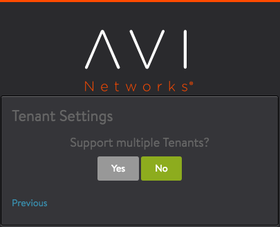

This guide describes how to install an Amazon Web Services (AWS) EC2 instance of Avi Vantage. The instructions in this guide can be used for installing Avi Vantage 16.2 and subsequent releases.

Also of interest: <a href="/docs/16.3/aws-cross-account-assumerole-support/">AWS Cross-Account AssumeRole Support</a>

## 1. About Avi Vantage

Avi Vantage consists of the Avi Controller and multiple Avi Service Engines (SEs). The Avi Controller analyzes traffic and based on real-time analytics it can scale-up/scale-down of SEs to load balance traffic.

## 2. Deployment Prerequisites

### Knowledge of AWS VPC

Knowledge of <a href="http://docs.aws.amazon.com/AmazonVPC/latest/UserGuide/VPC_Introduction.html">AWS  VPC</a> (Virtual Private Cloud ) is required for configuring your network space like availability zone and subnets of controller and SE's.

All IP addresses like controller management IP, SE's management IP, a virtual service IP, and server IP Addresses need to be planned and configured accordingly.

## 3. Credential Method

When deploying Avi Vantage within Amazon Web Services (AWS), the installation wizard prompts for input of credential information.
You are not required to enter AWS Secret and Access key credentials. The credentials can be entered in either of the following forms:

* **Identity and Access Management (IAM) roles:** A set of policies that define access to resources within AWS. The roles and the policies that define their access are defined in JSON files. This method does not require an AWS account key. Instead, the role and policy files must be downloaded from Avi Networks and installed using the AWS CLI. (Download links for the role and policy files, and the required AWS CLI syntax, are provided in .) After setting up the IAM roles, return to this article to install the Avi Vantage EC2 instance. Use this method if you don't want to enter AWS credentials.
<a href="/docs/16.3/iam-role-setup-for-installation-into-aws/">this article</a>

* **AWS customer account key:** A unique authentication key associated with the AWS account. If using this method, continue reading.

## 4. Protocol Ports Used by Avi Vantage for Management Communication

In an AWS deployment, the Avi Controller and Avi Service Engines use the following ports for management. The firewall should allow traffic for these ports.
<table class="table table table-bordered table-hover">  
<tbody>       
<tr>    
<th>Traffic Source
</th>
<th>Traffic Destination
</th>
<th>Ports To Allow
</th>
</tr>
<tr>    
<td rowspan="3">Avi Controller</td>
<td>Avi Controller</td>
<td>TCP 22 (SSH)

 
TCP 8443
 
TCP 5054
</td>
</tr>
<tr>   
<td>Avi Service Engine</td>
<td>TCP 22</td>
</tr>
<tr>   
<td>Management Net</td>
<td><em>See section below the table.</em></td>
</tr>
<tr>    
<td>Avi Service Engine</td>
<td rowspan="2">Avi Controller</td>
<td>TCP 22

 
TCP 8443
 
UDP 123
</td>
</tr>
<tr>   
<td>Management Net</td>
<td>TCP 22

 
TCP 80 <em>(optional)</em>
 
TCP 443
 
TCP 5054 <em>(if using the optional <a href="/docs/16.3/cli-installing-the-cli-shell/">CLI shell</a> for remote  management access)</em>
</td>
</tr>
</tbody>
</table>  

### 4.1 Ports Used by the Controller for Network Services

The Controller may send traffic to the following UDP ports as part of network operation:

* TCP 25 (SMTP)
* UDP 53 (DNS)
* UDP 123 (NTP)
* UDP 162 (SNMP traps)
* UDP 514 (Syslog) 

The firewall also should allow traffic from the Controller to these ports.

## 5. Installation

To install Avi Vantage in AWS, we need to deploy an EC2 instance of the Avi Controller; then run the Avi Controller setup wizard.

### 5.1 Deploying an EC2 Avi Controller Instance

<ol class="md-ignore"> 
 <li>Access Amazon Web Services (AWS) using<a href="https://aws.amazon.com"> https://aws.amazon.com</a> and log in  using your AWS credentials.</li> 
 <li>Click on EC2 to go to the EC2 Dashboard options.</li> 
 <li>Click on Launch Instance to start the EC2 deployment process.</li> 
 <li>Click on My AMIs in the left panel and select (checkmark) Shared with me , filter the list to display AMIs that  have the Avi-Controller tag. The Avi Vantage AMI should be listed, with name “Avi-Controller-&lt;Version&gt;”. For  example, select AMI Avi-Controller-16.2-9091 AMI to deploy Avi Vantage Controller version 16.2 onto a virtual  machine (VM).</li> 
 <li>Choose instance type m4.xlarge from the Instance Type pull-down list, and click Next.The following table lists the  ideal requirements for the VMs on which the Avi Controller and Avi SEs are installed.

 
  

 
  <table class="table"> 
   <tbody> 
    <tr> 
     <th width="60%">Component</th> 
     <th>Memory</th> 
     <th>vCPUs</th> 
     <th>Disk</th> 
    </tr> 
    <tr> 
     <td>Avi Controller</td> 
     <td>24 GB</td> 
     <td>8</td> 
     <td>64 GB</td> 
    </tr> 
    <tr> 
     <td>Service Engine</td> 
     <td>2 GB</td> 
     <td>2</td> 
     <td>10 GB</td> 
    </tr> 
   </tbody> 
  </table> 
Add 1 GB of RAM to the SE configuration for each additional vCPU. With 10 GB as an absolute minimum, set the disk  value to at least (2 x RAM Size) + 5 GB.
 
For added resiliency and redundancy, the Avi Controller can be deployed as a 3-node cluster. [See <a href="/docs/16.3/overview-of-vantage-high-availability/">Overview of Vantage High Availability</a>.] In this case, a  separate VM is needed for each of the 3 Avi Controller nodes. The requirements are the same for each node.
 
Note: While this example shows 4 CPUs and 16 GB memory.
 

</li> 
 <li>Select the appropriate VPC from the Network pull-down list and select the network from the Subnet pull-down list,  this is the subnet in which the controller will get the IP for the management NIC. Also select the Enable  termination protection option.  Note:  If installing with an <a href="/docs/16.3/iam-role-setup-for-installation-into-aws/">IAM role</a> instead of an AWS customer  account key, select IAM role if you have created as explained in <a href="/docs/16.3/installing-avi-vantage-in-amazon-web-services-16-2/#3_Credential_Method">Credential Method</a>. In  this example we have used the IAM Role "AviController-Refined-Role".</li> 
 <li>In the Size (G/B) field, enter 64 to allocate 64 GB to the Avi Controller instance, and go to the "Next:Tag  Instance" option.</li> 
 <li>Enter a name for this Avi Controller instance.</li> 
 <li>Create a security group that allows <a href="/docs/16.3/protocol-ports-used-by-vantage-for-management-communication/">traffic  through the firewall</a>, to allow management communication between the Avi Controller and the Avi Service Engines  (SEs)</li> 
 <li>(Optional) Select SSD as the storage type. (This enhances the responsiveness of the Avi Controller web  interface.) </li> 
 <li>Review your EC2 instance, and click Launch. </li> 
 <li><strong>Key pair settings:  </strong>

 
  <ul> 
   <li>If you don't have key pair, create new key pair. After downloading the key pair, change the permissions to  "400" (chmod 400 ".pem") to do SSH.  </li> 
   <li>If you have key pair, select a key pair for AMI authentication.  </li> 
  </ul> 
 
</li> 
 <li>The deployment status of the Avi Controller EC2 instance into AWS is displayed. When the instance is ready (status  "running"), you can access the instance using a private or public IP address. Wait for all checks to pass before  setting up controller. </li> 
</ol> 

### 5.2 Setting Up the Avi Controller Instance

After deploying an EC2 instance of the Avi Controller, use a browser to navigate to the Avi Controller's management IP address(10.144.137.13 for our case as shown in previous steps) to start the setup wizard.

* Configure basic system settings:  
    * Administrator account
    * Network DNS and NTP server information
    * Email and SMTP information 

* Select Amazon Web Services as the infrastructure type: 

* Enter AWS account settings:  
    * Access credentials are needed by the Avi Controller to communicate with AWS API. Enter the access key and secret access key.

    * (Optional) Proxy IP and port: If using custom proxy between your corporate network and AWS
    * If using an <a href="/docs/16.3/iam-role-setup-for-installation-into-aws/">IAM role</a>, instead select Use AWS IAM Roles.
 
* Configure SE Management Network, this is the subnet network which controller will place the management VNIC of SE's. The management network of SE should be reachable from Controller Management IP. Note: While creating virtual service make sure to select VIP subnet that has reachability to the SE's management subnet.

* Configure tenancy settings
* To verify installation, navigate to Infrastructure > Clouds, click Default-Cloud, then click the Status button.
* When the status turns green, installation is a success. 

This completes the installation process. The Avi Controller is now ready for <a href="/docs/16.3/architectural-overview/applications/virtual-services/create-virtual-service/">deploying virtual  services</a>.

