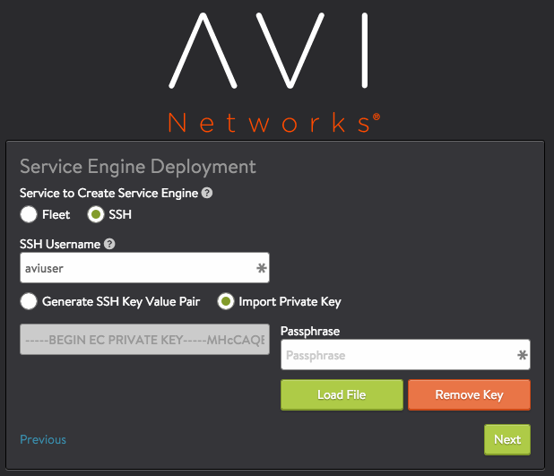
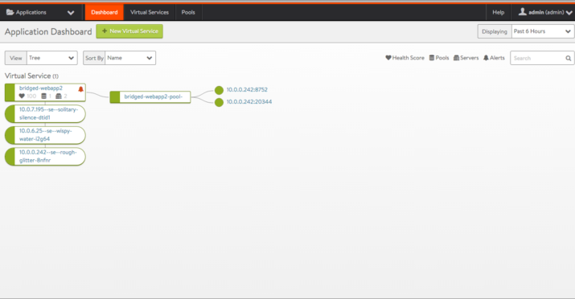
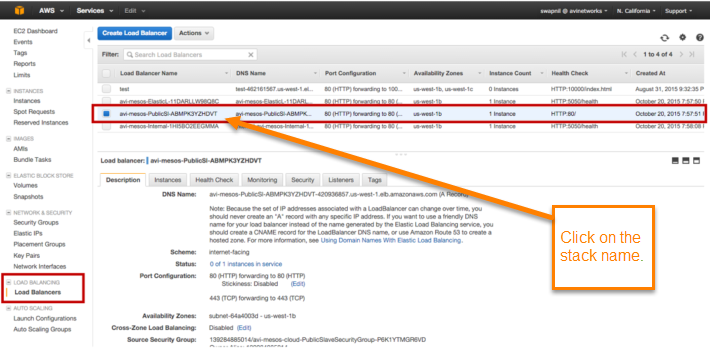
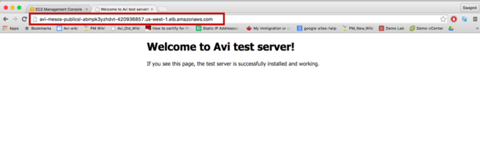

This guide describes how to install Avi Vantage into an Apache Mesos (Mesos) or Mesosphere DC/OS (DC/OS) cloud hosted by Amazon Web Services (AWS).

Avi Vantage integrates with Mesos or DC/OS and Marathon to provide the following services:

* Full-featured service proxy (distributed load balancing)
* Service discovery
* Autoscaling
* Application map and visibility 

Note: This guide applies to installation using the CLI. To install using the AWS web interface and a CloudFormation template from Avi Networks instead, go <a href="/docs/16.3/installation-guides/installing-avi-integration-with-mesos-in-aws/">here</a>.

If you are installing into an on-premises Mesos or DC/OS cloud, go <a href="/docs/16.3//installing-avi-vantage-with-mesosphere-dcos-on-premises//">here</a> instead.

Avi Vantage consists of the Avi Controller and multiple Service Engines (SEs). The Avi Controller analyzes traffic and can request spin-up/spin-down of SEs to load balance traffic. In an Mesos or DC/OS deployment, the Avi Controller works with Marathon to spin-up/spin-down SEs.

## Deployment Prerequisites

### Physical Node Requirements

The main components of the Avi Vantage solution, Avi Controllers and Service Engines (SEs), run as containers on Mesos nodes. For production deployment, a 3-node Avi cluster is recommended, with the each of the Avi Controller nodes running on separate nodes. Each Avi SE is deployed as a container on one of the 3 Mesos nodes. Each Mesos node can run 1 SE container. The node on which the Avi Controller runs must meet at least the minimum system requirements, which are specified in <a href="/system-requirements-hardware/">this article</a>.

### Software Infrastructure Requirements

For deployment of SEs, the following system-level software is required:

* Each node host OS must be a Linux distribution running systemd.
* One of the following is required for SE spin-up/spin-down:  
    * CoreOS Fleet: Optional cluster management service for Apache Mesos. If Fleet is installed, the Avi Controller can use it to schedule Avi SE container starts/stops based on service health.
    * SSH: The Avi Controller requires passwordless sudo access on Mesos nodes to start/stop an Avi SE container. A SSH keypair can be configured in one of two ways.  
        * Option 1: Import the private key of the AWS key pair used for DC/OS cluster creation. Click Import Private Key to import the private key into the Avi Controller.
        * Option 2: To instead generate a new key pair for SE creation, select Generate SSH Key Pair. Click Copy to clipboard, then copy the public key generated  into the following file on each of the Mesos nodes: /home/ssh_user/.ssh/authorized_keys. ssh_user is the username of the AWS user. 

## Installing the Avi Controller

To install the Avi Controller:
<ol> 
 <li>Copy the .tgz package onto the Mesos node that will host the Avi Controller: <pre crayon="false" class="command-line language-bash" data-prompt=": >"><code>scp controller_docker.tgz username@remotehost.com:/some/local/directory</code></pre> Note: Replace <em>username</em>@<em>remotehost.com</em> with your write-access username and password and the IP address or hostname for the host node.</li> 
 <li>Log onto the Mesos node:  <pre crayon="false" class="command-line language-bash" data-prompt=": >"><code>ssh username@remotehost.com</code></pre></li> 
 <li>Unzip the Avi Controller image:  <pre crayon="false" class="command-line language-bash" data-prompt=": >"><code>gunzip controller.tgz</code></pre></li> 
 <li>Load the Avi Controller image into the host's local docker repository:  <pre crayon="false" class="command-line language-bash" data-prompt=": >"><code>sudo docker load -i controller_docker.tar</code></pre></li> 
 <li>As a best practice, clean up any data that may be lingering from a previous run  <pre crayon="false" class="command-line language-bash" data-prompt=": >"><code>sudo rm -rf /var/lib/controller/*</code></pre></li> 
 <li>Use the vi editor to create a new file for spawning the Avi Controller service: <pre crayon="false" class="command-line language-bash" data-prompt=": >"><code>sudo vi /etc/systemd/system/avicontroller.service</code></pre></li> 
 <li>Copy the following lines into the file:</li> 
</ol> 

<pre><code class="language-lua">[Unit]
Description=AviController
After=docker.service
Requires=docker.service

[Service]
Restart=always
RestartSec=0
TimeoutStartSec=0
TimeoutStopSec=120
StartLimitInterval=0
ExecStartPre=-/usr/bin/docker kill avicontroller
ExecStartPre=-/usr/bin/docker rm avicontroller
ExecStartPre=/usr/bin/bash -c "/usr/bin/docker run --name=avicontroller --privileged=true -p 5054:5054 -p 8053:53/udp -p 161:161 -p 9080:9080 -p 9443:9443 -p 5098:5098 -p 8443:8443 -d -t -e NUM_CPU=4 -e NUM_MEMG=12 -e DISK_GB=80 -e HTTP_PORT=9080 -e HTTPS_PORT=9443 -e MANAGEMENT_IP=$(ip -o -4 addr list $interface | grep global | awk \'{print $4}\' | cut -d/ -f1) -v /:/hostroot -v /var/lib/controller:/vol -v /var/run/fleet.sock:/var/run/fleet.sock -v /var/run/docker.sock:/var/run/docker.sock avinetworks/controller:$tag"
ExecStart=/usr/bin/docker logs -f avicontroller
ExecStop=/usr/bin/docker stop avicontroller

[Install]
WantedBy=multi-user.target</code></pre>  
<ol start="8"> 
 <li>Edit the following values in the file: 
  <ul> 
   <li>NUM_CPU: Sets the number of CPU cores/threads used by the Controller (4 in this example).</li> 
   <li>NUM_MEMG: Sets the memory allocation (12 GB in this example).</li> 
   <li>DISK_GB: Sets the disk allocation (80 GB in this example).</li> 
   <li>$interface: Name of the default Ethernet interface (examples: eth0, ens03, ens1616163) with cluster access.</li> 
   <li>$tag: Tag value of the Avi Vantage image in the Docker repository. For example, “16.1-5000-20160212.235510”.</li> 
  </ul> </li> 
 <li>Save and close the file.</li> 
</ol> 

### Starting the Avi Controller Service

To start the Avi Controller, enter the following command at the OS shell prompt on the node where you installed the Avi Controller service:

<pre class="command-line language-bash" data-prompt=": >"><code>sudo systemctl enable avicontroller &amp;&amp; sudo systemctl start avicontroller</code></pre> 

Initial startup and full system initialization takes around 5 minutes.

### Accessing the Avi Controller Web Interface

Note: Avi Controller UI listens on ports 9080 & 9443. Allow 9080 & 9443 ports in the security group of the AWS instance where Avi Controller is running.

To access the Avi Controller web interface, navigate to the following URL:

<pre class="command-line language-bash" data-prompt=": >"><code>https://mesos-ip-or-hostname:9443</code></pre> 

The following section provides steps for initial configuration of the Avi Controller.

## Setting Up the Avi Controller

This section shows how to perform initial configuration of the Avi Controller using its deployment wizard. You will configure the following settings.

### Setup Parameters

<ol> 
 <li>Administrator account: Initial configuration of the Avi Controller begins with creation of an administrator account.</li> 
 <li>DNS and NTP servers: 
  <ul> 
   <li>DNS: If your deployment uses Mesos DNS, set the Avi Controller to use the Mesos Master as its DNS server. Otherwise, set the Avi Controller to use your network’s DNS.</li> 
   <li>NTP: Can use the default or your local NTP server. The Avi Controller does not require use of the Mesos Master for network time.</li> 
  </ul> </li> 
 <li>Infrastructure settings for the Mesos cloud, and configuration settings for SEs: 
  <ul> 
   <li>Mesos URL: IP address or hostname of the Mesos Master.</li> 
   <li>Marathon URL: IP address or hostname of the Marathon instance in DCOS.</li> 
   <li>Service port range: Must match the service port range of Marathon. (The default is 10000-20000.)</li> 
  </ul> </li> 
 <li>SE creation settings: Fleet or SSH. (See <a href="#software_infrastructure_requirements_anchor">Software Infrastructure Requirements</a>.)</li> 
 <li>Docker registry for SE creation: Access information for the Docker Registry. Enter the IP address or hostname, and the access credentials. You can use either Docker Hub or your cloud’s private Docker Registry. You can change or customize settings following initial deployment using the Avi Controller’s web interface.</li> 
</ol> 

### Setup Procedure

To start, use a browser to navigate to the Avi Controller.
<ol> 
 <li>Configure basic system settings: 
  <ul> 
   <li>Administrator account</li> 
   <li>DNS and NTP server information</li> 
  </ul> 
  
 
   
 
 
   
 
 
  
 </li> 
 <li>Configure Mesos infrastructure settings: 
  <ul> 
   <li>Proxy Service Port Range: The Avi Controller automatically creates a proxy Virtual Service (SE) for each Marathon application with a service_port in this range.</li> 
   <li>Non­Proxy Service Port Range: The Avi Controller does not create a virtual service for any Marathon applications with a service_port in this range. These Marathon applications are bypassed during automatic virtual service creation.</li> 
  </ul> 
Note: The Proxy Service Port Range and Non­Proxy Service Port Range fields specify the Marathon service_port ranges to use or ignore for automatic creation of proxy virtual services.
 
  
 
   

 
   
 
 
  
 </li> 
 <li>Configure settings for SE deployment. 
  <ul> 
   <li>If using Fleet:</li> 
  </ul> 
  
 
   

 
   
 
 
  
 
  <ul> 
   <li>If using SSH:</li> 
  </ul> 
  
 
   

 
   
 
 
  
 
Note: The Avi Controller requires root access to the OS on the SE node to start the SE process on the node.
 
  <ul> 
   <li>If the key pair already exists, use Import Private Key to import the private key for each SE node into the Avi Controller.</li> 
   <li>To instead generate a new key pair for SE creation, select Generate SSH Key Pair. Click Copy to clipboard, then copy the public key generated by the option into the following file on each of the SE nodes: /home/ssh_user/.ssh/authorized_keys</li> 
  </ul> </li> 
 <li>Configure Docker registry settings: 
  
 
   

 
   
 
 
  
 </li> 
</ol> 

### Make Service Ports Accessible on All Host Interfaces

After initial setup is completed using the wizard, the option to make service ports accessible on all host interfaces must be enabled. This is required for deployment into AWS.
<ol> 
 <li>Log onto the Controller using a browser.</li> 
 <li>Navigate to Applications &gt; Infrastructure.</li> 
 <li>Select Clouds on the menu bar.</li> 
 <li>Click the edit icon in the row for the cloud.</li> 
 <li>Click the Applications tab.</li> 
 <li>Check (enable) the following option: <strong>Make service ports accessible on all Host interfaces</strong> 
  
 
   

 
   
 
 
  
 </li> 
</ol> 

### APPLICATION CREATION IN MARATHON

<ol> 
 <li>Download Docker.json from <a href="https://s3-us-west-1.amazonaws.com/avi-tm/Docker.json">https://s3-us-west-1.amazonaws.com/avi-tm/Docker.json</a>. Save the file in Downloads.</li> 
 <li>Open an SSH session to the Mesos master’s IP address, and post the application:

 
  <!-- Crayon Syntax Highlighter v2.7.1 --> <pre><code class="language-lua">curl -H "Content-Type: application/json" -X POST -d@Downloads/Docker.json http://:8080/v2/apps</code></pre> 
  <!-- [Format Time: 0.0006 seconds] --> 
 
</li> 
</ol> 

### APPLICATION VERIFICATION

<ol> 
 <li>Log in to Marathon: https://<em>marathon-ip</em>:8080</li> 
 <li>Log in to the Avi Controller to verify that the application is getting load balanced.  </li> 
</ol> 

### ACCESS WEB SERVICE THROUGH AVI VANTAGE

<ol> 
 <li>Browse to EC2 Load Balancing instance. 
  <ol> 
   <li>Click onto go to the AWS homepage.</li> 
   <li>Select EC2 and click on Load Balancing in the left pane.</li> 
   <li>Click on the “PublicSlaveL” instance in the Load Balancer field (“avi-mesos-PublicSlaveL” in this example.)  </li> 
  </ol> </li> 
 <li>Edit the ELB instance to forward traffic to the application in the Mesos environment. 
  <ol> 
   <li>Verify the application port from the Avi Controller web interface. Select the application and hover near the name.  </li> 
   <li>Click on Listener and edit ELB Listener to change the HTTP listener to the service (application) port number.</li> 
   <li>Click on Health Check and edit ELB health Check to the application port number.</li> 
  </ol> </li> 
 <li>Click on the Description tab for the same ELB instance. Copy the DNS name and paste it into a new browser tab.  

 
  <ol> 
   <li>Paste the DNS name into a new browser window.  </li> 
   <li>Click on WebApp1 to verify that live traffic is flowing through.  </li> 
  </ol> </li> 
</ol> 