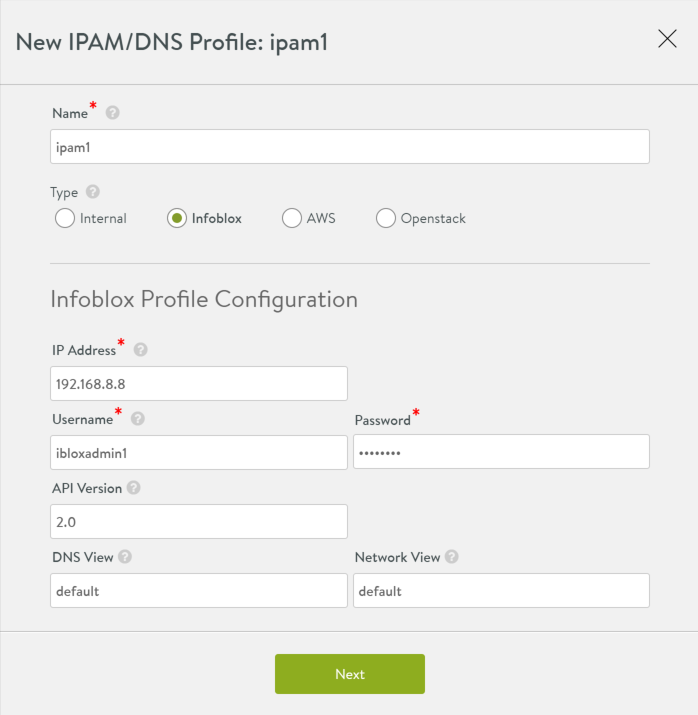
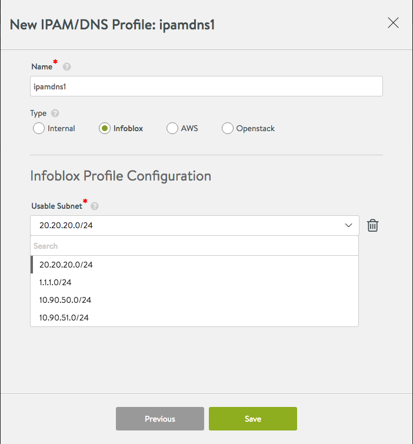
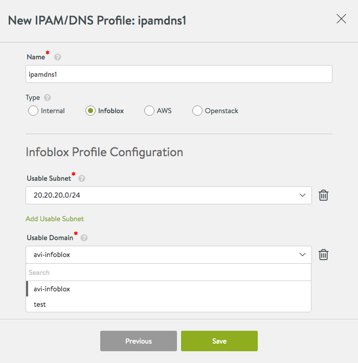

## IPAM and DNS Configuration

Avi Controller integrates with Infoblox for both IPAM and DNS services together (specifically, neither DNS-only nor IPAM-only are supported with Infoblox).

Navigate to Templates -> IPAM/DNS Profiles -> Create. Select IPAM/DNS type as Infoblox and enter credentials as shown below:

* IP address: address of the Infoblox appliance
* Username and password: credentials to access Infoblox
* API Version: as supported by the Infoblox server (default: 2.0)
* DNS view: as configured in Infoblox (default: “default”)
* Network view: as configured in Infoblox (default: “default”)
* Optionally, select a subset of IP subnets and DNS domains to choose from Infoblox:  
    * Usable subnet: Pick all or a subset of subnets configured in Infoblox to be used for VIP allocation. If none is specified, Vantage looks at all subnets.
    * Usable domain: Pick all or a subset of the domains configured in Infoblox to be used for DNS purposes. If none is specified, all domains are available during virtual service creation. 

### IPAM and DNS filters (Optional)

It is assumed that all interested subnets and domain names (zones) have been configured in Infoblox server for consumption by Vantage.

Selecting a subset of subnets/networks from Infoblox for IPAM:

Selecting a subset of domains/zones from Infoblox for DNS:

