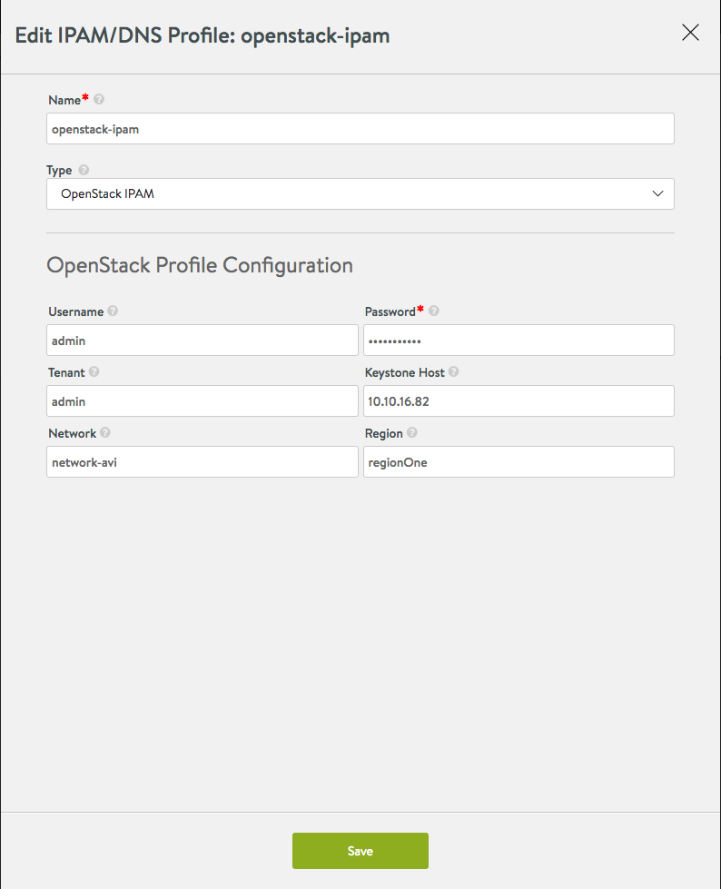

Avi Vantage communicates with OpenStack Neutron via APIs to provide IPAM functionality. Currently, DNS services from OpenStack are not supported in this configuration.

Note:

* If you are using OpenStack Cloud in Avi Vantage, then this configuration does not apply, as this is to provide support for other cloud providers who host their VMs/instances in OpenStack (for example, Mesos nodes running on OpenStack instances). 

See also: <a href="/docs/16.3/service-discovery-using-ipam-and-dns-16-3/">Service Discovery Using IPAM and DNS</a>

### IPAM

Select OpenStack, and enter the following information:

* **Username:** Username for logging onto the Keystone host.
* **Password:** Password for logging onto the Keystone host.
* **Tenant:** Name of the OpenStack tenant.
* **Keystone Host:** IP address or hostname of the Keystone host.
* **Network**: Network to use for VIP allocation (OpenStack network name or the network subnet IP can be used here).
* **Region**: OpenStack region. 

