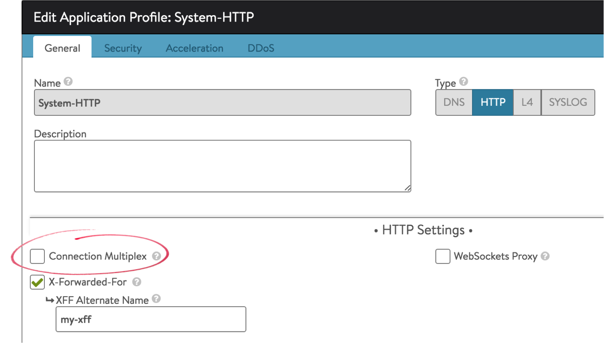

A number of Microsoft applications such as SharePoint and Outlook Anywhere rely on NTLM for session authentication. NTLM has a few unique requirements for load balancing that are addressed in this article, along with recommended changes for impacted applications or virtual services.

### Multiplex

Avi Vantage has connection multiplexing enabled by default within the HTTP application profile. Multiplexing enables the sharing of open, idle connections between Service Engines and the servers. This significantly accelerates connection establishment, however it is not compatible with NTLM, which establishes trust to a TCP connection rather than the session or request. For applications that rely on NTLM, Avi recommends unchecking the Connection Multiplex option in the virtual service's HTTP application profile as shown at right (navigate to Templates > Profiles).

### Monitoring

NTLM authenticated applications may require the HTTP health monitor to validate via NTLM for the check to succeed. This will require a custom, external monitor, such as the example below.

*Script*

<pre><code class="language-lua">#!/bin/bash
#curl http://$IP:$PORT/Shared%20Documents/10m.dat -I -L --ntlm -u $USER:$PASS -I -L &gt; /run/hmuser/$HM_NAME.out 2&gt;/dev/null
curl http://$IP:$PORT/Shared%20Documents/10m.dat -I -L --ntlm -u $USER:$PASS -I -L  | grep "200 OK”</code></pre>  

*Script Variables*

<pre><code class="language-lua">USER='foo\administrator' PASS=foo123</code></pre>  

### 401 Unauthorized Errors

When a client first connects to the site, the server responds back with a 401 error code, which instructs the client it is not authorized and must first authenticate.  This is a standard part of connecting to an NTLM site.  By default, the Vantage Authentication profile designates any 4xx response as an error.  This results in lowered health score (the Performance score is negatively impacted).  These responses are also logged as Significant.

Since 401 responses are expected, it is desirable to <a href="/docs/16.3/excluding-unwanted-messages-from-client-logs/">exclude these response codes from the defined error list</a>.  To do this, navigate to the Templates > Profiles > Analytics page.  Edit the profile attached to the NTLM enabled virtual service.  Add '401' to the *Exclude HTTP Status codes from Error Classification* section and save.
