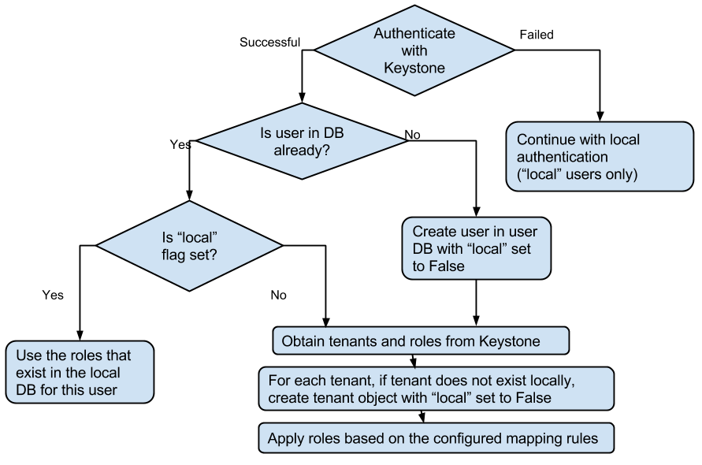
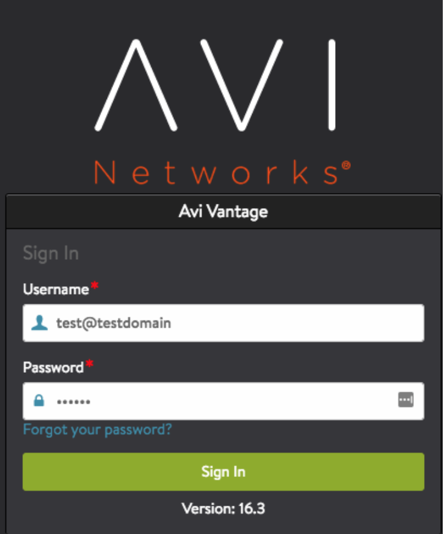
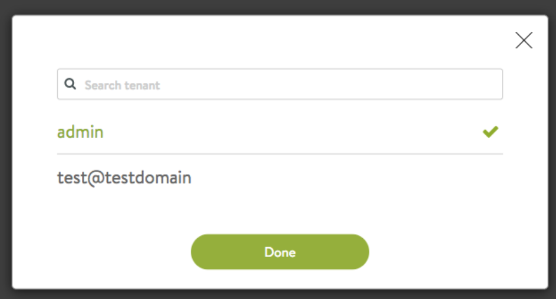

Avi Vantage may use OpenStack's Keystone service for user authentication to the Avi Controller.  Keystone v2 has been supported from v15.1 onward.  Keystone v3 is supported in v16.3 onward.

Note that using Keystone for authenticating users logging into Avi Vantage is a configurable option. This is controlled by the flag use_keystone_auth when configuring an OpenStack cloud on Avi Vantage. One can configure an OpenStack cloud with this flag disabled. In such case, only users configured on Avi Vantage are allowed to login. Also, tenants and roles for users can not be imported from Keystone, and hence have to be created locally by the Avi administrator.

When Keystone is used for authentication, Avi Vantage may only be used with one instance of Keystone. No other remote authentication mechanism may be used. Therefore, a single Avi Vantage system may only be configured with one OpenStack cloud when using Keystone for authentication. The Avi Vantage internal <a href="/docs/16.3/default-system-accounts/">system accounts</a>, such as *admin*, will maintain an internal local flag, denoting they are locally authenticated as illustrated below. As the below flowchart shows, when a user logs in, Avi Vantage will first authenticate against Keystone and only check the local user database if the Keystone authentication fails. We strongly recommend against creating any new local users, as those names could potentially be used in Keystone also and thus cause confusion.

Note that the tenant and role information from Keystone is imported only when a user is logging in. Thus, while a user is logged in, any new tenants and new roles added in Keystone for that user are **not** reflected in Avi Vantage right away. They are imported next time that user logs into Avi.

**Note on the list of tenants imported from Keystone:** Avi Vantage imports only those tenants from Keystone that the user configured in OpenStack cloud has access to. Suppose that the user configured in Avi Vantage's OpenStack cloud has access to only tenants p1, p2, and p3 in Keystone. When another user logs into Avi Vantage and has access to tenants p1, p3, and p6, Avi Vantage will only import information about the tenants in the intersection of those two lists: p1 and p3. Further note that, even if the user configured in Avi Vantage's OpenStack cloud has **admin** privileges on Keystone, if Avi Vantage does **not** have access to the **admin_url** for Keystone, then Avi Vantage can only import those tenants on Keystone where the configured user has explicit roles. In this case, OpenStack admins have to ensure that the configured user has **admin** role in each tenant where Avi Vantage needs to provide the LBaaS service.

 

## Avi Vantage-Keystone Integration Overview

For authentication, Keystone v2.0 has the concept of “users,” “projects” (also, alternatively referred to as “tenants”), and “roles.” A user can have one or more roles in one or more projects. Other services of OpenStack have their own policies to define the privileges of each role. Please refer to <a href="/docs/16.3/keystone-authentication/">Keystone Authentication</a> for details on how Avi Vantage imports the users, projects, and roles information from Keystone and map to Avi Vantage users, tenants, and roles objects, respectively.

Keystone v3.0 introduces an additional concept of “domains.” A “domain” defines the administrative boundaries for management of Keystone entities (“user” and “project”). A “user” or “project” thus belongs to one and only one domain. Each domain has a unique name. However, the same user name, e.g., “demo”, can exist in multiple domains. To be compatible with Keystone v2.0 APIs, v3.0 creates a default domain with name “Default” and all “users” and “projects” that are accessible under Keystone v2.0 APIs are placed under this default domain.

Keystone also introduces the concept of “groups.” A “group” is simply a collection of “users” in a single domain, and is owned by a domain. A “group” can be assigned a “role” in a project, thus effectively giving that role in that project to /*all/* users of that group.

While the Keystone v2.0 public API endpoint is of the form “<a href="http://keystone:5000/v2.0">http://keystone:5000/v2.0</a>,” Keystone v3.0 endpoints use “v3” as the suffix: “<a href="http://keystone:5000/v3">http://keystone:5000/v3</a>”.

### Details

With Avi Vantage 16.3, cloud configuration for OpenStack integration includes the “auth_url” field. We have deprecated the field “keystone_host” that was used in the previous versions to specify just the Keystone host’s name or IP address. Avi Vantage parses the auth_url field to determine the API version to use when communicating with the configured Keystone service -- if the suffix ends in “v3,” v3.0 APIs are used; otherwise, v2.0 APIs are used.

Avi Vantage’s authentication model currently doesn’t have a “domain” entity. However, a Keystone user “test” in domain “testdomain” is mapped to a user named “test@testdomain” in Avi Vantage. Similarly, a Keystone project “testproject” in “testdomain” is mapped as a tenant with name “testproject@testdomain” in Avi Vantage. The only exception is the “Default” domain on Keystone: Avi Vantage drops the “@Default” for users and tenants imported from Keystone from that domain.

Thus, the user “test” in domain “testdomain” on Keystone can login into the Avi Controller as shown in the picture below:

When no “@domain” is specified, Avi Vantage assumes the user belongs to the “Default” domain on the configured Keystone v3.0 service.

Suppose user “test” in domain “testdomain” on Keystone has access to the “admin” project in domain “Default” and “test” project in domain “testdomain.” Once that user logs into the Avi Controller, s/he will have access to the following two Avi Vantage tenants:

 

### Role Importing

Avi Vantage allows admins to configure an explicit mapping via the Avi Cloud resource APIs. Parameter role_mapping in openstack_configuration defines how a user’s roles from OpenStack Keystone are mapped to roles in the Avi Controller. Following is an example configuration for the role_mapping parameter:

<pre><code class="language-lua">"openstack_configuration": {
   ....
   "role_mapping": [
      {"os_role": "admin", "avi_role": "Tenant-Admin"},
      {"os_role": "_member_", "avi_role": "Tenant-Admin"},
      {"os_role": "*", "avi_role": "Application-Operator"}
   ],
}</code></pre>  

Note that the role_mapping parameter is an ordered list, where each item specifies how a Keystone role (os_role) maps to a role in Avi Controller (avi_role). One can define a default mapping for any Keystone role by specifying the “/*” wildcard for the os_role field. In the above example, roles admin and _member_ from Keystone are mapped to the role *Tenant-Admin* in Avi Controller. Further, any other role from Keystone is mapped to Avi role *Application-Operator*.

Following is another example that allows only users with role *lbaas_project_admin* to access the Avi Controller, and Keystone users that do not have that role are denied from logging in:

<pre><code class="language-lua">"openstack_configuration": {
   ....
   "role_mapping": [
      {"os_role": "lbaas_project_admin", "avi_role": "Tenant-Admin"},
   ],
   ....
}</code></pre>  