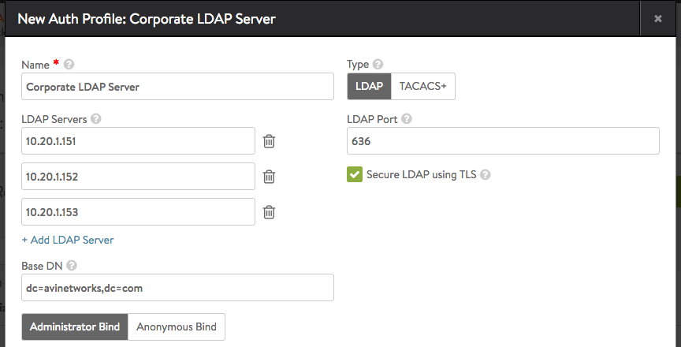
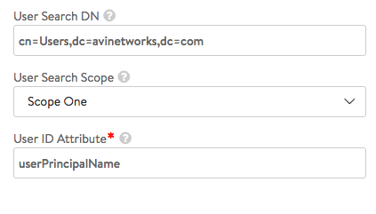
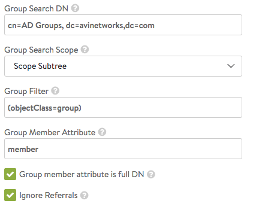
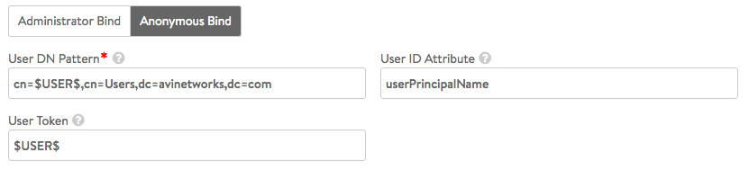

Avi Vantage supports user authentication using Lightweight Directory Access Protocol (LDAP). LDAP is a commonly used protocol for accessing a directory service. A directory service is a hierarchical object oriented database view of an authentication system.

LDAP settings can be configured in an authentication profile.

Navigate to Templates &gt; Security &gt; Auth Profile. Enter a name for the profile and select LDAP as type.

 

## Settings

 

Enter the list of LDAP server IPs (or FQDNs), and the port to connect to the server. Optionally, LDAP over SSL (LDAPS) is supported and is the recommended option

The Base DN field indicates the top level path in the directory server object hierarchy. Using a specific base DN speeds up all queries to the LDAP server, whereas using a more generic (higher level) base DN makes the queries reach out to more parts of the directory hierarchy. The base DN must be set to the topmost (most general) path to which the account has access.

 

 

### Administrator Bind and Anonymous Bind

Administrator bind is the recommended option since the administrator account given will be used to search for users and user group memberships across the LDAP server.

The anonymous bind option only checks whether bind is successful or failure with the password entered during login. Anonymous bind can only be used to authenticate the user and cannot be used to authorize the user.

### Administrator Bind

Administrator bind requires admin DN and password. The account used should have access to search the directory tree for both users and user groups.

Vantage uses the configuration to search for users or groups. An LDAP search typically requires:

* Top-level directory hierarchy (search DN) to start the search
* Scope value to limit the search to one of the following: base (one-level deep) or entire sub-tree
* Filter to match only on entries of a given class or category  

### User Search

User search enables searching for users who log into Vantage. This field limits the search to a more specific directory tree. The user ID attribute is the attribute in a user record that identifies the user, and is expected to match the username entered during user login. Administrator account should have privilege to search for users under the User Search DN entered.

### Group Search

Group search enables searching for a user's group membership. The group search DN and scope limit the search to a more specific directory tree. For efficiency, try to avoid searching under directory trees where a match to the user group is not expected. A search can find many different types of objects under the search DN, so the group filter is used to pick up group objects only. Vantage appends a user-specific group membership filter to the configured group filter in order to check a specific user's group membership. If LDAP group stores the full user DN as member instead of just username; the option "Group member attribute is full DN" should be enabled.  The option "Ignore Referrals" can be enabled if user is not expected to have groups in the referral links. Ignoring referral links can speed up group searches.

Example: A configured group filter (objectClass=group) is extended by Vantage to a full filter when user "bob" logs in, to something such as the following: (&amp;(objectClass=group)(member=bob))

For more details on LDAP search filters: <a href="https://tools.ietf.org/search/rfc4515">https://tools.ietf.org/search/rfc4515</a>

### Anonymous Bind

Anonymous bind supports only authentication of users. Authentication profiles that use anonymous bind cannot be used for role or tenant mapping.

Anonymous bind parameters:

* User DN pattern: the LDAP DN pattern common for all users
* User Token: token to be replaced by users' login name.
* User ID attribute: attribute that uniquely identifies the User's login name. 

 

**HTTP authentication** options can be ignored for user logins to Avi Vantage. It is only useful when LDAP authentication profile is configured for Basic Authentication in a Virtual Service

LDAP Auth Profile settings can be verified after the profile is created by using <a href="/docs/16.3/ldap-auth-profile-test">the test page</a>.

More configuration examples are presented <a href="/docs/16.3/ldap-configuration-examples">in this page</a>.

## LDAP AAA Settings

### Common Settings

These settings apply to to either Administrator Bind or Anonymous Bind.

* **LDAP Servers:** Configure one or more LDAP servers by adding their IP addresses. To add a server, click Add LDAP Server.
* **LDAP Port:** The service port to use when communicating with the LDAP servers. This is typically 389 for LDAP or 636 for LDAPS (SSL).
* **Secure LDAP using TLS:** Enables startTLS for secure communication with the LDAP servers. (This may require a service port change.)
* **Base DN:** LDAP Directory Base Distinguished Name. Used as default for settings where DN is required but was not populated like User or Group Search DN. 

### Anonymous Bind Settings

Anonymous bind uses the minimal LDAP settings that are required to verify user authentication credentials by binding to an LDAP server. Anonymous bind is useful when you do not have access to an administrator account on the LDAP server(s).

To configure anonymous bind, select Anonymous Bind and enter the following information:

* **User DN Pattern:** LDAP user DN pattern is used to bind an LDAP user after replacing the user token with real username. The pattern should match the user record path in the LDAP server. For example, cn=,ou=People,dc=myorg,dc=com is a pattern where we expect to find all user records under ou "People". When searching LDAP for a specific user, we replace the token with username.
* **User Token:** An LDAP token is replaced with real user name in the user DN pattern. For example, in User DN Pattern is configured as "cn=-user-,ou=People,dc=myorg,dc=com", the token value should be -user-.
* **User ID Attribute:** LDAP user ID attribute is the login attribute that uniquely identifies a single user record. The value of this attribute should match the username used at the login prompt. 

### Administrator Bind Settings

Administrator bind requires administrator access to the LDAP server(s).

The LDAP administrator credentials specified in the profile are used to bind Vantage as an administrator when querying LDAP for users or groups.

* **Admin Bind DN:** Full DN of LDAP administrator. Admin bind DN is used to bind to an LDAP server. Administrators should have sufficient privileges to search for users under user search DN or groups under group search DN.
* **Admin Bind Password:** Administrator password. Password expiration or change is not handled. The password is hidden from rest API and CLI.
* **User Search DN:** LDAP user search DN is the root of search for a given user in the LDAP directory. Only user records present in this LDAP directory sub-tree are allowed for authentication. Base DN value is used if this value is not configured.
* **User Search Scope:** LDAP user search scope defines how deep to search for the user starting from user search DN. The options are search at base, search one-level below or search the entire sub-tree. The default option is to search one-level deep under user search DN.
* **User ID Attribute:** LDAP user ID attribute is the login attribute that uniquely identifies a single user record. The value of this attribute should match the username used at the login prompt.
* **Group Search DN:** LDAP group search DN is the root of search for a given group in the LDAP directory. Only matching groups present in this LDAP directory sub-tree will be checked for user membership. Base DN value is used if this value is not configured.
* **Group Search Scope:** LDAP group search scope defines how deep to search for the group starting from the group search DN:  
    * Scope One
    * Scope Subtree (the default)
    * Scope Base
* **Group Filter:** (description)
* **Group Member Attribute:** LDAP group attribute that identifies each of the group members. For example, member and memberUid are commonly used attributes.
* **Group member attribute is full DN:** Indicates that group member entries have full DNs instead of just user ID attributes.
* **Ignore Referrals:** Ignores searching referrals during user or group search. 

### HTTP Authentication Settings

* **Insert HTTP Header for Client UserID:** Insert an HTTP header into the client request before it is sent to the destination server. This field is used to name the header. The value will be the client's User ID. This same UserID value will also be used to populate the User ID field in the Virtual Service's logs.
* **Required User Group Membership:** User should be a member of these groups. Each group is identified by the DN, for example,'cn=testgroup,ou=groups,dc=LDAP,dc=example,dc=com'
* **Auth Credentials Cache Expiration:** The max allowed length of time a client's authentication is cached. 