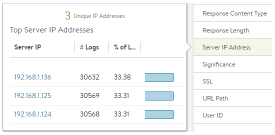
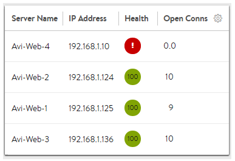
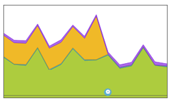

The heart of a load balancer is its ability to effectively distribute traffic across healthy servers. Avi Vantage provides a number of algorithms, each with characteristics that may be best suited for one use case versus another.

The LB algorithm may be used for distributing TCP and UDP connections across servers. When an HTTP profile is applied to the VS and connection multiplexing is enabled, the algorithm may also be used for distributing requests across servers as well.

When persistence is enabled, only the first connection from a client is load balanced. While the persistence remains in effect, subsequent connections or requests from a client are directed to the same server.

Many features within Avi Vantage play an indirect role in the behavior of load balancing. See the following <a href="/docs/16.3/issues-with-round-robin-lb/">KB article</a> for an explanation of why an algorithm may not behave the way it might be expected.

### Validate Distribution

To see the distribution of traffic across servers within a pool, navigate to the Virtual Service > Logs page. Enable non-significant logs to capture both errors and successful connections for the desired time period. Then select Server IP Address from the sidebar Analytics menu. This will show the distribution of connections or HTTP requests across the servers.

If the virtual service uses content switching across multiple pools, perform this check from within a Pool > Log page or add a filter for a specific pool name.

To see the current count of open connections to servers, navigate to the Pool > Servers page.  Edit the table via the sprocket icon in the top right of the table.  Add Open Connections to the displayed list and save. Now select the appropriate time period and average, current, or peak values. See the illustration below under Least Connections.

## Algorithms

Select a local server load-balancing algorithm using the Algorithm field within the Applications > Pool > Settings page. Changing a pool's LB algorithm will only affect new connections or requests, and will have no impact on existing connections. The available options in alphabetic order are:

### Consistent Hash

New connections are distributed across the servers using a hash that is based on a key specified in the field that appears below the LB Algorithm field. This algorithm inherently combines load balancing and persistence, which minimizes the need to add a persistence method. This algorithm is best for load balancing large numbers of cache servers with dynamic content. It is ‘consistent’ because adding or removing a server does not cause a complete recalculation of the hash table. For the example of cache servers, it will not force all caches to have to re-cache all content. If a pool has nine servers, adding a tenth server will cause the pre-existing servers to send approximately 1/9 of their hits to the newly-added server based on the outcome of the hash. Hence, persistence may still be valuable. The rest of the server's connections will not be disrupted. The available hash keys are:

* **Custom Header:** Specify the HTTP header to use in the Custom Header field, such as Referer. This field is case-sensitive. If the field is blank or if the header does not exist, the connection or request is considered a miss, and will hash to a server.
* **Source IP Address** of the client.
* **Source IP Address and Port** of the client.
* **HTTP URI,** which includes the host header and the path. For instance, *www.avinetworks.com/index.htm* 

### Fastest Response

New connections are sent to the server that is currently providing the fastest response to new connections or requests. This is measured as time to first byte. In the End-to-End Timing chart, this is reflected as Server RTT plus App Response time. This option is best when the pool’s servers contain varying capabilities or they are processing short-lived connections. A server that is having issues, such as a lost connection to the data store containing images, will generally respond very quickly with HTTP 404 errors. It is best practice when using the fastest response algorithm to also enable the Passive Health Monitor, which recognizes and adjusts for scenarios like this by taking into account the quality of server response, not just speed of response.
> <strong>Note:</strong> A server that is having issues, such as a lost connection to the data store containing images, will generally respond very quickly with HTTP 404 errors. You should therefore use the Fastest Response algorithm in conjunction with the Passive Health Monitor, which recognizes and adjusts for scenarios like this.
 

### Fewest Servers

Instead of attempting to distribute all connections or requests across all servers, Avi Vantage will determine the fewest number of servers required to satisfy the current client load. Excess servers will no longer receive traffic and may be either de-provisioned or temporarily powered down. This algorithm monitors server capacity by adjusting the load and monitoring the server’s corresponding changes in response latency. Connections are sent to the first server in the pool until it is deemed at capacity, with the next new connections sent to the next available server down the line. This algorithm is best for hosted environments where virtual machines incur a cost.

### Least Connections

New connections are sent to the server that currently has the least number of outstanding concurrent connections. This is the default algorithm when creating a new pool and is best for general-purpose servers and protocols. New servers with zero connections are introduced gracefully over a short period of time via the Connection Ramp setting in the Pool > Advanced page. This feature slowly brings the new server up to the connection levels of other servers within the pool.

Avi uses Least Connections as the default algorithm because generally provides an equal distribution when all servers are healthy, and yet is adaptive to slower or unhealthy servers. It works well for both long lived and quick connections.
> <strong>Note:</strong> A server that is having issues, such as rejecting all new connections, may have a concurrent connection count of zero and be the most eligible to receive all new connections. Avi recommends using the Least Connections algorithm in conjunction with the Passive Health Monitor which recognizes and adjusts for scenarios like this.  <a href="/docs/16.3/overview-of-health-monitors/">Passive monitor</a> will reduce the percent of new connections sent to a server based on the responses it returns to clients.
 

### Least Load

New connections are sent to the server with the lightest load, regardless of the number of connections that server has. For example, if an HTTP request requiring a 200-kB response is sent to a server and a second request that will generate a 1-kB response is sent to a server, this algorithm will estimate that —based on previous requests— the server sending the 1-kB response is more available than the one still streaming 200 kB. The idea is to ensure that a small and fast request does not get queued behind a very long request. This algorithm is HTTP-specific. For non-HTTP traffic, the algorithm will default to the least connections algorithm.

### Round Robin

New connections are sent to the next eligible server in the pool in sequential order. This static algorithm is best for basic load testing, but is not ideal for production traffic because it does not take the varying speeds or periodic hiccups of individual servers into account. A slow server will still receive as many connections as a better performing server.

In the example illustration to the right, a server was causing significant app response time in the end-to-end timing graph as seen by the orange in the graph. By switching from the static round robin algorithm to a dynamic LB algorithm (the blue config event icon at the bottom), Avi Vantage successfully directed connections to servers that were responding to clients faster, virtually eliminating the app response latency.

### Weighted Ratio

Avi Vantage does not include a dedicated weighted ratio algorithm. Instead, weight may be achieved via ratio, which may be applied to any server within a pool. Ratio may also be used in conjunction with any load balancing algorithm. With the ratio setting, each server receives statically adjusted ratios of traffic. If one server has a ratio of 1 (the default) and another server has a ratio of 4, the server set to 4 will receive 4 times the amount of connections it otherwise would.  For instance, using least connections, one server may have 100 concurrent connections while the second server has 400.
