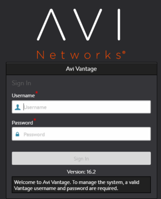

Avi Vantage supports configuration of the following types of management greeting messages:

* **Message of the Day:** Greeting that appears to Vantage users who log in via the web interface, SSH, or the CLI.
* **Login Banner:** Message that appears before login through the web interface or CLI. 

Here is an example of a login banner (at bottom of login dialog):

## Configure Message of the Day and Login Banner

<ol> 
 <li>Navigate to Administration &gt; Access Settings.</li> 
 <li>Click the edit icon to display the Update System Access Settings popup.</li> 
 <li>In the Message of the Day field, enter the text message to be displayed after login through the web interface, SSH, or CLI.</li> 
 <li>In the Login Banner field, enter the mesage to be disaplyed before login through the web interface or CLI.</li> 
 <li>Click Save.</li> 
</ol> 