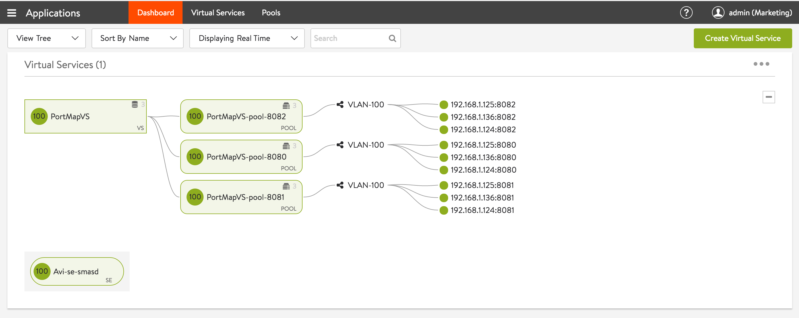

A virtual service may expose multiple ports. This article explains two different ways to map VS ports to corresponding ports on pool servers.

### Mapping a set of VS ports to the same port on pool servers

This is the simplest configuration, where the VS port and pool server port are the same. To achieve this:

* Use the Settings tab of the virtual service editor to identify multiple VS ports, one port at a time, or by specifying a port range, as shown in figures 1 and 2, respectively. 
<figure class="thumbnail wp-caption aligncenter">   
<figcapture> Figure 1. Adding individual ports 
</figcapture>
</figure> 

 

<figure class="thumbnail wp-caption aligncenter">   
<figcapture> Figure 2. Adding a port range 
</figcapture>
</figure> 

 

* Use the Advanced tab of the pool editor to disable port translation by checking the corresponding checkbox as shown below. 
<figure class="thumbnail wp-caption aligncenter">   
<figcapture> Figure 3. Disabling port translation 
</figcapture>
</figure> 

 

In this case, the “Default Server Port” property of the pool is ignored and requests are forwarded to servers on the same port as the receiving port of the virtual service.

### Mapping a set of VS ports to different ports on pool servers

For this case a specific virtual service port needs to be mapped to a specific port on pool servers.

To achieve this:

* Use the Settings tab of the virtual service editor to identify multiple VS ports, individually or by port range. Refer to figures 1 and 2 above.
* Create a pool for each pool server port and use the Settings tab of the pool editor to configure a unique “Default Server Port” for each of the pools. Refer to figures 4, 5 and 6. Note: The actual back-end members of all the pools may be the same. 
<figure class="thumbnail wp-caption aligncenter">   
<figcapture> Figure 4. Assigning port 8080 to the pool named PortMapVS-pool-8080. 
</figcapture>
</figure> 

 

<figure class="thumbnail wp-caption aligncenter">   
<figcapture> Figure 5. Assigning port 8081 to the pool named PortMapVS-pool-8081. 
</figcapture>
</figure> 

 

<figure class="thumbnail wp-caption aligncenter">   
<figcapture> Figure 6. Assigning port 8082 to the pool named PortMapVS-pool-8082. 
</figcapture>
</figure> 

 

* Using the Policies tab of the virtual service editor, add an HTTP request rule that uses content switching to direct requests to pools based on the value of the port number. Figures 7 illustrates what also should be done for ports 81 and 82. Figure 8 shows rules complete for all three service ports. 
<figure class="thumbnail wp-caption aligncenter">   
<figcapture> Figure 7. An HTTP request rule content switches service port requests to a different port on pool servers. 
</figcapture>
</figure> 

 

<figure class="thumbnail wp-caption aligncenter">   
<figcapture> Figure 8. For the virtual service, three content-switching rules are defined, one for each port mapping. 
</figcapture>
</figure> 

 

* The resulting virtual service will look as below. 
<figure class="thumbnail wp-caption aligncenter">   
<figcapture> Figure 9. Three port numbers for virtual service PortMapVS are content-switched to different corresponding back-end server port numbers. 
</figcapture>
</figure> 