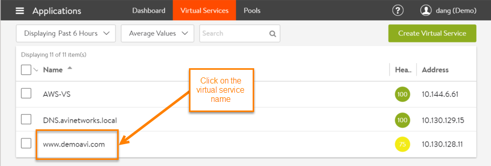
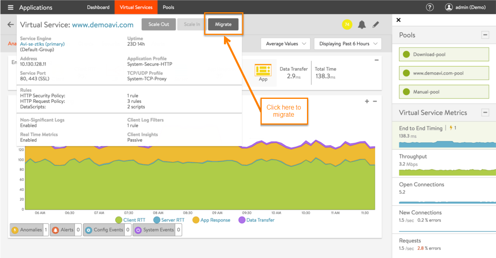
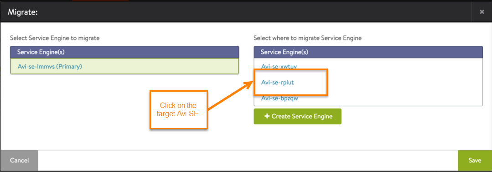
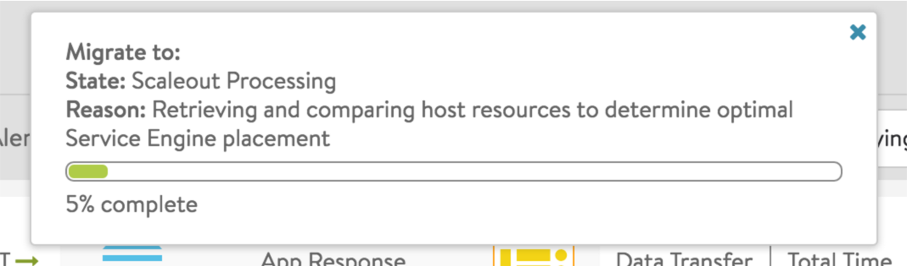
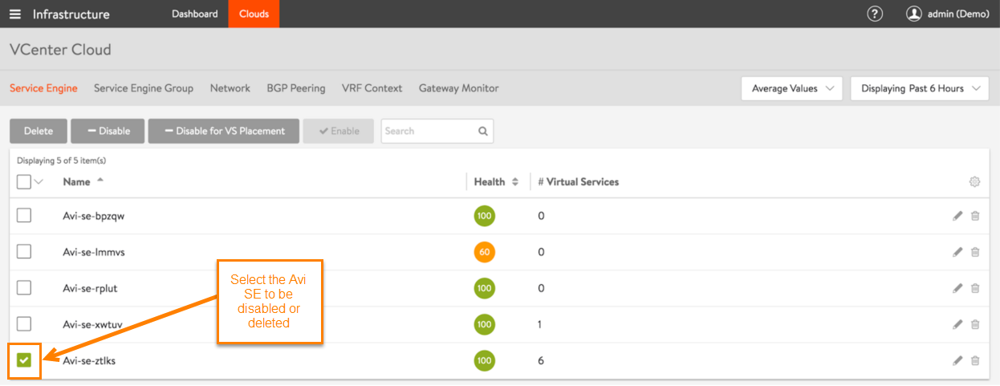

Vantage allows virtual services to easily be migrated from one Avi Service Engine (SE) to another. This capability can be useful in cases where an Avi SE needs to be disabled. For example, an Avi SE host may need to be disabled for maintenance. 

Using the steps in this article, the virtual services on an Avi SE can be migrated to another Avi SE. The migration is transparent to end users of the virtual service. Existing sessions continue with very minimal or no perceived interruption. 

## Migrating an Individual Virtual Service

<ol> 
 <li>Navigate to Applications &gt; Virtual Services.</li> 
 <li>Click on the name of the virtual service you want to migrate.  </li> 
 <li>Hover the mouse over the name of the virtual service to display the quick edit menu for the virtual service.</li> 
 <li>Click Migrate.  </li> 
 <li>Select the Avi SE to which to migrate the virtual service.   </li> 
</ol> 

Vantage shows the progress of the migration:

Note: If no other SEs are available, click Create Service Engine and select the host on which to create the SE.

## Migrating All Virtual Services

<ol> 
 <li>Navigate to Infrastructure &gt; Clouds.</li> 
 <li>Click on the cloud name.</li> 
 <li>Select the checkbox next to the Avi SE to be disabled.</li> 
 <li>Click Disable.  </li> 
</ol> 

Vantage migrates all virtual services that are on the disabled Avi SE to another SE. (Generally, this takes several minutes.) After all the virtual services have been migrated, the Avi SE is disabled and its health icon turns to grey. To view the virtual services that are on a remaining SE, including any migrated virtual services, click on the row for the SE (not on the SE name).

Note: For more on disabling Avi SEs, click <a href="/docs/16.3/disable-se">here</a>.
