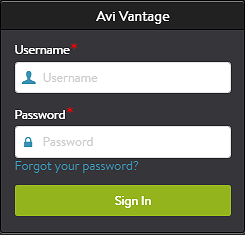

A valid account is required for access to Avi Vantage through the GUI, REST API, or CLI. Each user must be assigned a role which grants permissions and access to read or write to various objects within Vantage. Accounts may optionally be restricted to specific tenants, and granted different roles within each tenant.

User accounts are maintained either locally in Vantage or remotely via an external AAA server where authentication and authorization are performed.  Vantage will first attempt to validate the account via local auth database, then remote auth.

For SSH access, the Controller will also attempt to authenticate the user via the underlying Linux after failing to find the user in the local or remote auth databases.  Users created via local or remote are not created in Linux and may not have Linux access, with the exception of the *admin* account.

### Local User Authentication

* <a href="/docs/16.2.2/manage-local-user-accounts">Manage Local User Accounts</a>
* <a href="/docs/16.2.2/strong-password-enforcement">Strong Password Enforcement</a>
* <a href="/docs/16.2.2/password-recovery">Recover Lost Password</a> 

### Remote User Authentication

* <a href="/docs/16.2.2/ldap-auth-profile-test">LDAP Authentication Profile Test</a>
* <a href="/docs/16.2.2/ldap-configuration-examples">LDAP Configuration Examples</a>
* <a href="/docs/16.2.2/tacacs-authentication">TACACS+ Authentication</a>
* <a href="/docs/16.2.2/tacacs-configuration-examples">TACACS+ Configuration Examples</a>
* <a href="/docs/16.2.2/keystone-authentication">Keystone Authentication</a>
* <a href="/docs/16.2.2/cli-access">CLI Access and Remote Auth</a> 

### Roles

* <a href="/docs/16.2.2/user-account-roles">Roles</a> 

### Tenants

* <a href="/docs/16.2.2/tenants">Tenants</a>
* <a href="/docs/16.2.2/switch-between-tenants">Switch between Tenants</a>
* <a href="/docs/16.2.2/authorization-tenant-and-role-mapping-examples">Authorization - Tenant and Role Mapping Examples</a>
* <a href="/docs/16.2.2/all-tenants-view">All Tenants View</a> 

### Other

* <a href="/docs/16.2.2/super-user-accounts">Super User Accounts</a>
* <a href="/docs/16.2.2/default-system-accounts">Default System Accounts</a>
* <a href="/docs/16.2.2/user-account-self-service">User Account Self-Service</a> 

 

