A pool group is a list of server pools, accompanied by logic to selecta server pool from the list. Wherever a virtual service can refer to a server pool (directly, or via rules, DataScripts or service port pool selector), the virtual service could instead refer to a pool group.

The pool group is a powerful construct that can be used to implement the following:

* <a href="#prioritypools">Priority pools</a>
* <a href="#backuppools">Backup pools</a>
* <a href="#ABpools">A/B pools</a>
* <a href="#bluegreen">Blue/green deployment</a>
* <a href="#canary">Canary upgrades</a> 

*Note: Releases prior to 16.3 supported A/B pools and backup pools. These are being retired, and transitioned to the new pool group construct.*

## What is a Pool Group?

A pool group is a list of **member** (server) **pools**, combined with logic to select a member from the list. The PoolGroup object is represented as a list of 3-tuples { Priority, Pool, Ratio }, each tuple describing a member. For example, defining the pool group depicted below would require a PoolGroup object with nine 3-tuples.

<figure class="thumbnail wp-caption aligncenter"> <a href="img/nine-member-pool-group.png">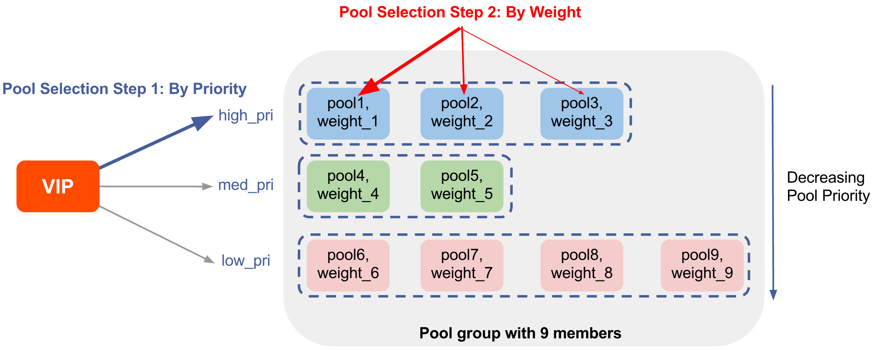</a>  
<figcapture> Figure 1 
</figcapture>
</figure> 

## How Does a Pool Group Work?

Let's use figure 1 to describe a typical scenario using the above diagram.

When a Service Engine responsible for a virtual service needs to identify a server to which to direct a particular client request, these are the steps.

* **Step 1: Identify best pools within the group**. This is governed by pool **priority**. This group of nine members defines three priorities— high_pri, med_pri, and low_pri — but pool1, pool2, and pool3 are the preferred (best) ones because they've all been assigned the highest priority. Avi Vantage will do all it can to pick one of them.
* **Step 2: Identify one of the highest-priority pools.**  This choice will be governed by the **weights** assigned to the three pool members, weight_1, weight_2 and weight_3. The **ratio** implied by those weights governs the percentage of traffic directed to each them. 
* **Step 3: Identify one server with the chosen pool.** Each of the 9 members can be configured with a different load-balancing algorithm. The algorithm associated with the chosen pool will govern which of its servers is selected. 

### The Effect of Persistence

Above we have described the algorithm as it would be applied to client requests initially and thereafter, absent the effect of persistence. However, persistence will have an overriding effect for the 2nd through nth request from a given client, if persistence is configured, which it can be, on a *per-pool* basis.

To enable persistence in a pool, navigate to Applications -> Pools -> Edit Pool -> Settings. You can choose one of the persistence profile types for the pool from the drop down provided. In 16.3. application cookie persistence and custom header cookie persistence are not supported for pools belonging to a pool group.

## Pool or Pool Group?

Pools and pool groups can be interchangeably used on a virtual service. If you anticipate needing to address any of its use cases in the future, use a pool group. You will profit from its flexibility, without disruption to existing traffic. There is no traffic disruption when pool group membership changes. Connections to servers in an existing pool member complete even if the pool member is removed from the pool group. Likewise, the pool group can be expanded dynamically.

On the other hand, if the functionality of a pool group is not anticipated, use a pool. A simple pool that does the job is more efficient than a pool group. It consumes less SE and Controller memory by avoiding configuration of an additional full-fledged uuid object.

## Configuration

Considering a pool group consisting of two pools, following are the steps to configure the feature:
<ol> 
 <li>Create individual pools that will be attached to the pool group.  Navigate to Applications -&gt; Pools -&gt; Create Pool -&gt; New Pool  The pools pool-1,pool-2 and cart2 have been created here.<a href="img/Create-pools.png">  </a><a href="img/my-new-pools.png">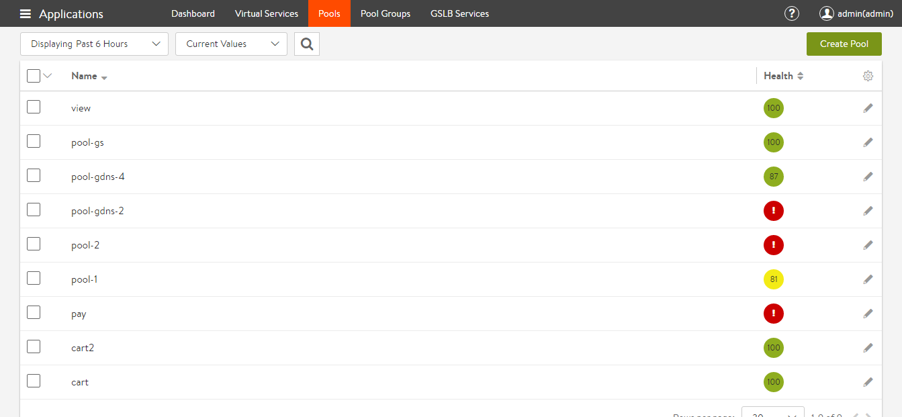</a>  To know more about configuring pool settings, please refer to the <a href="/architectural-overview/applications/pools/">Pool KB</a></li>
 <li>Create a new Pool Group, navigate to Applications -&gt; Pool Groups -&gt; Create Pool Group<a href="img/new-pg-1.png">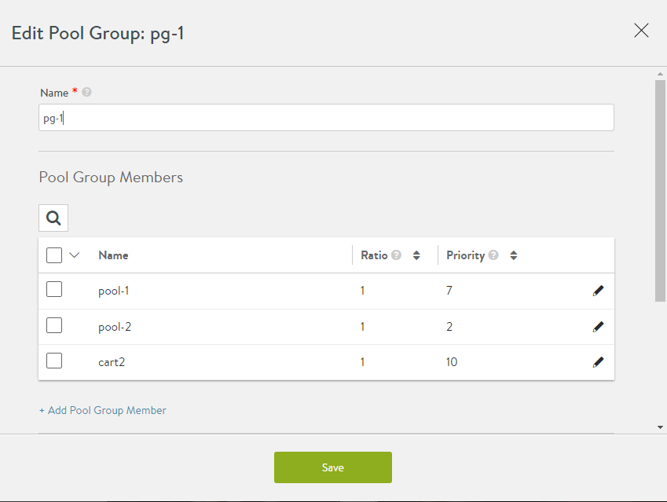</a><a href="img/Create-pool-group.png">  </a>Add the previously created pools as member pools or create new member pools. Note that each pool has been assigned a priority here.<a href="img/created-new-pg-1.png">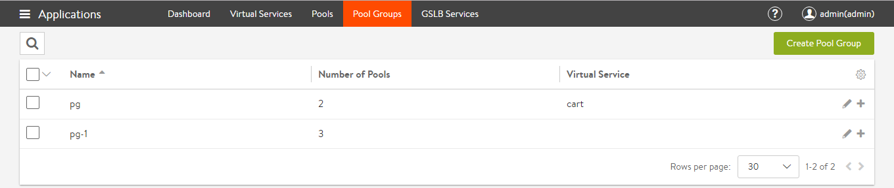</a></li> 
 <li>Attach the pool group to a virtual service.  Create a virtual service (in Advanced Mode) and configure its pool settings to include a pool group as follows:<a href="img/Create-new-virtual-service.png">  </a><a href="img/configure-VS-to-pg-1.png">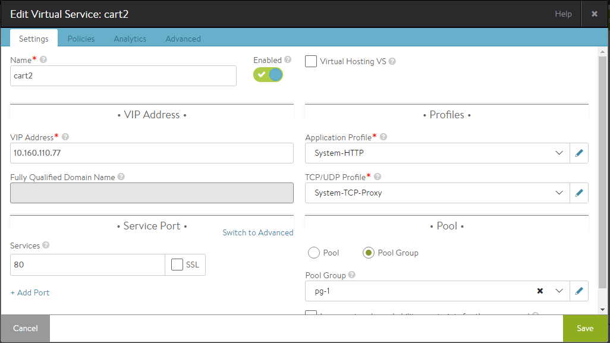</a>  Applications -&gt; Create Virtual Service -&gt; Advanced -&gt; New virtual service -&gt; Settings -&gt; Pool.  Select the Pool Group radio button and attach the previously created pool group to the virtual service.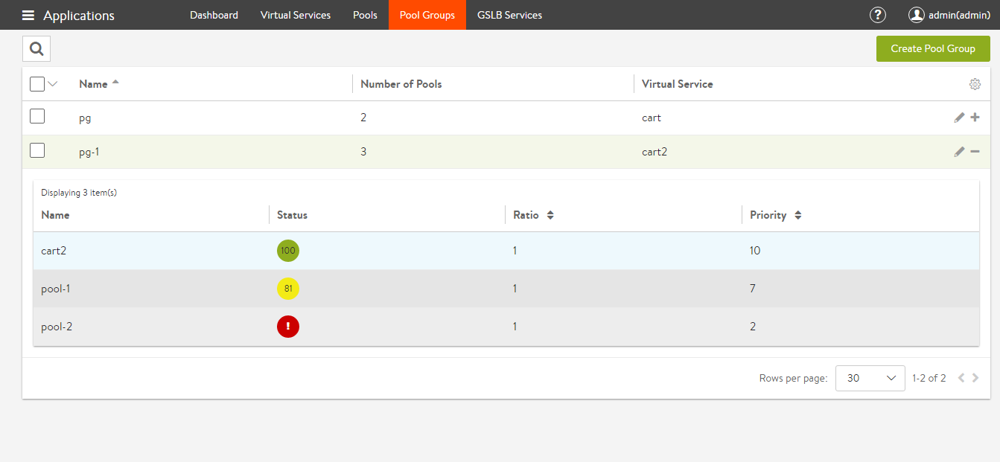</li> 
 <li>The pool group is attached and the virtual service is active:<a href="img/VS-cart2-active-and-attached-to-pg-1.png">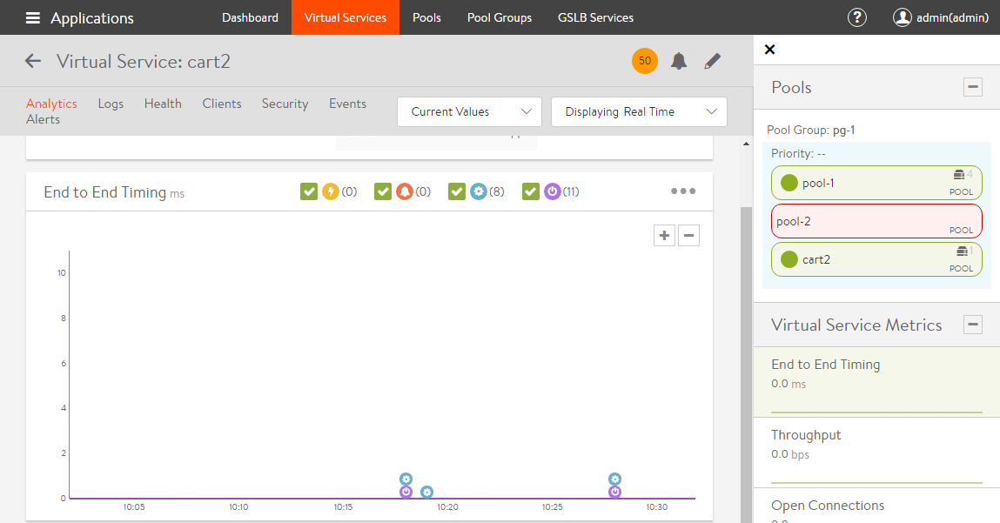</a></li> 
 <li>To view the overall setup of the virtual service and pool groups, navigate to Dashboard -&gt; Click on View VS Tree filter -&gt; Select specific virtual service (in this case cart2 virtual service)<a href="img/Tree-view.png">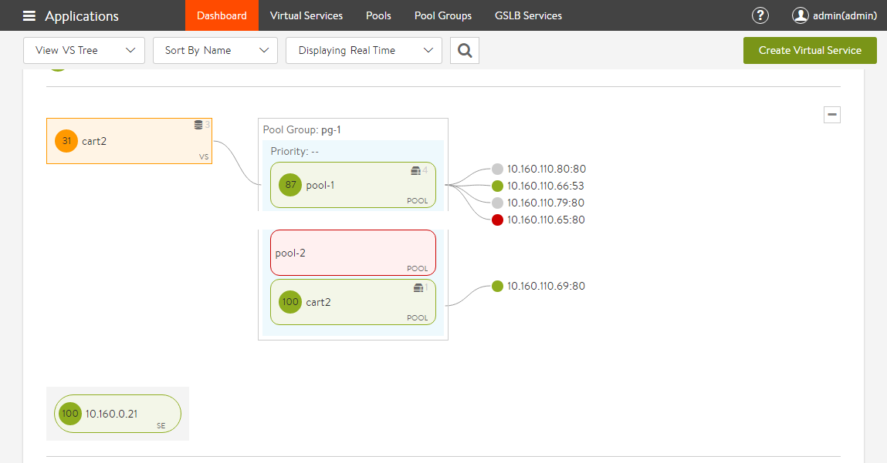</a></li> 
</ol> 

## Use Cases

### Priority Pools/Servers

Consider a case where a pool has different kinds of servers — newer, very powerful ones, older slow ones, and very old, very slow ones. In the diagram, imagine the blue pools are comprised of the new, powerful servers, the green pools have the older slow ones, and the pink pool the very oldest. Further note they've been assigned priorities from high_pri down to low_pri. This arrangement causes Avi Vantage to pick the newer servers in the 3 blue pools as much as possible, potentially always. Only if no server any of the highest priority pools can be found, Avi Vantage will send the slower members some traffic as well, ranked by priority.

One or a combination of circumstances trigger such an alternate selection (of a lower priority pool):
<ol> 
 <li class="p1">A running server can't be found.</li> 
 <li class="p1">Similar to #1, no server at the given priority level will accept an additional connection. All candidates are saturated.</li> 
 <li class="p1">No pool at the given priority level is running the minimum server count configured for it.</li> 
</ol> 

### Operational Notes

* It is recommended to keep the priorities spaced, and leave gaps. This makes the addition of intermediate priorities easier at a later point.
* For the pure priority use case, the ratio of the pool group is optional.
* Setting the ratio to 0 for a pool results in sending no traffic to this pool.
* For each of the pools, normal load balancing is performed. After Avi Vantage selects a pool for a new session, the load balancing method configured for that pool is used to select a server. 

### Sample Configuration for a Priority Pool

With only three pools in play, each at a different priority, the values in the Ratio column don't enter into pool selection. The cart2 will always be chosen, barring any of the three circumstances described above.

### Backup Pools

The pre-existing implementation of backup pools is explained in the <a href="/architectural-overview/applications/pools/">Pools (pre-16.3) KB.</a>The existing option of specifying a backup pool as a pool-down/fail action, is deprecated. Instead, configure a pool group with two or more pools, with varying priorities. The highest priority pool will be chosen as long as a server is available within it (in alignment with the three previously mentioned circumstances).

### Operational Notes

* A pool with a higher value of priority is deemed better, and traffic is sent to the pool with the highest priority, as long as this pool is up, and the minimum number of servers is met.
* It is recommended to keep the priorities spaced, and leave gaps. This makes the addition of intermediate priorities easier at a later point.
* For each of the group's pool members, normal load balancing is performed. After Avi Vantage selects a pool for a new session, the load balancing method configured for that pool is used to select a server.
* The addition or removal of backup pools does not affect existing sessions on other pools in the pool group. 

### Sample Configuration for a Backup Pool

<ol> 
 <li>Create a pool group ‘backup’, which has two member pools — primary-pool with a priority of 10, and backup-pool which has a priority of 3.<a href="img/Create-new-pool-group-backup.png">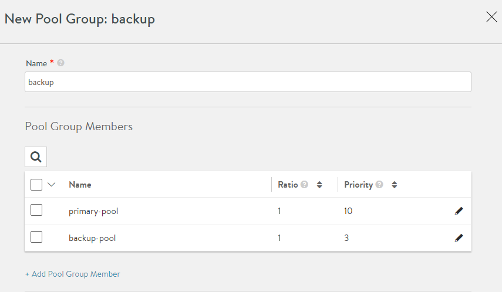</a>  Object Details:  
  <!-- Crayon Syntax Highlighter v2.7.1 --> <pre><code class="language-lua">{
     url: "https://10.10.25.20/api/poolgroup/poolgroup-f51f8a6b-6567-409d-9556-835b962c8092",
     uuid: "poolgroup-f51f8a6b-6567-409d-9556-835b962c8092",
     name: "backup",
     tenant_ref: "https://10.10.25.20/api/tenant/admin",
     cloud_ref: "https://10.10.25.20/api/cloud/cloud-3957c1e2-7168-4214-bbc4-dd7c1652d04b",
     _last_modified: "1478327684238067",
     min_servers: 0,
     members:
    [
        {
            ratio: 1,
            pool_ref: "https://10.10.25.20/api/pool/pool-4fc19448-90a2-4d58-bb8f-d54bdf4c3b0a",
            priority_label: "10"
        },
        {
            ratio: 1,
            pool_ref: "https://10.10.25.20/api/pool/pool-b77ba6e9-45a3-4e2b-96e7-6f43aafb4226",
            priority_label: "3"
        }
    ],
    fail_action:
    {
        type: "FAIL_ACTION_CLOSE_CONN"
    }
}</code></pre> 
  <!-- [Format Time: 0.0018 seconds] --> </li> 
</ol> 

### A/B Pools

Avi Vantage supports the specification of a set of pools that could be deemed equivalent pools, with traffic sent to these pools in a defined ratio.

For example, a virtual service can be configured with a single-priority group having two pools, A and B. Further, the user could specify that the ratio of traffic to be sent to A is 4, and the ratio of traffic for B is 1.

The A/B pool feature, sometimes referred to as blue/green testing, provides a simple way to gradually transition a virtual service's traffic from one set of servers to another. For example, to test a major OS or application upgrade in a virtual service's primary pool (A), a second pool (B) running the upgraded version can be added to the primary pool. Then, based on the configuration, a ratio (0-100) of the client-to-server traffic is sent to the B pool instead of the A pool.

To continue this example, if the upgrade is performing well, the Avi Vantage user can increase the ratio of traffic sent to the B pool. Likewise, if the upgrade is unsuccessful or sub-optimal, the ratio to the B pool easily can be reduced again to test an alternative upgrade.

To finish transitioning to the new pool following successful upgrade, the ratio can be adjusted to send all traffic to pool, which now makes pool B the production pool.

To perform the next upgrade, the process can be reversed. After upgrading pool A, the ratio of traffic sent to pool B can be reduced to test pool A. To complete the upgrade, the ratio of traffic to pool B can be reduced back to 0.

### Operational Notes

* Setting the ratio to 0 for a pool results in sending no traffic to this pool.
* For each of the pools, normal load balancing is performed. After Avi Vantage selects a pool for a new session, the load balancing method configured for that pool is used to select a server.
* The A/B setting does not affect existing sessions. For example, setting the ratio sent to B to 1 and A to 0 does not cause existing sessions on pool A to move to B. Likewise, A/B pool settings do not affect persistence configurations.
* If one of the pools that has a non-zero ratio goes down, new traffic is equally distributed to the rest of the pools.
* For pure A/B use case, the priority of the pool group is optional.
* Pool groups can be applied as default on the virtual service, or attached to rules, DataScripts and Service port pool selector as well. 

### Sample Configuration for an A/B Pool

<ol> 
 <li style="font-weight: 400;">Create a pool group ‘ab’, with two pools in it — a-pool and b-pool — without specifying any priority:<a href="img/Create-ab-pool-group.png">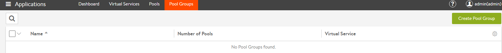</a>   <a href="img/Add-pools-in-ab-pool-group.png">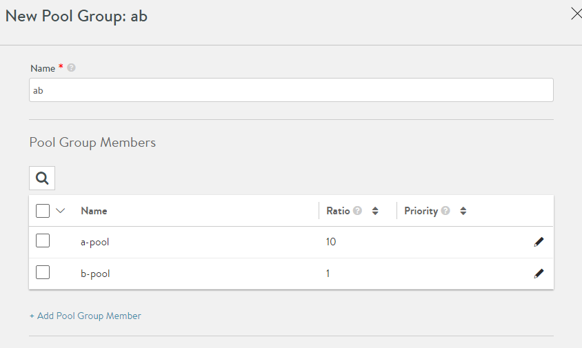</a>  In this example, 10% of the traffic is sent to b-pool, by setting the ratios of a-pool and b-pool to 10 and 1 respectively.</li> 
 <li style="font-weight: 400;">Apply this pool group to the VS, where you would like to have A/B functionality:<a href="img/add-ab-pool-group-to-virtual-service.png">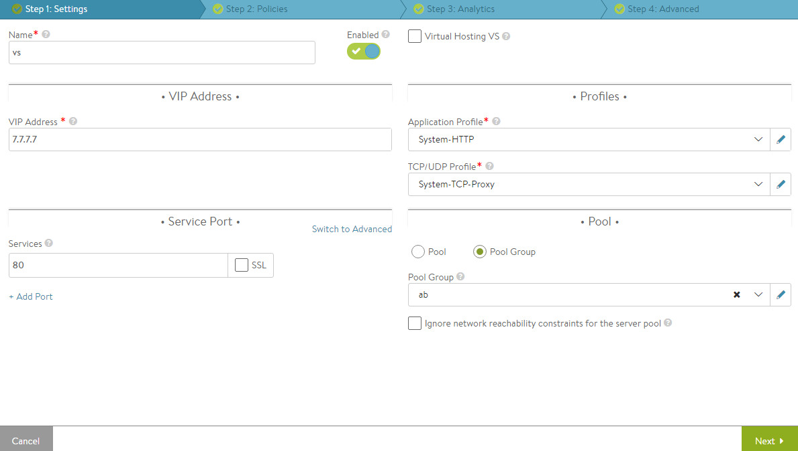</a>  Object details:  
  <!-- Crayon Syntax Highlighter v2.7.1 --> <pre><code class="language-lua">{
    url: "https://
     
    <controller>
      /api/poolgroup/poolgroup-7517fbb0-6903-403e-844f-6f9e56a22633", uuid: "poolgroup-7517fbb0-6903-403e-844f-6f9e56a22633", name: "ab", tenant_ref: "https:// 
     <controller>
       /api/tenant/admin", cloud_ref: "https:// 
      <controller>
        /api/cloud/cloud-3957c1e2-7168-4214-bbc4-dd7c1652d04b", min_servers: 0, members: [ { ratio: 10, pool_ref: "https:// 
       <controller>
         /api/pool/pool-c27ef707-e736-4ab6-ab81-b6d844d74e12" }, { ratio: 1, pool_ref: "https:// 
        <controller>
          /api/pool/pool-23853ea8-aad8-4a7a-8e9b-99d5b749e75a" } ], } 
        </controller> 
       </controller> 
      </controller> 
     </controller> 
    </controller></code></pre> 
  <!-- [Format Time: 0.0013 seconds] --> </li> 
</ol> 

### A/B Pool Feature Prior to 16.3

<a href="/ab-pool-feature/">A/B Pool Test Pool</a> defines the feature shipping prior to 16.3. It had the following shortcomings:

* Only two pools could specified as A/B. This could not be extended to pools C, D, etc.
* A/B pools and backup pools were mutually exclusive. Only one of them could be specified. 

These shortcomings do not exist in the new implementation.

### Additional Use Cases

### <a href="/an-article-is-planned/">Blue/Green Deployment</a>

This is a release technique that reduces downtime and risk by running two identical production environments, only one of which (e.g., blue) is live at any moment, and serving all production traffic. In preparation for a new release, deployment and final-stage testing takes place in the environment that is *not* live (e.g., green). Once confident in green, all incoming requests go to green instead of blue. Green is now live, and blue is idle. Downtime due to application deployment is eliminated. In addition, if something unexpected happens with the new release on green, roll back to the last version is immediate; just switch back to blue.

### <a href="/an-article-is-planned/">Canary Upgrades</a>

This upgrade technique is so called because of its similarity to miner’s canary, which would detect toxic gasses before any humans might be affected. The idea is that when performing system updates or changes, a group of representative servers get updated first, are them monitored/tested for a period of time, and only thereafter are rolling changes made across the remaining servers.
