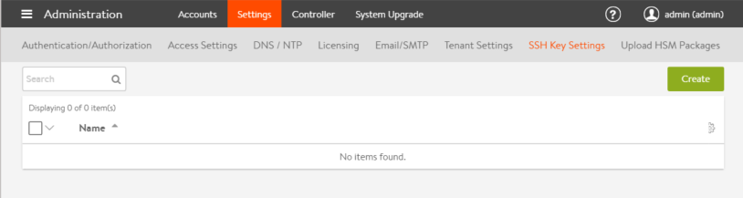
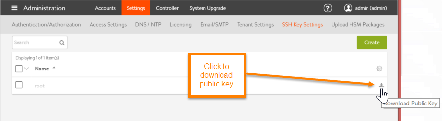

When <a href="/installation-guides/installing-avi-vantage-for-a-linux-server-cloud/">installing Vantage for a Linux server cloud</a>, part of the deployment process for a new Avi Service Engine is to add an SSH user to the Avi Controller, then add the same user and its public key to the SE host. The SSH user and key are used by the Controller to log onto the SE host, transfer the Docker container for the Avi SE onto the host, and start the SE within the Docker container.

For releases prior to 16.2.2, this article describes how to set up SSH on the Avi Controller and on each Avi SE host so that the Avi Controller can log onto the Avi SEs in a Linux server cloud. Part of this process takes place on the Avi Controller. The other part takes place on each of the Avi SE hosts.

## Add the SSH User to the Avi Controller

On the Avi Controller, add the SSH user and the user's public-private key pair. An SSH account can be created on the Avi Controller (the easy way), or an existing account can be used by adding its username and importing its keys.

Use this section even if the SSH user has already been added. The user's public key needs to be copied so it can be pasted into a command line on each of the Avi SE hosts.

Navigate to Administration > Settings, and click SSH Key Settings. If any SSH users have already been added to the Avi Controller, they are listed here.
While this example shows more than one account, the same account can be used for all the SE hosts. A unique account is not required for each SE host. (The account serves a similar purpose to the well-known secret in a routing protocol topology.)

* To copy the public key for an SSH user listed here, click the download icon in the row for that user.
* If creating a new user: <ol> 
 <li>Click Create SSH User.</li> 
 <li>Enter the username.</li> 
 <li>Select the Generate SSH Key Value Pair radio button, and click Generate SSH Key Pair.</li> 
 <li>Click Copy to clipboard.</li> 
 <li>Click Save. The SSH user appears in the list.</li> 
</ol>  

The public key can be downloaded from the SSH user list at any time, by clicking on the download icon.

Open the downloaded file and copy the entire contents of the file to the clipboard.

## Preparing the SE Hosts (if using SSH account *root*)

To add the SSH user configured on the Controller to each of the SE hosts, use the following steps. These steps also enable password-less sudo access for the SSH user. The SSH account and password-less sudo access are required by the Controller to log onto the SE host, transfer the Docker container for the SE onto the host, and start the SE within the Docker container.
<ol> 
 <li>Log into the Linux shell on the Avi SE host (in this example, 10.130.164.76): <pre crayon="false" pre="" class="command-line language-bash" data-user="" data-host="$" data-output="1-100"><code>ssh avi@10.130.164.76
password:
</code></pre> </li> 
</ol> <ol start="2"> 
 <li>Prepare the Avi SE host for adding the key from the Avi Controller: <pre crayon="false" pre="" class="command-line language-bash" data-user="aviuser" data-host="localhost ~"><code>mkdir .ssh &amp;&amp; chmod 700 .ssh &amp;&amp; cd .ssh
</code></pre> </li> 
</ol> <ol start="3"> 
 <li>Add the Avi Controller's public key to the authorized key file by pasting the key copied from the Avi Controller by clicking Copy to clipboard into the following command line:<pre crayon="false" class="command-line language-bash" data-prompt=": >"><code>echo "paste-key-file-copied-from-Controller" &gt; .ssh/authorized_keys
chmod 644 authorized_keys</code></pre>Use quotation marks to delimit the pasted key string. (If the authorized_keys file does not already exist, the command string also creates the file.)</li> 
</ol> <ol start="4"> 
 <li>Repeat these steps on each Avi SE host.</li> 
</ol> 

**Example:**

<pre pre="" class="command-line language-bash" data-user="aviuser" data-host="localhost ~"><code>mkdir .ssh &amp;&amp; chmod 700 .ssh &amp;&amp; cd .ssh
echo "ecdsa-sha2-nistp256 AAAAE2VjZHNhLXNoYTItbmizdHAyNTYAAAAlbmlzdHAyNTYAAABBBAHjOS
Uo8AVTISniFZ05UwOsce8/CxMhZ0myWFeRJJSnEC/T09EwOj+z6uMbnTEC+
AHrYAEMgVCkdlhYfmWlrCg=root@Avi-Controller" &gt; .ssh/authorized_keys
chmod 644 authorized_keys
</code></pre> 

Note: Make sure to paste the public key for the Avi SE in your deployment. The key shown here is only an example and will not work with your Avi SEs.

## Preparing the Avi SE Hosts (if not using SSH account *root*)

The steps above assume that SSH user "root" will be used by the Avi Controller to log into the Avi SE for management. To use a different SSH user instead, perform the following steps ***on each Avi SE host***:
<ol> 
 <li>Log into the Linux shell on the Avi SE host (in this example, 10.130.164.76): <pre crayon="false" pre="" class="command-line language-bash" data-user="aviuser" data-host="localhost ~" data-output="1-100"><code>ssh avi@10.130.164.76
password:
</code></pre> </li> 
</ol> <ol start="2"> 
 <li>Prepare the Avi SE host for adding the key from the Avi Controller: <pre crayon="false" pre="" class="command-line language-bash" data-user="aviuser" data-host="localhost ~"><code>mkdir .ssh &amp;&amp; chmod 700 .ssh &amp;&amp; cd .ssh
</code></pre> </li> 
</ol> <ol start="3"> 
 <li>Add the Avi Controller's public key to the authorized key file by pasting the key copied from the Avi Controller by clicking Copy to clipboard into the following command line:<pre crayon="false" class="command-line language-bash" data-prompt=": >"><code>echo "paste-key-file-copied-from-Controller" &gt; .ssh/authorized_keys
chmod 644 authorized_keys</code></pre>Use quotation marks to delimit the pasted key string. (If the authorized_keys file does not already exist, the command string also creates the file.)</li> 
</ol> <ol start="4"> 
 <li>Enable sudo password-less login for the SSH user:<pre crayon="false" class="command-line language-bash" data-prompt=": >"><code>sudo echo "avise ALL=(ALL) NOPASSWD:ALL" &gt;&gt; /etc/sudoer</code></pre>Where the example shows "avise," make sure to type the SSH user name created above.</li> 
</ol> <ol start="5"> 
 <li>Repeat these steps on each Avi SE host.</li> 
</ol> 

**Example:**

<pre pre="" class="command-line language-bash" data-user="aviuser" data-host="localhost ~"><code>mkdir .ssh &amp;&amp; chmod 700 .ssh &amp;&amp; cd .ssh
echo "ecdsa-sha2-nistp256 AAAAE2VjZHNhLXNoYTItbmizdHAyNTYAAAAlbmlzdHAyNTYAAABBBAHjOS
Uo8AVTISniFZ05UwOsce8/CxMhZ0myWFeRJJSnEC/T09EwOj+z6uMbnTEC+
AHrYAEMgVCkdlhYfmWlrCg=root@Avi-Controller" &gt; .ssh/authorized_keys
chmod 644 authorized_keys
sudo echo "avise ALL=(ALL) NOPASSWD:ALL" &gt;&gt; /etc/sudoer
</code></pre> 