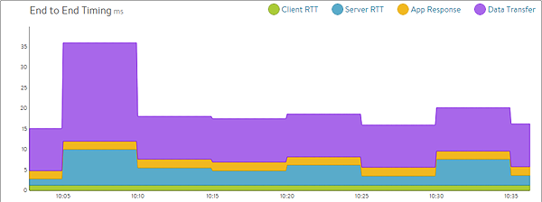
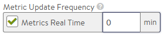
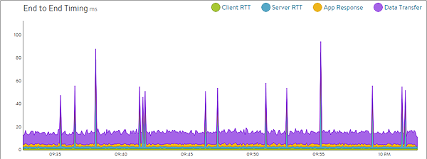

### The Issue

Within an object such as a Service Engine (SE), virtual service, pool, or server, the display time pull-down menu allows for displaying metrics in real time. However, the graphs may update only every few minutes, resulting in five-minute blocks of averaged data.  

<pre>Table 1: Metrics Real Time <strong>disabled</strong></pre> 

### The Reason

When a new virtual service is first created, the update frequency for analytics metrics data is set to capture metrics aggressively for the first 60 minutes.  

After the first 60 minutes, the aggressive metrics capture expires and the SEs report metrics less frequently, in 5-minute intervals. This method enables richer troubleshooting data during the initial testing of the new application deployment. After an application is successfully deployed, analytics for the application might not be viewed again for days, months, or perhaps ever. With larger deployments incorporating potentially hundreds or thousands of applications, Vantage attempts to reduce noise and conserve resources on the Controllers by capturing data less aggressively when not required.

### The Solution

For high priority applications or ones that require more detailed data, edit the virtual service and navigate to the Analytics tab. Check (enable) Metrics Update Frequency and set the time to 0 (unlimited). This will permanently enable capture of real-time metrics for the application. If a time other than 0 is specified, metrics collection reverts to the less aggressive interval upon expiration of the timer.

Table 2: Metrics Real Time **enabled**  
