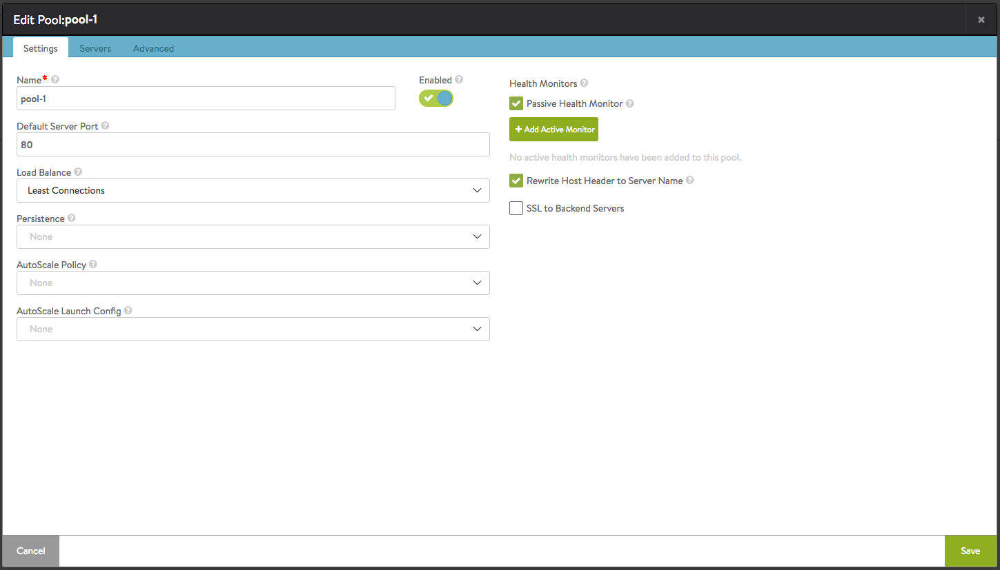
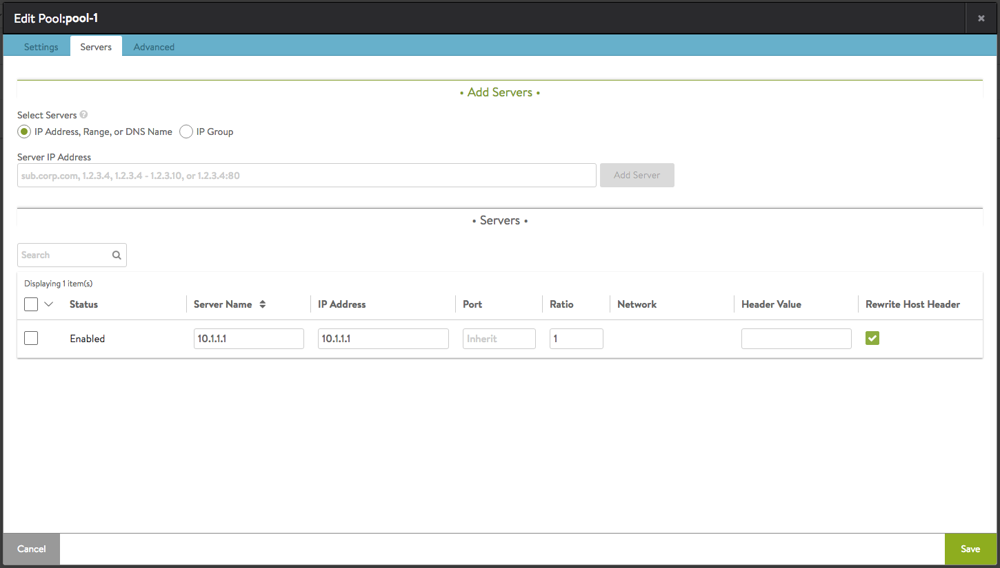

Starting with Avi Vantage release 16.2.3, when proxying a request to a back-end server, an SE can rewrite the host header to the server name of the particular back-end server to which the request is forwarded. This functionality can be turned on for selected or all servers in the pool.

To provide this functionality, two options have been added  to the pool editor:
Option 1. Under the Settings tab, check the box labeled Rewrite Host Header to Server Name.

 

Option 2. Under the Servers tab, in the Rewrite Host Header column, check the box corresponding to the individual server for which this behavior is intended.

The pool-level check box (option /#1) takes precedence (over option /#2). If the pool-level option is selected, the behavior is on for all servers, no matter what selections have been made on a per-server basis.

If the rewrite host header to SNI is turned on as well as this feature, it takes precedence over the "to server name" feature.
