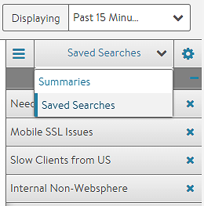

One of Vantage's usability features is the ability to save and reuse log searches. A saved search captures the search parameter(s) defined by the currently configured search, and allows the same Vantage user to retrieve the search later. Searches are tied to the user account and are not be visible to other users.

## Saving a Search

To save a search, first enter at least one search parameter into the search bar. Icons appear on the right side of the bar, the star, the X, and the magnifying glass. Clicking the star will bring up a box to input a name for the saved search.  

## Restoring a Saved Search

To restore and execute a saved search, select the Summaries pull-down menu, which can be toggled to show saved searches. Click any one of the saved searches to automatically run the search against the logs for the time period selected. The star in the search box will turn yellow, indicating the search matches an existing saved search.

## Removing a Saved Search

A saved search may be removed by clicking the X next to it in the saved search list in the sidebar menu.  
