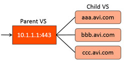

### Description

Server Name Indication, or SNI, is a method of virtual hosting multiple domain names for an SSL enabled virtual IP. A single VIP is advertised for multiple virtual services. When a client connects to the VIP, Avi Vantage begins the SSL/TLS negotiation, but does not choose a virtual service, or an SSL certificate, until the client has requested the site by name via the TLS hello packet's domain field. If the requested domain name is configured on the virtual IP, the appropriate certificate is returned to the client and the connection is bound to the proper virtual service.

Other SNI-related KB articles: <a href="/docs/16.3/wildcard-sni-matching-for-virtual-hosting/">Wildcard SNI Matching for Virtual Hosting</a>, <a href="/docs/16.3/support-for-sni-extension-in-tls-handshakes-to-pool-servers/">Support for SNI Extension in TLS Handshakes to Pool Servers</a>.

### Configuration

Avi uses a concept of parent and child virtual services for SNI virtual hosting. When the Virtual Hosting VS option is selected on the create VS (via advanced mode) or edit VS, the virtual service participates in the virtual hosting. The virtual hosting VS must be configured as either a parent or a child VS.

### Parent VS

The parent virtual service governs the networking properties used to negotiate TCP and SSL with the client. It may also be a catch-all in case a client's requested domain name does not exist or does not match one of the configured child virtual services.
Configure the following properties on the parent VS:

* **Network:** The listener IP address, service port, network profile, and SSL profile. No networking properties are configured on the child virtual services.
* **Pool:** Optionally specify a pool for the parent VS. The pool will only be used if no child virtual service matches a client's requested domain name.
* **SSL Certificate:** An SSL cert may be configured, and may be either a wildcard certificate or a specific domain name. The parent’s SSL certificate will only be used if the client’s request does not match a child virtual service domain. If an SSL certificate with specific domain name is returned to the client, such as while sending a friendly error message, the client will receive an SSL name mismatch message. For this reason is may be desirable to use a wildcard on the parent. 

The parent virtual service will receive all new client TCP connection handshakes, which will be reflected in the statistics. Once a child VS is selected, the connection is internally handed off to a child VS, so subsequent metrics such as packets, concurrent connections, throughput, requests, logs and other stats will only be recorded on the child virtual service. Similarly the child VS will not have logs for the initial TCP or SSL handshakes, such as the SSL version mismatch errors, which are recorded at the parent VS.

### Child VS

The child virtual service does not have an IP address or service port. Instead, it points to a parent virtual service, which must be created first. The domain name field is a fully qualified name requested by the SNI-enabled client within the SSL handshake. The parent matches the client request with the child's configured domain name. It does not match against the configured SSL certificate. The child may use a wildcard or domain specific certificate.
If no child matches the client request, the parent's SSL certificate and pool are used.
