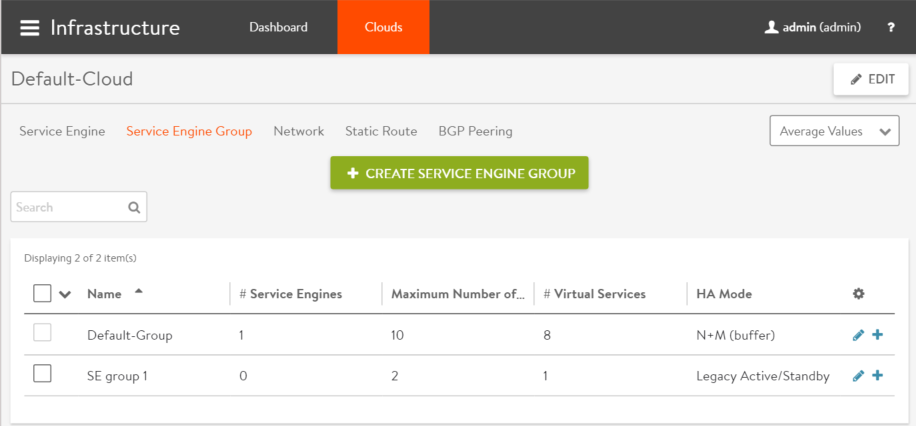
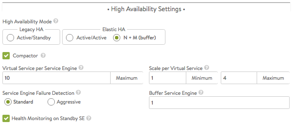
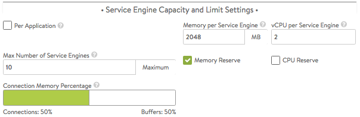
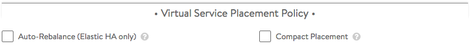
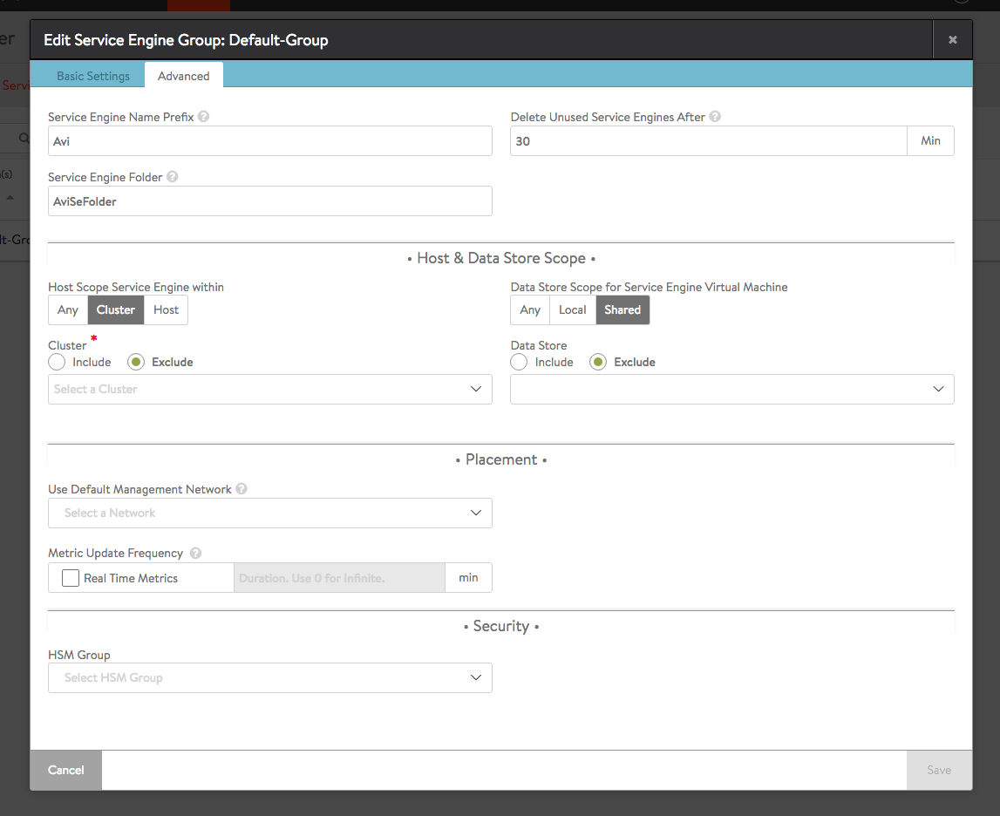

Service Engines are created within a group, which contains the definition of how the SEs should be sized, placed, and made highly available. Each cloud will have at least one SE group.  The options within an SE group may vary based on the type of cloud within which they exist and the settings within that cloud, such as*no access* versus *write access* mode.  SEs may only exist within one group.  Each group acts as an isolation domain.  SE resources within an SE group may be moved around to accommodate virtual services, but SE resources are never shared between SE Groups.

Changes made to an SE group may be applied immediately, only applied to SEs created after the changes are made, or require existing SEs to first be disabled before the changes can take effect.

Multiple SE groups may exist within a cloud.  A newly created virtual service will be placed on the default SE group, though this can be changed via the VS > Advanced page while creating a VS via the advanced mode.  To move an existing virtual service from one SE group to another, the VS must first be disabled, moved, and then re-enabled.  SE groups provide data plane isolation, therefore moving a VS from one SE group to another is disruptive to existing connections through the virtual service.

### SE Group — Basic Settings Tab

To access the Service Engine group page, navigate to Infrastructure > Clouds > -cloudname- > Service Engine Group.

### High Availability Settings

The high availability mode of the SE group controls the behavior of the SE group in the event of an SE failure.  It also controls how load is scaled across SEs. Selecting a particular HA mode will change the settings and options that are exposed in the UI. These modes span a spectrum, from use of the fewest virtual machine resources on one end to providing the best high availability on the other.

* <a href="/docs/16.3/legacy-ha-for-avi-service-engines/">Legacy Active Standby HA Mode</a>:  This mode is primarily intended to mimic a legacy appliance load balancer for easy migration to Avi Vantage.  Only two Service Engines may be created.  For every virtual service active on one, there is a standby on the other, ready to take over in case of a failure of the active SE.  There is no Service Engine scale out.
* <a href="/docs/16.3/elastic-ha-for-avi-service-engines/">Elastic N + M HA Mode</a>: This default mode permits up to N active SEs to deliver virtual services, with the capacity equivalent of M SEs within the group ready to absorb SE(s) failure(s).
* <a href="/docs/16.3/elastic-ha-for-avi-service-engines/">Elastic Active/Active HA Mode</a>:  This HA mode distributes virtual services across a minimum of two SEs. 

For additional considerations for SE high availability, see <a href="/docs/16.3/overview-of-vantage-high-availability/">Overview of Vantage High Availability</a>. To compare the above HA modes to those defined prior to Vantage 16.2, see <a href="/docs/16.3/comparing-past-and-present-se-group-ha-modes/">Comparing Past and Present SE Group HA Modes</a>.

 

### Service Engine Capacity and Limit Settings

* **Per Application: **Select this option to deploy dedicated load balancers per application, i.e., per virtual service. In this mode, each SE is limited to a maximum of 2 virtual services. vCPUs in per-app SEs count towards licenings at 25% rate.
* **Max Number of Service Engines**:  Defines the maximum SEs that may be created within a SE group. This number, combined with the virtual services per SE setting, dictate the maximum number of virtual services that can be created within an SE group. If this limit is reached, it is possible new virtual services may not be able to be deployed and will show a gray, un-deployed status. This setting can be useful for limiting Vantage from consuming too many virtual machines.
* **Memory per Service Engine**:  Enter the amount of RAM, in MB, to allocate to all new SEs. Changes to this field will only affect new SEs. Allocating more memory to an SE will allow larger HTTP cache sizes, more concurrent TCP connections, better protection against certain DDoS attacks, and increased storage of un-indexed logs. This option is only applicable in write access mode deployments.
* **Memory Reserve**:  Reserving memory ensures an SE will not have contention issues with over-provisioned host hardware. Reserving memory makes that memory unavailable for use by another virtual machine, even when the virtual machine that reserved those resources is powered down. Avi strongly recommends reserving memory, as memory contention may randomly overwrite part of the SE memory, destabilizing the system. This option is applicable only for deployments in write access mode. For deployments in read access mode deployments or no access mode, memory reservation for the SE VM must be configured on the virtualization orchestrator.
* **vCPU per Service Engine**:  Enter the number of virtual CPU cores to allocate to new SEs. Changes to this setting do not affect existing SEs. This option is only applicable in write access mode. Adding CPU capacity will help with computationally expensive tasks, such as SSL processing or HTTP compression.
* **CPU Reserve**:  Reserving CPU capacity with a virtualization orchestrator ensures a SE will not have issues with over-provisioned host hardware. Reserving CPU cores makes those cores unavailable for use by another virtual machine, even when the virtual machine that reserved those resources is powered down. This option is only applicable in write access mode deployments.
* **Connection Memory Percentage:** The percentage of memory reserved to maintain connection state. It comes at the expense of memory used for HTTP in-memory cache. Sliding the bar causes the percentage to range between its limits, 10% minimum and 90% maximum. 

### Virtual Service Placement Policy

* **Auto-Rebalance**:  When disabled, Vantage will generate an event when the Controller recommends migrating a virtual service to a different Service Engine, scaling in SE capacity, or scaling out SE capacity.  When checked, the Controller will generate an event and also take the recommended action.  This option applies to the elastic HA modes only. See<a href="/docs/16.3/autoscale-service-engines/"> Autoscale Service Engines</a> for more info on the criteria that triggers these recommendations.
* **Compact Placement**: When compact placement is ON (previously referred to as "Compactor"), Vantage uses the minimum number of SEs required. When it is OFF, Vantage will use as many SEs as required, up to the limit allowed by Max Number of Service Engines. By default, compact placement is ON for elastic HA N+M mode and OFF for elastic HA active/active mode. 

### SE Group — Advanced Tab

The advanced tab in the Service Engine group popup allows configuration of optional functionality for SE groups. This tab only exists for VMware clouds configured with write access mode. The appearance of some fields is contingent upon selections made.

* **Service Engine Name Prefix**:  Enter the prefix to use when naming the SEs within the SE group. This name will be seen both within Vantage, and as the name of the virtual machine within the virtualization orchestrator.
* **Service Engine Folder**:  SE Virtual Machines for this SE group will be grouped under this folder name within the virtualization orchestrator.
* **Delete Unused Service Engines After**:  Enter the number of minutes to wait before the Controller deletes an unused SE. Traffic patterns can change quickly, and a virtual service may therefore need to scale across additional SEs with little notice. Setting this field to a high value ensures that Vantage keeps unused SEs around in case of a sudden spike in traffic. A shorter value means the Controller may need to recreate a new SE to handle a burst of traffic, which may take a couple of minutes. This option is only applicable in write access mode. 

### Host & Data Store Scope

* **Host Scope Service Engine**:  SEs may be deployed on any host that most closely matches the resources and reachability criteria for placement. This setting directs the placement of SEs.  
    * **Any**:  The default setting allows SEs to be deployed to any host that best fits the deployment criteria.
    * **Cluster**:  Excludes SEs from deploying within specified clusters of hosts. Checking the Include checkbox reverses the logic, ensuring SEs only deploy within specified clusters.
    * **Host**:  Excludes SEs from deploying on specified hosts. The Include checkbox reverses the logic, ensuring SEs only be deploy within specified hosts.
* **Data Store Scope for Service Engine Virtual Machine**:  Set the storage location for SEs. Storage is used to store the OVA (vmdk) file for VMware deployments.  
    * **Any**:  Vantage will determine the best option for data storage.
    * **Local**:  The SE will only use storage on the physical host.
    * **Shared**:  Vantage will prefer using the shared storage location. Specific data stores may be Excluded or specified via Include. 

### Placement

* **Use Default Management Network**:  If the SEs require a different network for management than the Controller, it must be specified here. The SEs will use their management route to establish communications with the Controllers.  See <a href="/docs/16.3/deploy-ses-in-different-data-centers-from-controllers/">Deploy SEs in Different Datacenter from Controllers</a>
* **Metric Update Frequency**: You can turn on real-time metrics, which will cause SEs in the group to upload SE-related metrics to the Controller once every 5 seconds, as opposed to once per five minutes or longer. [<a href="/docs/16.3/metrics-retention-period/">More info on metrics-upload intervals</a>.] After clicking the box, select the duration in minutes for real-time updating to last. A value of 0 is interpreted to mean "forever." 

### Security

* **HSM Group**:  Hardware security modules may be configured within the Templates > Security > HSM Groups.  An HSM is an external security appliance that is used for secure storage of SSL certificates and keys.  The HSM Group dictates how Service Engines can reach and authenticate with the HSM.  See <a href="/docs/16.3/physical-security-for-ssl-keys/">Physical Security for SSL Keys</a>  