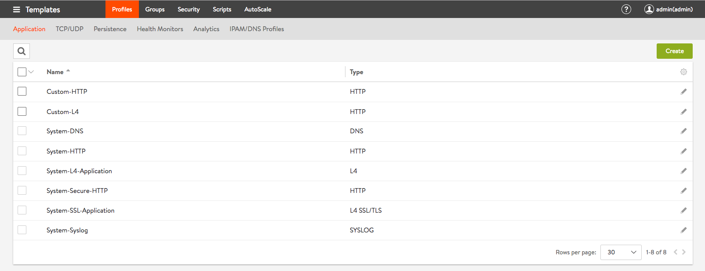
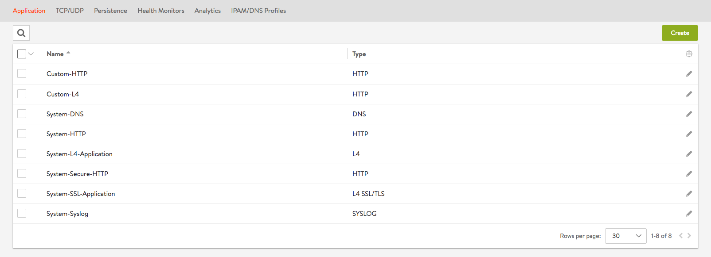
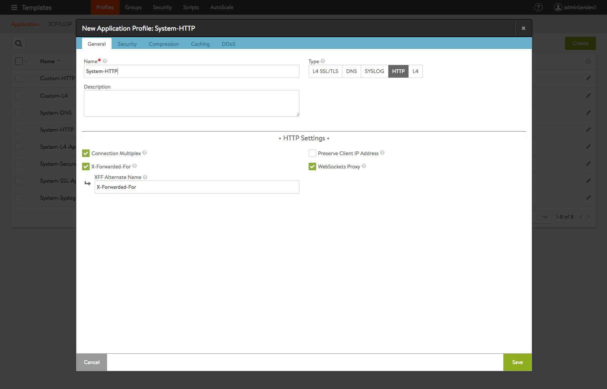
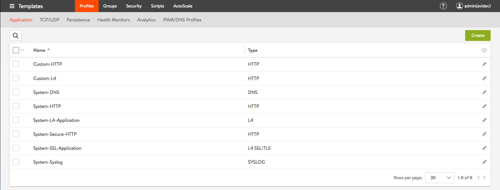

Profile objects in the admin tenant are shared across all tenants in the system. We refer here to objects visible under the Templates section of the UI such as Health Monitor, Application Profile, SSL Profile, Network Profile, PKI Profile, etc.

Avi Vantage defines a set of system default profiles as a part of the installation itself. These objects can be edited but can neither be renamed nor deleted. In addition to these profiles, the administrator can create, edit and delete custom profile objects suited to their specific deployment. Both the system default profiles and any custom profiles that are created in the admin tenant are automatically shared across all the tenants in the system. Tenants are able to view and use these profiles, but cannot delete the shared admin profiles.

Tenants may chose to override the default profile parameters to something that best suits their application deployment. A tenant can do this by either editing the shared admin profile or creating new custom profiles under their tenant context. Editing the shared admin profile creates a copy-on-write effect, such that a new profile with the same name (but a different UUID) is created in the specific tenant's context. Making changes to this profile object does not affect other tenants in the system. Deleting such a profile created using copy-on-write brings the shared admin profile back into the tenant context.

The following screenshots demonstrate the sharing functionality.

Here, we look at the application profiles where a couple of custom profiles have been created by the administrator. Note that the default profiles (System-xxx) cannot be deleted (adjacent checkbox is grey) but the custom profiles can be selected for deletion (adjacent checkbox is black).

In the context of tenant avidev, the shared admin profiles are visible but none of the profiles can be deleted.

By clicking on the pencil icon at the extreme right of a row, tenant avidev edits the System-HTTP and Custom-HTTP profiles.

The formerly grey boxes turn black, indicating that the profiles have undergone a copy-on-write operation and can now be selected for deletion.

Tenant avidev deletes the System-HTTP and Custom-HTTP profiles. Note that the shared admin profiles are now visible and cannot be deleted.

