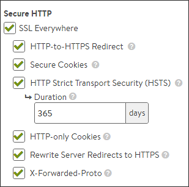

The Templates > Profiles > HTTP application profile's security settings page affects how a virtual service should handle HTTPS. These settings provide a simple interface to enabling common HTTPS-related functionality. If the HTTP profile is attached to a virtual service that is only configured for HTTP, the HTTPS settings in this section will not apply. Only if the virtual service is configured for HTTPS, or HTTP and HTTPS within the same virtual service, will these settings take effect.

More granular settings also may be configured using <a href="/docs/16.3/configuration-guide/applications/vs-policies/">policies </a>or <a href="/docs/16.3/datascript-guide/">DataScripts</a>.

### SSL Everywhere

This option enables all six of the following options, which together provide the recommended security for HTTPS traffic.

### HTTP to HTTPS Redirect

For a single virtual service configured with both an HTTP service port (SSL disabled) and an HTTPS service port (SSL enabled), this feature will automatically redirect clients from the insecure to the secure port. For instance, clients who type www.avinetworks.com into their browser will automatically be redirected to https://www.avinetworks.com. If the virtual service does not have both an HTTP and HTTPS service port configured, this feature will not activate. For two separate virtual services sharing one virtual IP (one with HTTP and another on the same IP address listening to HTTPS), an HTTP request policy must be created to <a href="/docs/16.3/redirect-http-to-https">manually redirect</a> the protocol and port.

### Secure Cookies

When Vantage is serving as an SSL proxy for the back-end servers in the virtual service's pool, Vantage communicates with the client over SSL. However, if Vantage communicates with the back-end servers over HTTP (not over SSL), the servers will incorrectly return responses as HTTP. As a result, cookies that should be marked as secure will not be so marked. Enabling secure cookies will mark any server cookies with the Secure flag, which tells clients to send only this cookie to the virtual service over HTTPS. This feature will only activate when applied to a virtual service with SSL/TLS termination enabled.

### HTTP Strict Transport Security (HSTS)

Strict Transport Security uses a header to inform client browsers that this site should be accessed only over SSL/TLS. This feature is intended to mitigate man-in-the-middle attacks that can force a client’s secure SSL/TLS session to connect through insecure HTTP. HSTS has a duration setting that tells clients the SSL/TLS preference should remain in effect for the specified length of time. This setting will activate only on a virtual service that is configured to terminate SSL/TLS.

**Note**: It is important to understand the ramifications of enabling HSTS. If a virtual service is set temporarily to support SSL/TLS and HSTS has been set, it cannot gracefully be downgraded back to HTTP. Client browsers will refuse to accept the site over HTTP. When HSTS is in effect, clients will not accept a self-signed certificate.

### HttpOnly Cookies

This marks server cookies as HttpOnly, which means the cookies cannot be viewed or used by third parties, including JavaScript or other web sites. The enforcement of this functionality is done by the browser. This feature will activate for any HTTP or terminated HTTPS virtual service.

### Rewrite Server Redirects to HTTPS

When a virtual service terminates client SSL/TLS and then passes requests to the server as HTTP, many servers assume that the connection to the client is HTTP. Absolute redirects generated by the server may therefore include the protocol, such as HTTP://www.avinetworks.com. If the server returns a redirect with HTTP in the location header, this feature will rewrite it to HTTPS. Also, if the server returns a redirect for its own IP address, this will be rewritten to the hostname requested by the client. If the server returns redirects for hostnames other than what the client requested, they will not be altered. This feature will activate only if the virtual service has both HTTP and HTTPS service ports configured.

Consider creating an HTTP response policy if greater granularity is required when rewriting redirects.

### X-Forwarded-Proto

Enabling this option makes Vantage insert the X-Forwarded-Proto header into HTTP requests sent to the server, which informs the server whether the client connected to Vantage over HTTP or HTTPS. This feature activates for any HTTP or HTTPS virtual service.
