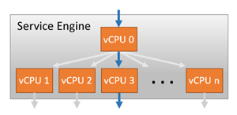
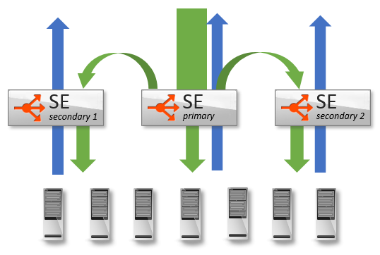

SSL performance is determined by a number of factors, including hardware, Avi Service Engine scaling, and the ciphers and certificates used. Performance can be broken down into three primary benchmark numbers:

* **Transactions Per Second**:  Primarily gated by the available CPU
* **Bulk throughput**:  Dependent upon CPU and the maximum packets per second through Avi Vantage
* **Concurrent connections**:  Memory is the limiting factor 

While each of these benchmark numbers is useful for gauging capacity, it is equally important to understand the impact of real world scenarios which are not tailored for one metric at a time. This article will attempt to illustrate the real world performance that can be expected.

 

### Scale Up Service Engine Hardware

### CPU

Vantage performs SSL termination in software, leveraging advances in the x86 chipset to provide high capacity. Intel and AMD have steadily improved their processors with enhancements such as <a href="http://www.intel.com/content/www/us/en/architecture-and-technology/advanced-encryption-standard--aes-/data-protection-aes-general-technology.html">AES-NI</a>, to offload more cryptographic workloads into dedicated rather than general-purpose instructions. Leveraging Intel's processors allows Avi Vantage's performance to increase steadily with each generation of processor.

Increasing CPU cores allocated to a Service Engine provides near-linear increases in SSL performance, as CPU is the primary constraint for both transactions per second and bulk throughput.  A single SE can scale up to 36 vCPU cores. Within a Service Engine, a vCPU core will be given a dispatcher role.  It will interface with a NIC and distribute network flows across the other cores within the system, effectively load balancing traffic to other CPU cores.  Each core is then responsible for terminating TCP, SSL, and other processing determined by the virtual service configuration.  vCPU 0 in the diagram is acting as the dispatcher, and may also handle some percent of SSL traffic if it has available capacity.  By using a system of internally load balancing across CPU cores, Vantage is able to scale linearly across ever increasing capacity.

### Memory

Memory allocation for a Service Engine, which primarily impacts the number of concurrent connections, can be anywhere between 1 and 128 GB.  See <a href="/docs/16.3/se-memory-consumption">SE Memory Consumption</a> for a verbose description of expected concurrent SSL connections.  As a general rule of thumb, SSL connections consume about twice as much memory as HTTP layer 7 connections, and four times as much memory as layer 4 with TCP proxy.

### NIC

Throughput through a Service Engine can be a gating factor for the bulk throughput and sometimes for TPS.  The throughput for an SE is highly dependent on the platform.  For instance, VMware ESX 5.x will push approximately 550k packets per second, while VMware ESX 6.x can sustain closer to 1M packets per second.  For maximum performance on a single SE, Avi recommends bare metal or <a href="/docs/16.3/installation-guides/installing-avi-vantage-for-a-linux-server-cloud">Linux cloud deployments</a>, using an Intel 10 Gb/s or greater NIC capable of supporting DPDK.

 

### Scale Out Across Service Engines

Similar to how Vantage scales capacity across CPU cores, Vantage may also scale traffic across multiple Service Engines. This is primarily useful when CPU or memory are the limiting factor for a virtual service, as it allows linearly scaling.  It is beneficial for increasing throughput as well.  Using Vantage's native autoscale feature allows a virtual service to be striped across four Service Engines.  Using ECMP, a virtual service may be scaled out across up to 32 Service Engines.

See <a href="/docs/16.3/autoscale-service-engines">SE Autoscaling</a> for an in-depth description.

 

### Transactions Per Second

In addition to the hardware factors outlined above, maximum TPS is dependent on the the negotiated settings of the SSL session between the client and Vantage.  Avi supports both RSA and elliptic curve certificates.  The type of certificate used, along with the cipher selected during negotiation, determines the CPU cost of establishing the session. At a high level, RSA 2k keys are about 4x more computationally expensive compared to EC.  EC using perfect forward secrecy (ECDHE) is about 15% more expensive than EC without PFS (ECDH).  As a general rule of thumb, assume 500 TPS per core for RSA and 2000 for EC.

Avi Networks strongly recommends using EC with PFS, which provides the best performance and the best possible security.  RSA certificates may still be used as a backup for clients that do not support current industry standards.  See <a href="/docs/16.3/ecc-versus-rsa-certificate-priority">RSA versus EC</a> certificate priority for more on this.  Vantage's default settings prioritize EC over RSA, and PFS over non-PFS.

The table below illustrates the average performance seen on a Service Engine running on a virtual machine in VMware ESX 6, using a Xeon E5-2630 v3 @ 2.4-GHz processor.  These numbers are generated with SSL session reuse disabled.

<table class="table table-hover table table-bordered table-hover">  
<tbody>       
<tr>        
<td></td>
<td>Type</td>
<td>PFS</td>
<td>2 Core</td>
<td>4 Core</td>
<td>8 Core</td>
<td>16 Core</td>
</tr>
<tr>        
<td>ECDH-ECDSA-AES256-SHA</td>
<td>EC</td>
<td>N</td>
<td>5107</td>
<td>9352</td>
<td>16091</td>
<td>34543</td>
</tr>
<tr>        
<td>ECDHE-ECDSA-AES256-SHA</td>
<td>EC</td>
<td>Y</td>
<td>4011</td>
<td>7950</td>
<td>12173</td>
<td>26040</td>
</tr>
<tr>        
<td>ECDHE-ECDSA-AES128-GCM-SHA256</td>
<td>EC</td>
<td>Y</td>
<td>4543</td>
<td>9237</td>
<td>15979</td>
<td>33994</td>
</tr>
<tr>        
<td>AES128-GCM-SHA256</td>
<td>RSA</td>
<td>N</td>
<td>1476</td>
<td>2740</td>
<td>5314</td>
<td>9586</td>
</tr>
<tr>        
<td>DHE-RSA-AES128-GCM-SHA256</td>
<td>RSA</td>
<td>Y</td>
<td>828</td>
<td>1538</td>
<td>2939</td>
<td>5220</td>
</tr>
</tbody>
</table> 

 

To achieve greater TPS numbers, use faster processors, bare metal servers rather than virtual machines, more CPU cores, and scale across multiple Service Engines.  Real world performance will likely be higher due to SSL session reuse.

 

### Bulk Throughput

The maximum throughput for an SSL terminated virtual service depends on CPU as well as the NIC or hypervisor.

Using multiple NICs for client and server traffic can reduce the possibility of congestion or NIC saturation.  The maximum packets per second for virtualized environments varies dramatically, and will be the same limit regardless if the traffic is SSL or unencrypted HTTP.  For best throughput, Avi Networks recommends bare metal or Linux cloud servers with Avi supported Intel NICs capable of DPDK.

As a general rule of thumb, Vantage can terminate and push about 1 Gb/s throughput per vCPU core, up to the PPS limit of the system.  This number is generated with standard ciphers (such as those listed above).  Using more esoteric or expensive ciphers can have a negative impact on throughput.  Similarly, using less secure ciphers, such as RC4-MD5, will provide better performance, but are also not recommended by security experts.

The bulk throughput numbers, like any single benchmark metric, are based on large transaction sizes with fewer TPS. To estimate CPU requirements for real world scenarios, add the requirements for bulk throughput plus TPS.  In the following example, the goal is to achieve 20k TPS and 5 Gb/s throughput for a virtual service using elliptic curve with perfect forward secrecy, ECDHE-ECDSA-AES128-GCM-SHA256.

<pre><code class="language-lua">Requirement              Estimates               
20k TPS                  2k TPS per core        + 10 cores for TPS       
  5 Gb/s                 1  Gb/s Tput           +  5 cores for Tput
                                                = 15 CPU cores required</code></pre>  

Typically, SSL termination is only performed on the client-to-Vantage side of the connection, not Vantage to the server. If SSL re-encryption is required, generally the TPS impact is negligible on the Service Engine's CPU, since the majority of the CPU cost for establishing a new SSL session is on the server, not the client. For the bulk throughput, the impact to the Service Engine's CPU will be double for this metric.

### Concurrent Connections

Often overlooked when capacity planning for SSL is the impact on concurrent connections. Often administrators hear numbers of tens of millions of concurrent numbers achieved by a load balancer, so no further attention is paid to this metric. The concurrent benchmark numbers floating around are generally for layer 4 in a pass-through, or non-proxy mode. In other words, they are many orders of magnitude greater than what will be achieved. As a rough yet conservative estimate, assume 40k of memory per SSL terminated connection in the real world. The amount of HTTP header buffering, caching, compression, and other features play a role in the final number. See <a href="/docs/16.3/se-memory-consumption" target="_blank">SE Memory Consumption</a> for more detail, including methods for optimizing for greater concurrency.
