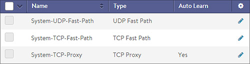
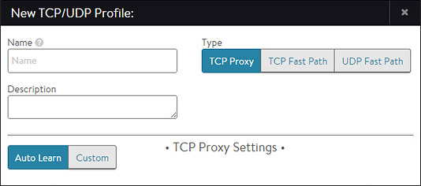
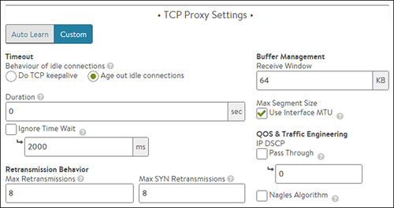
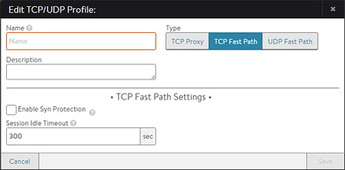
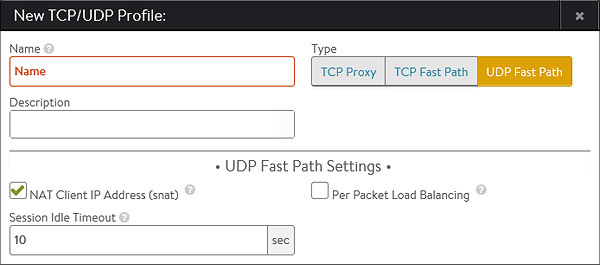

A TCP/UDP Profile determines the type and settings of the network protocol that a subscribing virtual service will use. It sets a number of parameters, such as whether the virtual service is a TCP proxy versus a pass-through via fast path. A virtual service can have both TCP and UDP enabled, which is useful for protocols such as DNS or Syslog.

Avi Vantage will rewrite the client IP address before sending any TCP connection to the server, regardless which type of TCP profile is used by a virtual service. Similarly, the destination address will be rewritten from the virtual service IP address to the IP address of the server. The server will always see the source IP address of the Service Engine. UDP profiles have an option to disable Service Engine Source NAT.

For the UDP and TCP fast path modes, connections occur directly between the client and server, even though the IP address field of the packet has been altered.

For HTTP applications, Avi Vantage can insert the client’s original IP address via XFF into an HTTP header sent to the server.

This section contains the following sub-chapters.

* <a href="#tcp-proxy">TCP Proxy</a>
* <a href="#tcp-fast-path">TCP Fast Path</a>
* <a href="#udp-fast-path">UDP Fast Path</a> 

### TCP/UDP Profiles Settings

Select Templates > Profiles > TCP/UDP to open the TCP/UDP Profiles tab. This tab includes the following functions:

* **Search:** Search across the list of objects.
* **Create:** Opens the New TCP/UDP Profile popup.
* **Edit:** Opens the Edit TCP/UDP Profile popup.
* **Delete:** A TCP/UDP profile may only be deleted if it is not currently assigned to a virtual service. An error message will indicate the virtual service referencing the profile. The default system profiles cannot be deleted. 

The table on this tab provides the following information for each TCP/UDP profile:

* **Name:** Name of the profile.
* **Type:** Type of TCP/UDP profile, which can be one of the following:  
    * **TCP Proxy:** This profile terminates client connections to the virtual service and then opens a new TCP connection to the destination server. Each connection will negotiate the optimal TCP settings for the connecting device. For example, a client may connect with a 1400-byte MTU while the server can still send data to Avi Vantage in 1500-byte MTUs. In this case, Avi Vantage will buffer the server’s responses and send them back to the client separately. If the client connection drops a packet, then Avi Vantage will handle retransmission, as the server may have already finished the transmission and moved on to handling the next client request. See <a href="#tcp-proxy">TCP Proxy</a>.
    * **TCP Fast Path:** Upon receiving a TCP SYN from the client, Avi Vantage will make a load balancing decision and forward the SYN and all subsequent packets directly the server. The client’s source IP address will still be translated to the Service Engine’s IP address for the server network to ensure return path routing. The client to server communication occurs over a single TCP connection, using the parameters negotiated between client and server. See <a href="#tcp-fast-path">TCP Fast Path</a>.
    * **UDP Fast Path:** UDP is connectionless, meaning that packets are directly forwarded to the load-balanced server. The load-balancing decision is made on the first packet from the client, and the source IP address is still changed to the Service Engine’s IP address. See <a href="#udp-fast-path">UDP Fast Path</a>.
* **Auto Learn:** While in the default Auto Learn mode, the TCP/UDP profile will dynamically adjust settings based on the application type assigned to the virtual service. Disabling Auto Learn uses the parameters statically defined within the profile. 

### Create TCP/UDP Profile

To create or edit a TCP/UDP profile:
<ol> 
 <li><strong>Name:</strong> Enter a unique name for the profile.</li> 
 <li><strong>Type:</strong> Select the type of TCP/UDP Profile: 
  <ul> 
   <li><strong>TCP Proxy:</strong> This option terminates client TCP connections at the virtual service. A new TCP connection will then be used for the connection between the Service Engine and the server. This type is required in order to apply an HTTP application profile to the virtual service. See <a href="#tcp-proxy">TCP Proxy</a>.</li> 
   <li><strong>TCP Fast Path:</strong> This option allows a client to connect directly with the server through Avi Vantage. This minimizes the workload for Avi Vantage, but also reduces security, visibility, acceleration, and application availability. See <a href="#tcp-fast-path">TCP Fast Path</a>.</li> 
   <li><strong>UDP Fast Path:</strong> This option enables UDP for the virtual service. See <a href="#udp-fast-path">UDP Fast Path</a>.</li> 
  </ul> </li> 
 <li>Click Save to save your changes and return to the TCP/UDP Profiles tab.</li> 
</ol> 

### TCP Proxy

Enabling TCP Proxy causes Avi Vantage to terminate an inbound connection from a client. Any application data from the client that is destined for a server is forwarded to that server over a new TCP connection. Separating (or proxying) the client-to-server connections allows Avi Vantage to provide enhanced security, such as TCP protocol sanitization or DoS mitigation. It also provides better client and server performance, such as maximizing client and server TCP MSS or window sizes independently and buffering server responses. You must use a TCP/UDP profile with the type set to Proxy for application profiles such as HTTP.

Select TCP Proxy in the Create/Edit TCP/UDP Profile popup and select either Auto Learn or Custom. With Auto Learn, Avi Vantage will dynamically adjust the following parameters based on the virtual server application it is assigned to. This option is selected by default and is the easiest way to ensure optimal performance.

Auto Learn mode sets all of the knobs to default values and dynamically changes the buffer size. Below are the **default** values when Auto Learn is selected.

* TCP keepalive is enabled. The idle timeout is 10 minutes, i.e, after 10 minutes of idle, Avi Vantage initiates the TCP keepalive protocol. If the other side responds, the connection will continue to live.
* Max. Retransmission is set to 8.
* Max SYN retries is set to 8.
* IP DSCP: No special DSCP values are used.
* Nagles algorithm is disabled.
* Buffer Management: The receive window advertised to the client and on the server dynamically change. It starts out small (32 KB) and can grow when needed up to 64 MB for a single TCP connection. The algorithm also takes into account the amount of memory available in the system and the number of open TCP connections.

Alternatively, you can click Custom to manually configure the following parameters:

* **Timeout:** Controls the behavior of idle connections, as follows:  
    * **Do TCP keepalive:** Send a periodic keep-alive signal to the client that will keep the current connection open.
    * **Age out idle connections:** Terminate idle connections that have no keep-alive signal from the client, as specified by the Duration field.
    * **Duration:** Idle time, in seconds, before the TCP connection is eligible to be proactively closed by Avi Vantage. The timer resets when any packet is sent or received. Setting this value higher may be appropriate for long-lived connections that do not use keepalive packets; however, higher settings may also increase the vulnerability of Avi Vantage to denial of service attacks, as the system will not proactively close out idle connections. You may either specify a range of 60-1800 seconds, or 0 for an infinite timeout.
    * **Ignore Time Wait:** When a connection between either a Service Engine and a client or the Service Engine and a server is closed, the unique client or server IP:Port + Service Engine IP:Port (called a 4-tuple) is placed in a TIME_WAIT state for a period of time. This 4-tuple cannot be reused until it is clear that there are no more delayed packets on the network that are still in flight or that have yet to be delivered. The Time Wait value defines the timeout period before this 4-tuple may be reused. This may either be a value between 500 – 2000 (default) ms or enable the Ignore Time Wait checkbox to allow Avi Vantage to immediately reopen the 4-tuple connection if it receives a SYN packet from the remote IP that matches the same 4-tuple.
* **Retransmission Behavior:**  
    * **Max Retransmissions:** Maximum number of attempts (3-8) to retransmit packets before giving up and closing the connection.
    * **Max SYN Retransmissions:** Maximum number of attempts (3-8) to retransmit a SYN packet before giving up.
* **Buffer Management:**  
    * **Receive Window:** The Receive Window informs the sender how much data Avi Vantage can buffer (32-256KB) before sending a TCP acknowledgement.
    * **Max Segment Size (MSS):** This may be calculated by using the maximum transmission unit (MTU) length for a network interface. The MSS determines the largest size of data that may be safely inserted into a TCP packet. In some environments, the MSS should be smaller than the MTU. For example, traffic between Avi Vantage and a client that is traversing a site-to-site VPN may require some space reserved for padding with encryption data. Select either:  
        * **Use Interface MTU:** Sets the MSS to the MTU size of the network interface.
        * **Custom value:** May be a range between 512–9000 kilobytes.
* **QOS & Traffic Engineering:**
        * **IP DSCP:** Allows Avi Vantage to either pass an existing Differentiated Services Code Point (DSCP) parameter or specify a custom number. DSCP is an 8-bit field in the TCP header that can be used for classifying traffic in a manner similar to the deprecated TCP TOS field.

    

    * **Nagles Algorithm:** Attempts to reduce latency by combining small packets into a smaller quantity of larger packets before sending. This reduces the impact of network latency by reducing the number of round-trip times required due to TCP acknowledgements. This option could adversely impact real-time protocols, particularly SSH and Telnet. For example, typing in a telnet session many not reflect any text back until either a user types 1500 characters (enough to fill a typical packet) or enough time has elapsed and the packet is sent half-full.

Additional options may be configured but are not shown in the GUI.

* **MTU**:  The maximum transmission unit may be configured as a global property, which will set the MTU across all SEs managed by the Controller cluster.  By default the MTU is learned via DHCP.  This may be manually set via the CLI.  The following command sets the MTU to 1500 bytes. Two examples illustrate the need to change MTU from the default:  

    <pre class="command-line language-bash" data-prompt="1|: >;2,6|: seproperties> ;3,5|: seproperties:se_runtime_properties> " data-output="4"><code>configure serviceengineproperties
se_runtime_properties
global_mtu 1500
Overwriting the previously entered value for global_mtu
save
save</code></pre>
    
    * If the installation is in an environment using VXLAN or some other type of overlay network (e.g., OpenStack), the MTU must be reduced to accommodate the additional tunnel headers.
    * If the DHCP option sets the MTU to 9000 (jumbo), but the entire infrastructure (switches and routers) does not support jumbo MTU. This can happen in AWS environments. 

### TCP Fast Path

A TCP Fast Path profile does not proxy TCP connections; rather, it directly connects clients to the destination server and translates the client’s destination Virtual Service address with the chosen destination server’s IP address. The client’s source IP address is still translated to the Service Engine address to ensure that server response traffic returns symmetrically.

In this mode, network negotiation such as MSS or TCP windows occurs between the client and the server. TCP fast path is less work (CPU overhead) for Vantage than TCP proxy mode; however, it also results in greater network overhead and latency for both the client and server. Further, a virtual service using TCP fast path may not use application layer profiles such as HTTP.

This profile type has the following settings:

* **Enable SYN Protection:** When disabled, Avi Vantage performs load balancing based on the initial client SYN packet. The SYN is forwarded on to the server and Avi Vantage merely forwards the packets between client and server, which leaves servers vulnerable to SYN flood attacks from spoofed IP addresses. When enabled, Avi Vantage will proxy the initial TCP three-way handshake with the client to validate the client is not a spoofed source IP address. Once the three-way handshake has been established, Avi Vantage will replay the handshake on the server side. After the client and server are connected, Avi Vantage will drop back into pass through (fast path) mode. This process is sometimes referred to as delayed binding.  
> Note: Consider using TCP Proxy mode for maximum TCP security.

* **Session Idle Timeout:** Idle flows will terminate (time out) after the specified time period. Avi Vantage will issue a TCP reset to both the client and the server. 

### UDP Fast Path

The UDP Fast Path profile allows a Virtual Service to support UDP. Avi Vantage will translate the client’s destination Virtual Service address to the destination server and rewrite the client’s source IP address to the Service Engine’s address when forwarding the packet to the server. This ensures that server response traffic traverses symmetrically through the original SE.

This profile type uses the following settings:

* **NAT Client IP Address:** By default, Avi Vantage will translate the client's source IP address to an IP address of the Avi Service Engine. This may be disabled for connectionless protocols which do not require server response traffic to traverse back through the same Service Engine. For example, a syslog server will silently accept packets without responding. Therefore, there is no need to ensure response packets route through the same SE. When SNAT is disabled, it is recommended to ensure the Session Idle Timeout is kept to a lower value.
* **Per Packet Load Balancing:** By default, Avi Vantage treats a stream of UDP packets from the same client IP:Port as a session, making a single load balancing decision and sending subsequent packets to the same destination server. For some application protocols, each packet should be treated as a separate session that can be uniquely load balanced to a different server. DNS is one example where enabling Per Packet Load Balancing causes Avi Vantage to treat each packet as an individual session or request.
* **Session Idle Timeout:** Idle UDP flows will terminate (time out) after the specified time period. Subsequent UDP packets could be load balanced to a new server unless a <a href="/overview-of-server-persistence/">persistence profile</a> is applied.