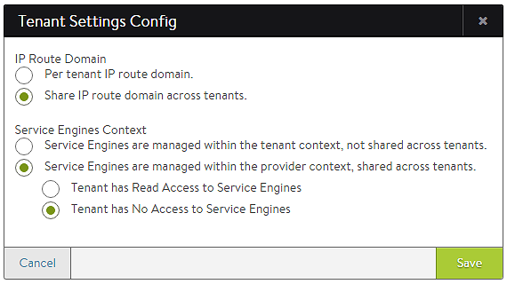
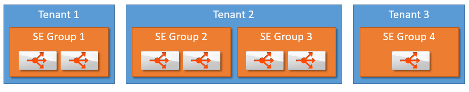
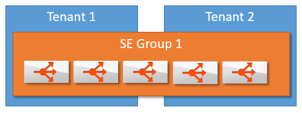

### About

There are multiple ways to create isolation within Avi Vantage.  This article explores the difference between tenants and SE groups and their relationship to data plane isolation and control plane isolation.

<table class=" table table-bordered table-hover">   
<tbody>    
<tr>     
<td><strong> Isolation</strong></td>
<td><strong> Tenant: </strong>  <strong> Provider Context</strong></td>
<td><strong> Tenant: </strong>  <strong> Tenant Context</strong></td>
<td><strong> SE Group</strong></td>
</tr>
<tr>     
<td> Control Plane</td>
<td> Yes</td>
<td> Yes</td>
<td> No</td>
</tr>
<tr>     
<td> Data Plane</td>
<td> No</td>
<td> Yes</td>
<td> Yes</td>
</tr>
</tbody>
</table>  

### Tenants

A tenant is a logical grouping of configuration.  An administrator may belong to one or multiple tenants, but may only view and edit one tenant at a time. Each tenant has its own isolated control plane configuration.

Each tenant may or may not have its own isolated data plane.  This will depend on the global configuration of the Avi Vantage deployment.  Tenants may be deployed within a Provider Context or a Tenant Context, configured via *Administration > Settings > Tenant Settings*.

* Provider Context mode:  Service Engine groups are shared across tenants
* Tenant Context mode:  Service Engine groups are exclusive to each tenant 

 

### Service Engine Groups

SE groups are an inherent method of grouping Service Engines to provide data plane isolation.  A single tenant may have one or more SE groups.  Multiple tenants may also point to one or more SE Groups.  A virtual service may only be serviced by one SE group.  If one of its SEs fail, another SE within the same SE group may take over.  SEs in other SE groups may not be pulled in to provide capacity for another SE group.  This ensures data plane isolation.   

### Examples

Example 1:

An administrator manages an application in both test and production environments. Each application's virtual service should be deployed on a different SE group.  For ease of management, both applications can be in the same tenant (tenant 2 in the image), though arguments could be made for separating these different environments into two separated tenants (such as tenant 1 and 3 in the image).
  

Example 2: 
A cloud service provider manages multiple customer's applications.  Placing each customer in a unique tenant guarantees there will be complete configuration isolation.  The service provider may choose to allow all tenants to have isolated Service Engines, or they may choose to place multiple tenants on the same SE group's SEs to reduce idle resources.  