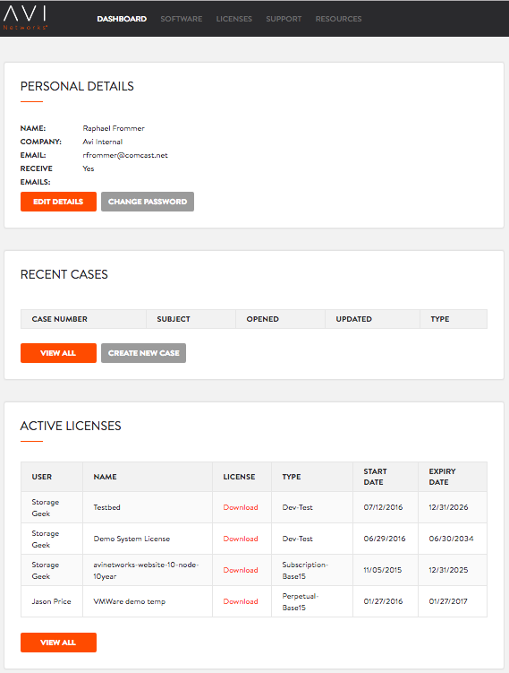
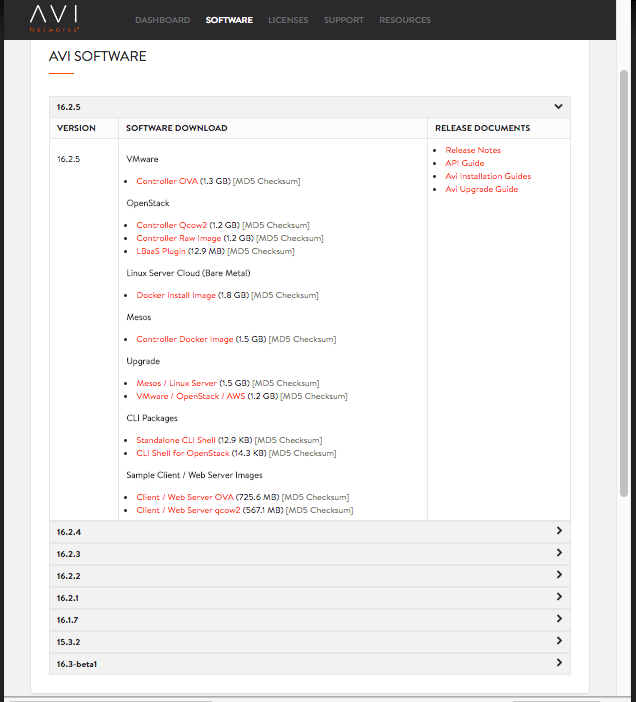
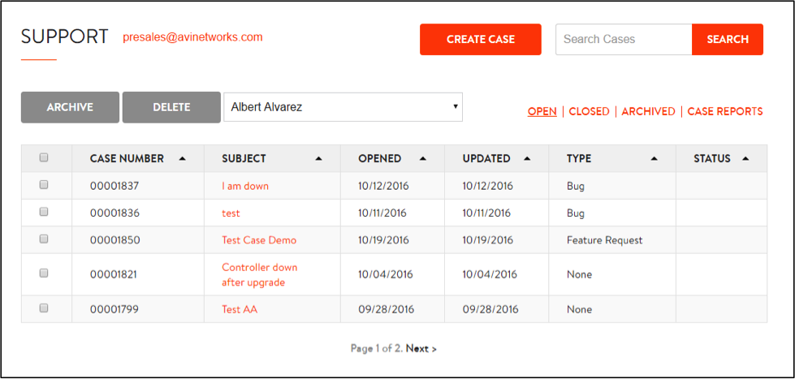
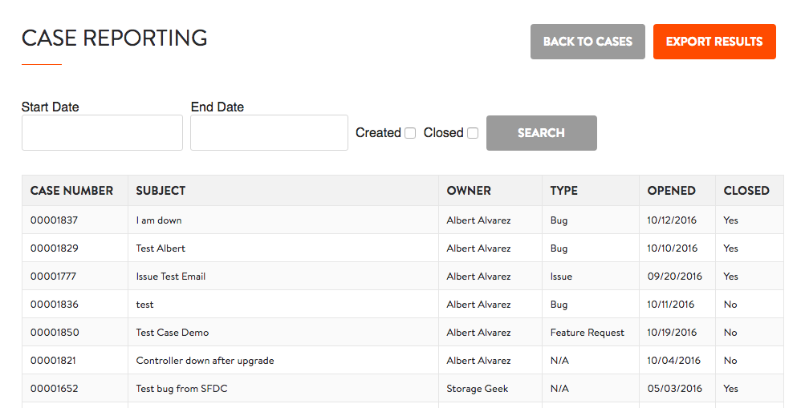
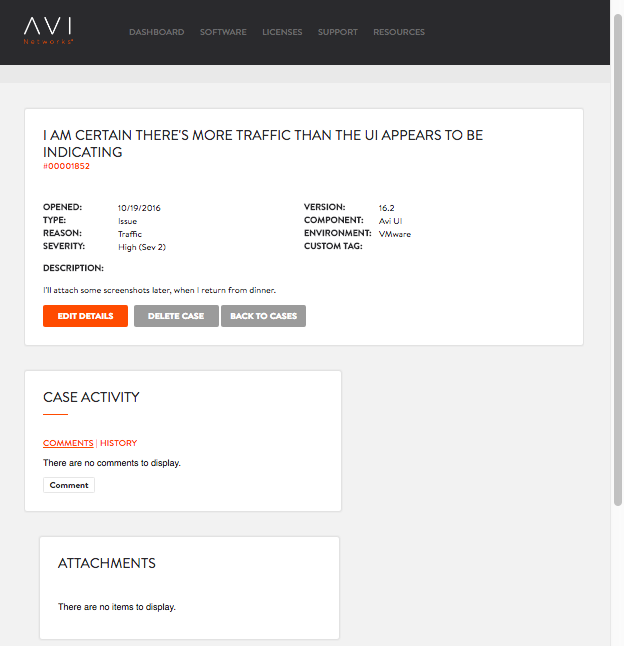
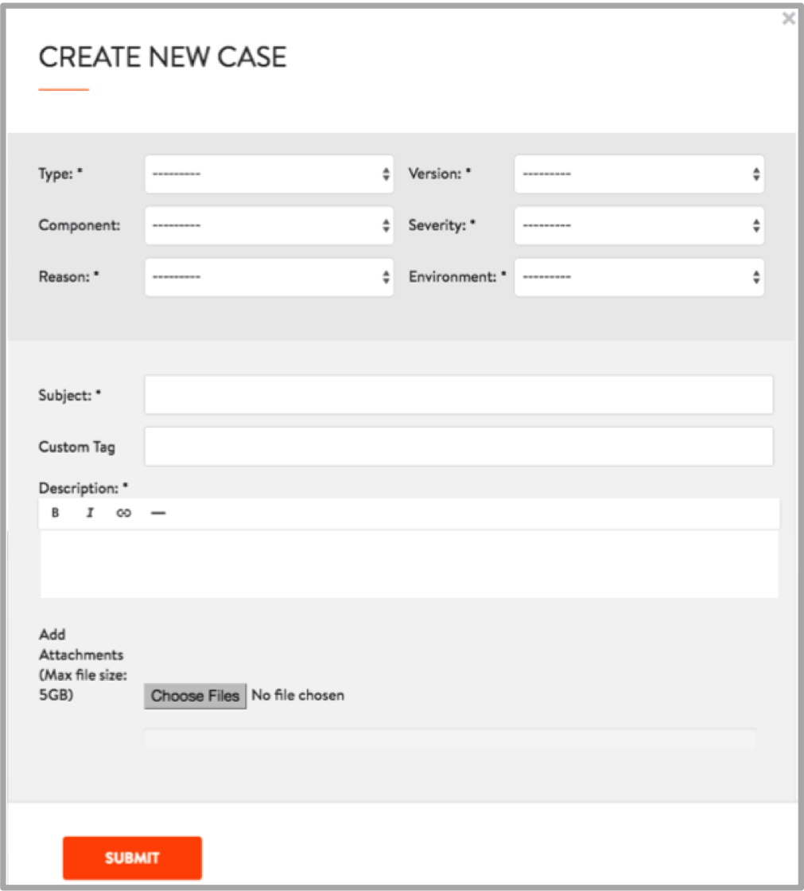
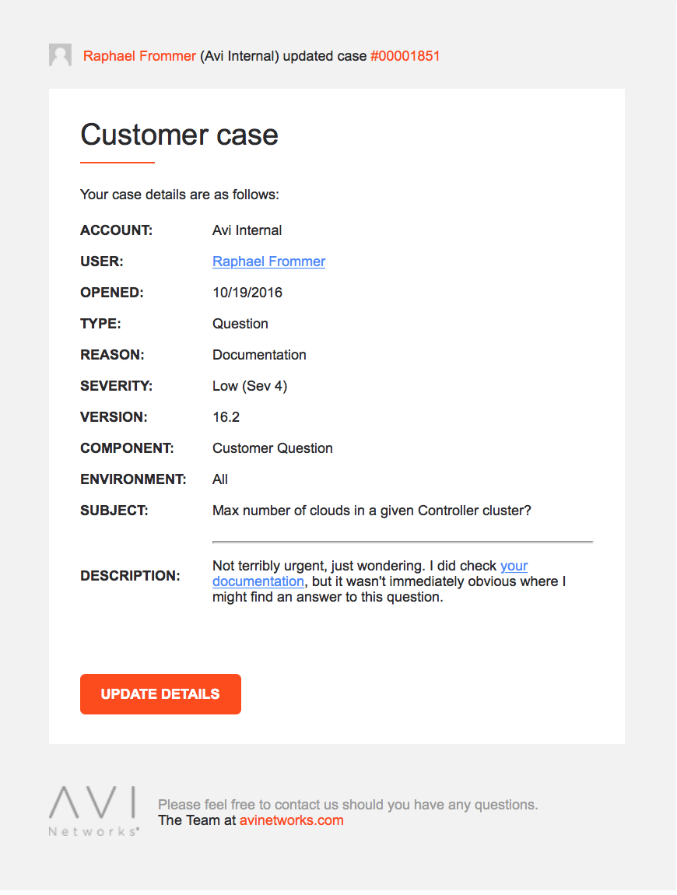

 

 

The Avi Customer Portal gives secure access to a customer's support cases, software images, and licenses. It is the preferred means by which to initiate, modify, and track customer support cases. This article explains how to use the Portal.

## Top Banner Navigation

Using the credentials Avi Networks provides them, Avi Customer Portal (<a href="https://www.avinetworks.com/portal">www.avinetworks.com/portal</a>) users log into the home page. The banner (figure 1) offers five links by which to quickly navigate to:

* **DASHBOARD**:  Default page providing at-a-glance information 
<figure class="thumbnail wp-caption alignright">   
<figcapture> Figure 1 
</figcapture>
</figure>
* **SOFTWARE**:  Downloadable installation images of current and recent Avi Vantage releases, links to release documents
* **LICENSES**: Downloadable YAML files to enable installed product
* **SUPPORT**: Repository of customer's existing cases; case-creation starting point
* **RESOURCES**: Convenient links to Avi Resource Center, Webinars, Knowledge Base, and Community pages 

## Dashboard

<figure class="thumbnail wp-caption alignright">   
<figcapture> Figure 2 
</figcapture>
</figure> 

The default Customer Portal page is the three-section Dashboard (figure 2). It provides a quick overview as well as buttons by which to drill down if required.

* **PERSONAL DETAILS.** This section displays the full name Avi Networks has on file for the logged-in user, his/her company name, the user's email address, and whether the user has opted to receive email bulletins from Avi. For example, a subscribed user is notified by email when new Avi Vantage release notes become available on the Knowledge Base (kb.avinetworks.com).
* **RECENT CASES.** This section displays the most recent cases submitted by the logged-in user, in order of most recent first. The list is empty if the user has yet to submit a case. Five columns display the auto-assigned case number, user-specified subject, when the case was opened, when last it was updated, and its type (issue, bug, feature request, or question). Typically, a case starts as a question or an issue. Avi Support's investigation of an issue typically results in its reclassification as either a bug or a feature request. Refer to <a href="/docs/16.3/avi-support-case-workflow/">Avi Support Case Workflow</a> for details.
* **ACTIVE LICENSES**. Links by which to download YAML license files appear here, along with the names of the users who requested the licenses. The NAME column indicates a purpose or destination. The license type and start/expiry dates round out the display. The LICENSES link in the Customer Portal banner additionally lists expired licenses. 

## Downloading Software

By clicking on the SOFTWARE link in the banner, a download page appears with per-release-version ...

* Installation images for Avi Vantage for various environments (e.g., VMware, OpenStack, Mesos)
* Upgrade packages
* CLI packages
* Sample clients and web servers
* Release notes
* API Guide
* Avi Installation Guides
* Avi Upgrade Guide 
<figure class="thumbnail wp-caption aligncenter">   
<figcapture> Figure 3 
</figcapture>
</figure> 

 

## Support Management Console

Users can navigate to the Support Management console two ways:

* Click on the SUPPORT link in the Customer Portal banner.
* Click the VIEW ALL button of the Dashboard's RECENT CASES section. 
<figure class="thumbnail wp-caption aligncenter">   
<figcapture> Figure 4 
</figcapture>
</figure> 

 

The Console offers these case-oriented functions: creation, search, archival, deletion, modification, filtering and reporting. Selecting one or more rows (by checking the boxes in the first column) identifies a set of cases to be *archived* or *deleted*.

Clicking the CASE REPORTS button (seen in figure 4) yields a new display (figure 5). It is a read-only list of all cases (including those that have been archived). Filters can be applied.

<figure class="thumbnail wp-caption aligncenter">   
<figcapture> Figure 5 
</figcapture>
</figure> 

### Support Case Search

In contrast to the Dashboard, which displays cases associated with the logged-in user, the Support Management Console (figure 4) can also show cases submitted by another user selected from the username pulldown list. Choose *All* to display cases regardless of who submitted them. In the example shown, only cases opened by Albert Alvarez appear.

Entering one or more words in the Search Cases field yields a case list when

* All or part of the *single* *word* entered is found in one or more case's subject or description fields.
* The entire, exact *phrase* is found in one or more case's subject or description fields. 

Clicking the OPEN, CLOSED, or ARCHIVED buttons displays appropriately filtered cases. Each of the columns can be re-sorted by clicking the triangle to the right of the column heading. Cases matching the selection criteria appear five to a page. The default is to display a paginated set of all the open cases of the indicated user. Clicking on the red hypertext in the subject column of a case reveals all case attributes, comments, and history. Refer to figure 4.

<figure class="thumbnail wp-caption aligncenter">   
<figcapture> Figure 6 
</figcapture>
</figure> 

## Support Case Creation

Both the Dashboard and the Support Management Console of the Avi Customer Portal contain links leading the user to the case-creation editor. This section explains its fields.

<figure class="thumbnail wp-caption aligncenter">   
<figcapture> Figure 7 
</figcapture>
</figure> 

 

* **Type**: Use this pulldown to select one of four values (issue, bug, feature request, or question).
* **Component**: Use this pulldown to optionally identify the Avi Vantage component that is the focus of this case (e.g., Avi Controller, Avi SE, Avi UI).
* **Reason**: Use this pulldown to select one of several keywords by which to further characterize the focus of the case:  configuration, documentation, installation, traffic, or upgrade.
* **Version**: Select the Avi Vantage release to which the case applies.
* **Severity**: Choose between four severity levels.
* **Environment**: If the case pertains to all environments, select All. Otherwise, choose one of the following: APIC, AWS, bare metal, CloudStack, OpenStack, VMware.
* **Subject**: Enter text to tersely suggest what the issue or question is about.
* **Custom Tag**: Optionally enter text that may help you associate groups of similarly themed cases.
* **Description**: Enter as much text and as many hyperlinks as needed to pose your question or describe your issue.
* **Attachments**: Optionally attach relevant files, screenshots, etc. We highly recommend attaching the tech support log. Learn <a href="/docs/16.3/collecting-tech-support-logs-163/">how to collect tech support logs</a>. 

### Support Case Notifications

After a case is created or modified, an email is sent to the customer user associated with the case. Figure 8 shows the body of that email resembles the below. A click on the provided button takes the user directly to the Customer Portal to either view or modify the details of the case.

<figure class="thumbnail wp-caption aligncenter">   
<figcapture> Figure 8 
</figcapture>
</figure> 

 

 
