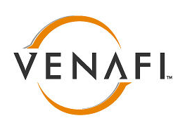
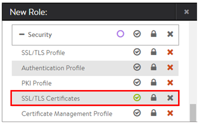

Avi Vantage can be set up to integrate with the <a href="https://www.venafi.com/platform/trust-protection-platform">Venafi Trust Protection Platform</a>™ for automation of SSL and TLS certificate life-cycle management.  All certificates will be protected and controlled through TPP.  This process is transparent to the Avi Controllers.

*Note: Minimum Venafi release is Trust Protection Platform 16.3.*

### Configuration

**Config**:  The Venafi Trust Protection Platform leverages Avi Vantage's REST API for all communications, including creating and updating SSL certificate and keys.  No configuration changes are required on Avi Vantage.  TPP does require a username, password, and an IP address of an Avi Controller.  If the Controller is configured with a floating Controller cluster IP, this address should be used.  If no floating IP is configured, the IP address of any Controller can be used.

For help configuring Trust Protection Platform, refer to Venafi's support team, who can provide the latest version of the required driver, along with instructions for TPP's configuration..

**Workflow**:  When a new application is created or a new SSL/TLS certificate is required, use the following workflow.

* From the Trust Protection Platform, create a new certificate for Avi Vantage.  Behind the scenes, the following will happen:  
    * TPP will send the API calls necessary to generate a CSR on Vantage and import it.
    * TPP will forward the CSR to the configured certificate authority.
    * TPP receives the signed certificate and key from the CA.
    * TPP pushes the certificate and key to Avi Vantage, along with any required chain certs.
* From Avi Vantage, create a new application virtual service, attaching the certificate.
* Any subsequent updates to the certificate received by the Avi Controller will automatically and transparently be pushed to Service Engines using the cert.
* TPP will learn the mapping of the VS name to the certificate.  It will automatically handle certificate and chain certificate renewals. 

**IP Access**:  Best practice is to lock down Avi's administrative UI to known IP addresses.  If this has been done, be sure to include the Trust Protection Platform's source IP address(es) in the Avi Vantage allowed-IP list for administrative access.

**Admin Access**:  TPP may use any administrator account that has write access to SSL/TLS certificates for the required tenants.  Best practice is to create a new role for SSL administration, with only write access for SSL/TLS Certificates enabled.  Create a new admin account mapped to this role.  This limits the exposure of this account, and provides better audit logs.

 
