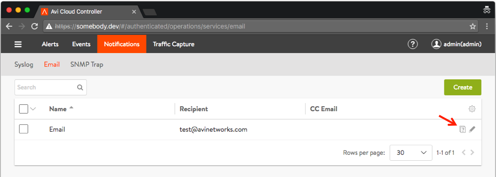
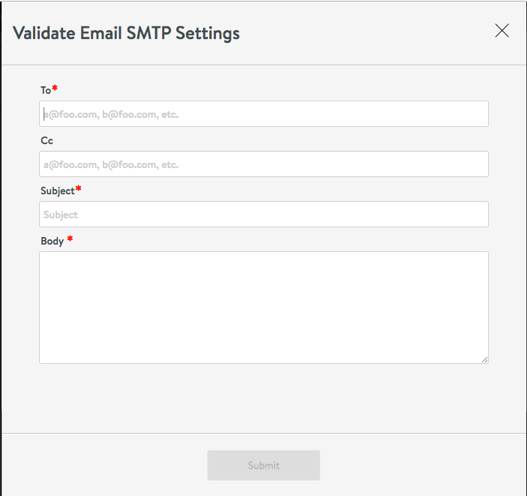
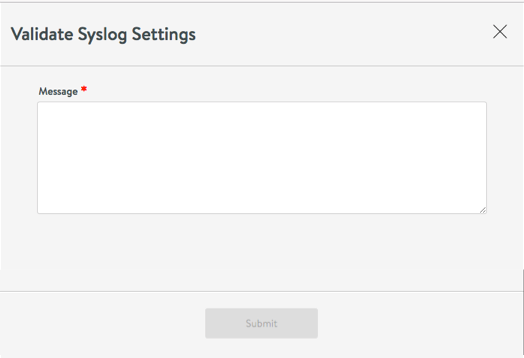
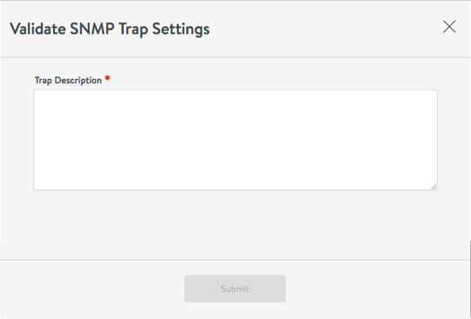
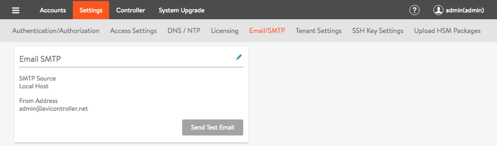

Starting with Avi Vantage 16.2.2, users can verify certain settings prior to putting them into effect. These are:

* SNMP trap configuration
* Syslog profile configuration
* Email profile configuration
* SMTP configuration 

Verification is manifested in the UI in several places. In the Notifications tab, notice the question mark icon to which the red arrow points in the below screenshot.

 

Clicking the icon causes one of three dialog boxes to pop up, depending upon the sub-tab chosen, be it Syslog, Email (in the above screenshot), or SNMP Trap.

    

 

 

 

An additional step may be taken, to send a test email.

