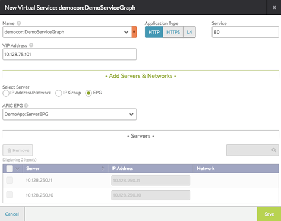

This article describes how to create a virtual service for an APIC cloud:
<ol> 
 <li> 
Create a contract and apply a Service Graph.
 </li> 
 <li> 
Create a load-balancing virtual service using Vantage.
 </li> 
</ol> 

Detailed steps are provided below.

## Create Contract and Apply Service Graph

<ol> 
 <li> 
Select the tenant where Controller was deployed.
 </li> 
 <li> 
Navigate to Security Policies &gt; Contracts (left pane).
 </li> 
 <li> 
Click Actions and select Create Contract from the drop-down menu.
 </li> 
 <li> 
Provide the following information:
 
  <ul> 
   <li>Name for the contract</li> 
   <li>Subject with filters</li> 
   <li>Graph template created previously</li> 
  </ul> </li> 
 <li> 
Associate the contract with a consumer EPG and a provider EPG. The provider EPG must contain servers to load balance.
 </li> 
</ol> 

## Configure Load-balancing Virtual Service Using Vantage

Create a virtual service in the tenant where the Vantage device package is deployed, or in a tenant to which the device package was exported.
<ol> 
 <li> 
Click admin (top right corner) and select a tenant.
 </li> 
 <li> 
Navigate to Applications &gt; Dashboard.
 </li> 
 <li> 
Select the cloud and click New.
 </li> 
 <li> 
Enter a user-friendly virtual service name.
 </li> 
 <li> 
Enter an IP address or DNS hostname for the virtual service.
 </li> 
 <li> 
On the New Virtual Service edit menu, select a graph instance in the Name field (<em> 
    <contract name></contract></em>:<em> 
    <graph name></graph></em>).
 </li> 
 <li> 
Check EPG on the Select Server menu.
 </li> 
 <li> 
Select an EPG for the servers to be load balanced from the APIC EPG drop-down list.
 </li> 
 <li> 
Click Save.
 </li> 
</ol> 

Note: It can take up to 3 minutes until the virtual service becomes online. This is because a new concrete device needs to be added.

Clicking New Virtual Service (or Create Virtual Service) opens the configuration wizard for the service.

