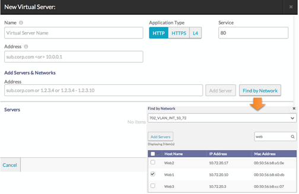

In Avi Vantage, a virtual service is the combination of an IP address and a TCP/UDP port number. Each virtual service is associated with a pool of servers. Vantage load balances web requests from end-users among the servers in the virtual service's pool.

Virtual services can be configured using Basic Setup for quick provisioning or Advanced Setup for additional options. A virtual service's policies and options can be added when the service is created, and also can be modified later.

To create a virtual service for a VMware cloud using Basic Setup:
<ol> 
 <li> 
Log into the Avi Controller through a browser.
 </li> 
 <li> 
Select Applications from the menu on the top left corner.
 </li> 
 <li> 
Select Virtual Services on the top menu bar.
 </li> 
 <li> 
Click New -&gt; Basic Setup.
 </li> 
 <li> 
Select the cloud and click New.
 </li> 
 <li> 
Enter a user-friendly virtual service name.
 </li> 
 <li> 
Enter an IP address or DNS hostname for the virtual service.
 </li> 
 <li> 
Click Select Servers by Network and choose a port group to list candidate servers for the pool members.
 
Note: This step is not applicable in No Access Mode.
 </li> 
 <li> 
Select pool members from the list.
 </li> 
 <li> 
Click Add Servers.
 </li> 
 <li> 
Click Save.
 </li> 
</ol> 

