This article covers connecting VMware's vRealize Orchestrator to vCenter and Avi Vantage deployments.  vRO can be used to automate tasks with Avi Vantage, such as deploying a new virtual service or editing an existing one.

See VMware's <a href="http://www.vmware.com/products/vrealize-orchestrator.html">vRO website</a> for more info on vRealize Orchestrator. The latest vRO ova can be downloaded from <a href="https://my.vmware.com/group/vmware/home">My VMware</a>. The image used for initial implementation can be downloaded from Amazon <a href="https://s3.amazonaws.com/aviswdownloads/VMware-vRO-Appliance-7.2.0.19944-4629837_OVF10.ova">S3</a>.

Avi Network's vRO package, which includes pre-built templates for configuring Avi Vantage, may be downloaded from the <a href="https://github.com/avinetworks/avi_vrealize">Avi git repo</a>.  vRO support requires at least version 16.3 of Avi Vantage.

## Connect vRO to vCenter

* Once the vRO appliance is deployed using the ova, browse to https://<VRO-IP>:8283/vco-controlcenter/#/
* Login using the root credentials provided during ova deploy.
* Click “Configure Authentication Provider.”
* Select Authentication mode as vSphere and configure as shown: <a href="img/vro1.png">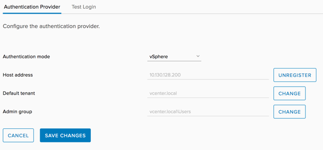</a> 
    
     
    
* On the home page, click Startup Options and restart the services. 

## Log into vRO

* Browse to https://<VRO -IP>:8281/vco/
* Click “Start Orchestrator Client.” The Java client binary will be downloaded.
* Open the client.jnlp file and click ‘Run’ when prompted.
* Login using vCenter credentials (not VRO login). The host name will be VRO-IP:8281.
* Change the view to “Design” using the dropdown on top. <a href="img/vro2.png">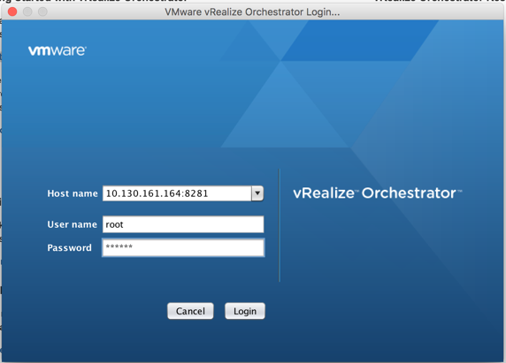</a> 

 

## Import the Avi-VRO Package

* Download the latest com.vmware.avinetworks.plugin.dynamictypes.package from the git repo <a href="https://github.com/avinetworks/avi_vrealize">avinetworks/avi_vrealize</a>
* On the Packages tab, import the Avi package. <a href="img/vro3.png">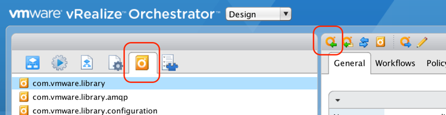</a> 
    
     
    
* Navigate to the Workflows tab and check that the Avi Networks folder is created with all supported workflows. <a href="img/vro4.png">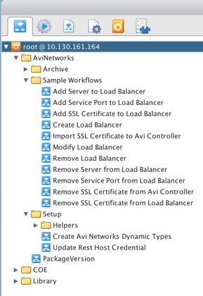</a> 
    
     
    
# Add Avi Controller and Create Dynamic Objects

Before running any of the workflows, first create an Avi Controller object. Make sure support for HTTP basic authentication is enabled on the Avi Controller; it is disabled by default. See the following <a href="/http-basic-auth-for-api-queries/">Basic Auth KB</a> to enable. Next, write access to vCenter Cloud must be configured for the same vCenter server to which vRO is connected.

* Select “Create Avi Networks Dynamic Types” workflow under Avi Networks > Setup > Helpers <a href="img/vro5.png">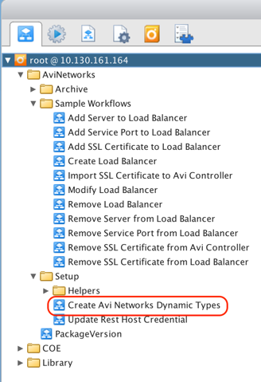</a> 
    
     
    
* Run the Workflow and follow steps as below:<a href="img/vro6.png">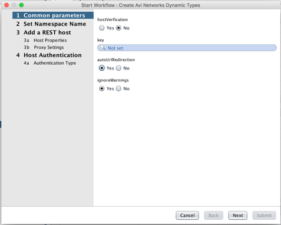  </a><a href="img/vro7.png">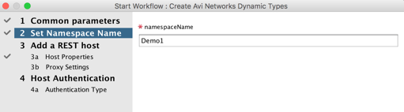  </a><a href="img/vro8.png">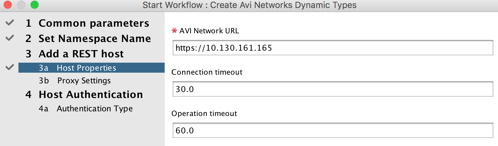</a> (Note: enter the Avi Controller URL as > , with no / at the end) 
https://<IP
    
    <a href="img/vro9.png">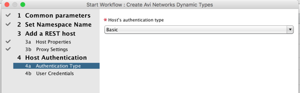  </a><a href="img/vro10.png">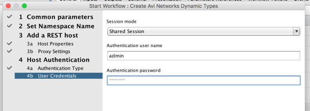  </a>
    
* On the Inventory tab, Dynamic Types objects will be auto-created for all existing virtual services, pools and certificates: 
<a href="img/vro11.png">  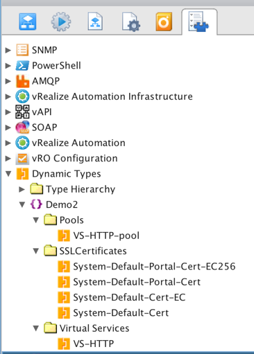</a> 

## Running Workflows

Steps for running all workflows is same. This section walks through HTTPS VS creation workflow.

* Navigate to the Workflows tab.
* Run the “Create Load Balancer” under Avi Networks > Sample Workflows
* Follow the steps below to run the workflow:   
<a href="img/vro12.png">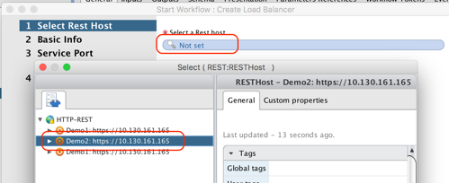</a>
    
    <a href="img/vro13.png">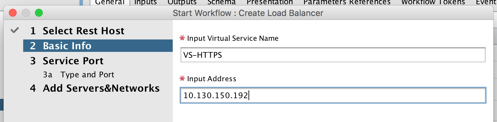  </a><a href="img/vro14.png">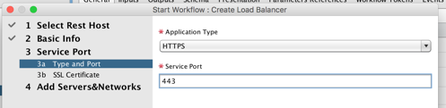  </a><a href="img/vro15.png">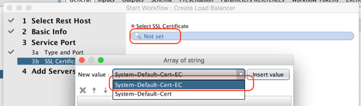  </a><a href="img/vro16.png">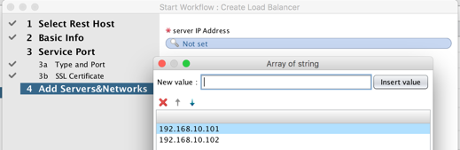</a>
    
* Check that the Dynamic type object for the virtual service is created on Inventory tab under your selected namespace. Refresh if it is not visible.
* Check the VS on the Avi Controller UI. 

## Editing Workflows

Each workflow is made up of many components (input parameters, Java scripts, action Java scripts, presentation, etc). Depending on what needs to be changed, one may need to edit one or more of these components.

This section walks through an example of adding load balancing algorithm as a new option exposed in the “Create Load Balancer” workflow demonstrated previously in this article.

* Edit the “Create Load Balancer” workflow.
* From the Input tab add a new variable called lbAlgo of type string: <a href="img/vro17.png">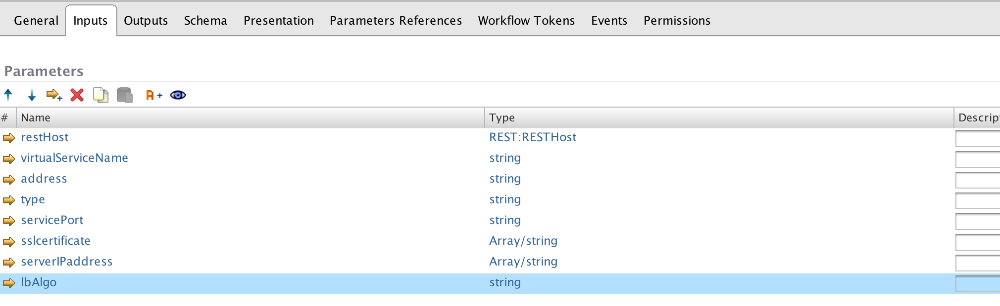  </a>
* From the Presentation tab the variable lbAlgo must be visible.
* Create a new step and name it.
* Drag-drop the lbAlgo variable to the new step:<a href="img/vro18.png">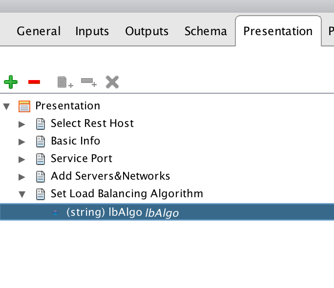  </a>
* Click on lbAlgo.
* Add a property of “Predefined answers” since we need to create a dropdown with all algorithm options.
* Add some load balancing algorithm strings to the list: 
<a href="img/vro19.png">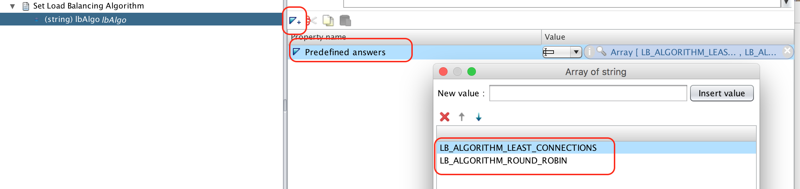  </a>
* Navigate to the Schema tab and edit the “generate parameter” script: <a href="img/vro20.png">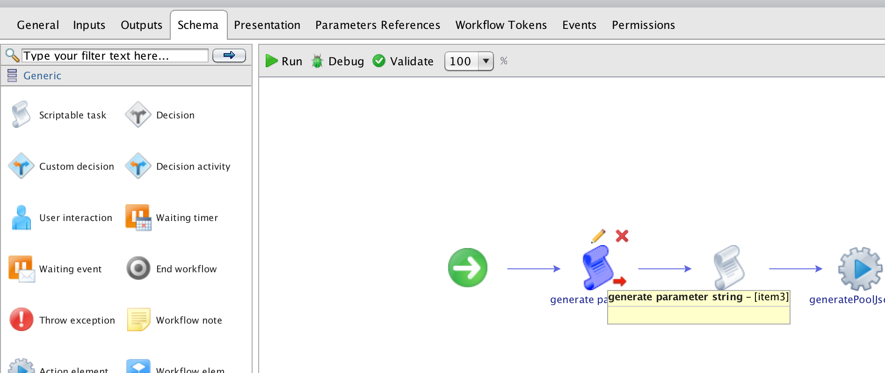</a> 
    
    <a href="img/vro23.png">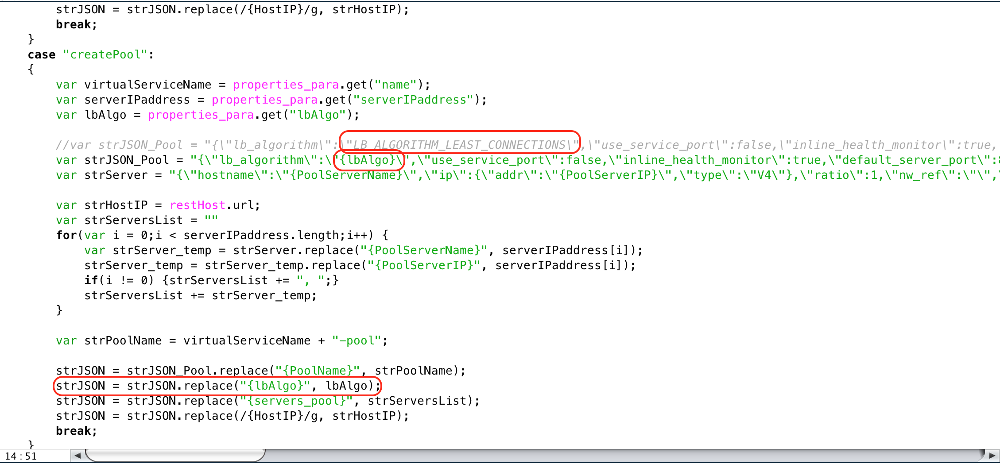  </a>
    
* From the Visual Binding tab, drag-drop the lbAlgo variable from left margin (in parameters) to center table under IN column: <a href="img/vro21.png">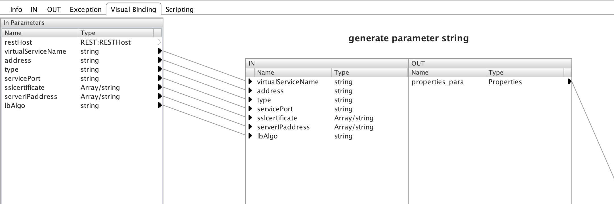  </a>
* From the Scripting tab, edit the JavaScript to add the lbAlgo parameter to output parameter (properties_para): <a href="img/vro22.png">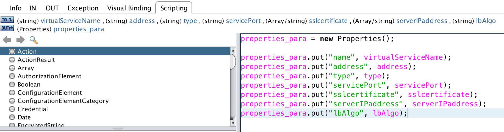  </a>
* Save the changes to the script and exit.
* Save and close the workflow. 

Now that we have read the input from the presentation form and forwarded it to next blocks in workflow, edit the *actionscript,* which adds it to the REST payload. The action *generatePoolJsonData* calls *genetrateJsonData*. Edit this genetrateJsonData actionscript.

* From the Actions tab > com.avinetworks, edit the genetrateJsonData.
* Update the script to get the lbAlgo from properties para and add it to pool json data string instead of the hardcoded string, as shown: <a href="img/vro23-1.png">  </a>
* Save and exit. 

 

