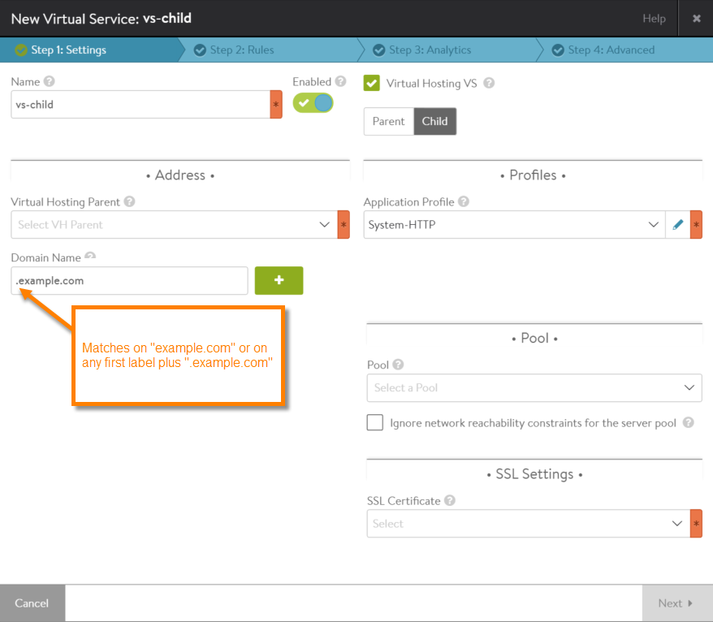

Virtual services have a configuration option to enable virtual hosting support. Enabling this option within a virtual service indicates the virtual service is a parent or child of another service, in a <a href="/docs/16.3/server-name-indication/">server name indication (SNI)</a> deployment.

During the SSL handshake between a client and a parent virtual service, the parent virtual service checks the domain names of its children virtual services for a match with the domain name in the client's handshake. If there is a match, the parent virtual service passes the client request to the child virtual service with the matching domain name.

Beginning in Avi Vantage 16.2, wildcards can be used to match on the beginning or ending of the domain name.

## Wildcards

Within a child virtual service's configuration, a wildcard character can be used at the beginning or end of the domain name:

* <code>*.example.com</code> - Matches on any labels at the beginning of the domain name, if the rest of the domain name matches. This example matches on mail.example.com, app1.example.com, app1.test.example.com, app1.test.b.example.com, any.set.of.labels.in.front.of.example.com, and so on. 
* <code>.example.com</code> - Matches on any set of first labels or on no first label. This example matches not only on any domain name matched by *.example.com, but also matches simply on "example.com" (with no other label in front). 
* <code>www.example.*</code> - Matches on any set of ending labels, if the other labels match. This example matches on www.example.com, www.example.org, www.example.edu, www.example.edu.any.set.of.labels.after.www.example, and so on. 

A domain name can contain any one of these wildcard characters, in the positions shown. Use of wildcards in other label positions within a domain name is not supported. Likewise, use of multiple wildcard characters within the same domain name is not supported.

### Longest Match Is Used

If there are multiple matches, the longest (most specific match is used).

For example, suppose a parent virtual service has the following child virtual services:

* VS1: matches on domain name <code>*.example.com</code>
* VS2: matches on domain name <code>*.test.example.com</code> 

If the server certificate contains a domain name that ends with ".test.example.com," the certificate matches on VS2 but not on VS1.

## Configuring Wildcard SNI Matching for a Child Virtual Service

<ol> 
 <li>Access the advanced configuration popup for the child virtual service: 
  <ol> 
   <li>Navigate to Applications &gt; Virtual Services.</li> 
   <li>Click the edit icon next to the virtual service name.</li> 
  </ol> </li> 
 <li>On the Settings tab, select Virtual Hosting VS, then select Child. This displays the Domain Name field.</li> 
 <li>Enter the domain name to use for matching. For wildcard matching, enter the wildcard character.  </li> 
 <li>To save the virtual service configuration, click Next until the Review tab appears, then click Save. If creating a new pool, a name is required before the pool can be saved.</li> 
 <li>Configure other settings if applicable, then click Save. (At minimum, the name for the virtual service configuration is required.)</li> 
</ol> 