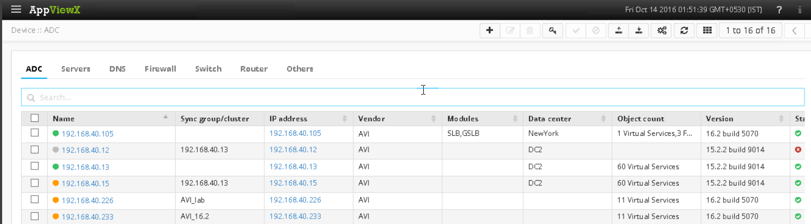

Avi Network's partnership with AppViewX enables Avi Vantage deployments to be managed from AppViewX's ADC+.  AppViewX uses API calls to send and receive configuration information with the Vantage Controllers, and can be used as a central point of management for multiple Vantage Controller clusters, other devices such as firewalls, and may also provide SSL certificate lifecycle management with CERT+.

The communication between Avi Vantage and AppViewX is secure and encrypted, using REST API calls authenticated via session IDs.  The communication between the two products is initiated from AppViewX, which pulls API data from the Avi Controllers.  Simply add the Vantage Controller's IP address, username, and password.  If the Avi Controller cluster uses a floating IP, this address should be used.  If not, the IP addresses of each Controller should be added to the AppViewX configuration.

Avi Vantage must be running v16.2 or later, and AppViewX must be running v11.3 or later.
All configuration is performed on AppViewX and not on Avi Vantage.  See AppViewX documentation for adding and managing Avi Vantage.

