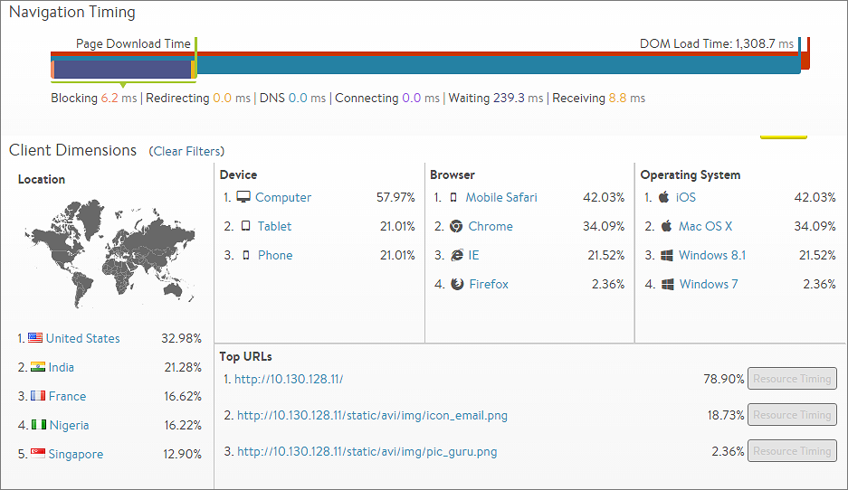
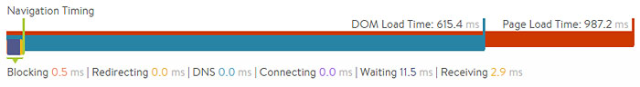

The Clients tab for an HTTP virtual service displays information about clients accessing that service. The information shown within the tab is dependent on the setting for client insights. This setting can be modified in the Analytics tab of the Create Virtual Service popup.

> Note: This tab does not appear for non-HTTP virtual services.
 

Many of the entries on this tab will present expanded data when clicked. For example, clicking Computer in the Devices section filters the Clients tab to display data for clients connecting to the virtual service from a desktop computer (versus phones or tablets). While an entry is highlighted, other sections will have two numbers.

Continuing with the example of highlighting Computers:

* Green or red percentage number shows how much higher or lower the numbers are when filtered for computers compared to without the filter. 
* Specific percentage for computers. 
* Clicking the selected item again, such as Computer, deselects that item and removes the filter.  

The Clients tab presents the following information:

* **End-to-End Timing:** Complete view of client-to-server transaction times. This includes the time required for a client to download an individual HTTP-requested object or to complete a TCP transaction. 
* **Page Load Time:** If you have enabled active client insights on the Analytics tab for the virtual service, then Avi Vantage will insert Javascript into a sampling of HTTP responses sent to the client to gather additional information about the client’s experience loading the page. This data appears in two bars:  
    * **DOM Load Time:** Amount of time from when clients first attempted to load a page served from the virtual service until the client browsers were able to begin rendering the HTML page, even if the entire page was not fully downloaded yet. 
    * **Page Load Time:** Total time required to download and render the entire page. These metrics differ from the end-to-end timing in that they are a client’s view of the total time taken versus Vantage's view. Thus, they incorporate different metrics. End-to-end timing is the average time to download a single object, whereas page load time is the time to download all objects for the page and then render them in the client's browser. Page load time measures:  
        * All HTTP objects, not just a single file 
        * HTML errors and timeouts 
        * HTTP redirects 
        * DNS resolution 
        * Blocking, where the browser is waiting for various reasons 
        * Rendering time, or the time the browser took to "paint" the page 
* **Location:** Client country of origin. Clients connecting from internal IP addresses will display as Internal; however, administrators may create custom locations using IP groups. For example, an IP group can be configured in which "10.1.0.0/16 = West_Campus" and "10.2.0.0/16 = East_Campus". Any clients connecting from these IP ranges will be shown as originating from the custom locations, while all other 10.x.x.x IP addresses will still be classified as Internal. If an IP address exists in multiple places, such as Japan and Tokyo Campus, the more specific address match will be used. > <strong>Note:</strong> Custom groups are more specific and will override any default country.
 
* **Device:** Client device type such as Computer, Tablet, Phone or Other. Vantage derives this information from the client’s User-Agent header. Clients that do not present this header or that present an unknown User-Agent string are categorized as Other. 
* **Browser:** Client browser. Vantage tracks Firefox, Safari, Internet Explorer, Opera, and Chrome. This information is sourced from the client’s User-Agent string. 
* **Operating System:** Client operating system. Vantage tracks Apple MacOS, Apple iOS, Google Android, Microsoft Windows, and Linux. This information is sourced from the client’s User-Agent string. 
* **Top URLs:** Vantage records the most commonly requested URLs for the virtual service. Clicking the Resource Timing button for one of the URLs opens a detailed waterfall view for that URL and displays a breakdown of the objects referenced by the following:  
    * **Selected page** 
    * **Ordering** of the objects 
    * **Load times** for each object, including DOM load time and total page load time. This information can be very useful for website developers to diagnose slow page load issues. 
    * **URL:** Host, path, and query for the requested object. 
    * **Initiator:** This object could have been requested because:  
        * It was referenced by a link or script. 
        * It is an image. 
        * It is blank for the root-level page that was clicked by the client. 
    * **Start Time:** The time when this object was requested relative to its peers. The first object will always be time 0 and will reference sub-objects, which are requested later. The indicated times are averaged for the recorded requests to this page. 
    * **Duration:** Total client download duration. This is a superset of the data points included in the end-to-end timing, because it includes additional metrics beyond the immediate client-to-web-server interaction. 
    * **Resource Timing:** Breakdown of the time required to download the page object. The length of the bar indicates the time, and the colors denote the various stages where time was spent. The bars furthest to the left were processed first. Bars that start further to the right are objects that began downloading and processing later.  

### Resource Timing Metrics

The Resource Timing/*/* breakdown provides the following timing information:

* **DNS:** Time the client spent waiting for the object hostname to resolve.  
    * Many objects have the same underlying fully qualified domain name (FQDN) and thus not every object will contain a DNS time. 
    * If the client must wait for DNS resolution, then the time could be notably longer. 
    * If the client or the client’s local DNS server has the hostname cached, DNS time may be imperceptibly small. 
* **Blocking:** Time spent while the browser was blocked from further processing. This typically implies the browser was busy reading and processing a page or a script. Failed scripts may cause a head-of-line block while the browser waits to time out the failed process before continuing the page load process. 
* **Redirecting:** Time spent following redirects, such as HTTP-to-HTTPS, to a different hostname or path. 
* **Connecting:** Time spent connecting with the endpoint (virtual service). This roughly corresponds to the end-to-end timing's client RTT metric. 
* **Waiting:** Time spent by the client waiting for the first packet of the response to its request. From the client’s perspective, this is a single metric for all objects requested for a page. The End to End Timing graph on the Health tab for the virtual service breaks this into the following separate metrics, recorded on a per object basis:  
    * **Server RTT:** The TCP latency between Vantage and the server. 
    * **Client RTT:** The TCP latency between Vantage and the client. 
    * **Application Response:** The time during which the application server was processing or generating the content. 
* **Receiving:** Time spent waiting after the first packet of the response was received until the last packet of the response was received. This is a combination of object size, TCP latency and packet loss, as well as how many round trip times (TCP ACKs) are required. This corresponds to the end-to-end timing chart's data transfer time. 
* **Rendering:** The time the browser spent rendering or ‘painting’ the page.   