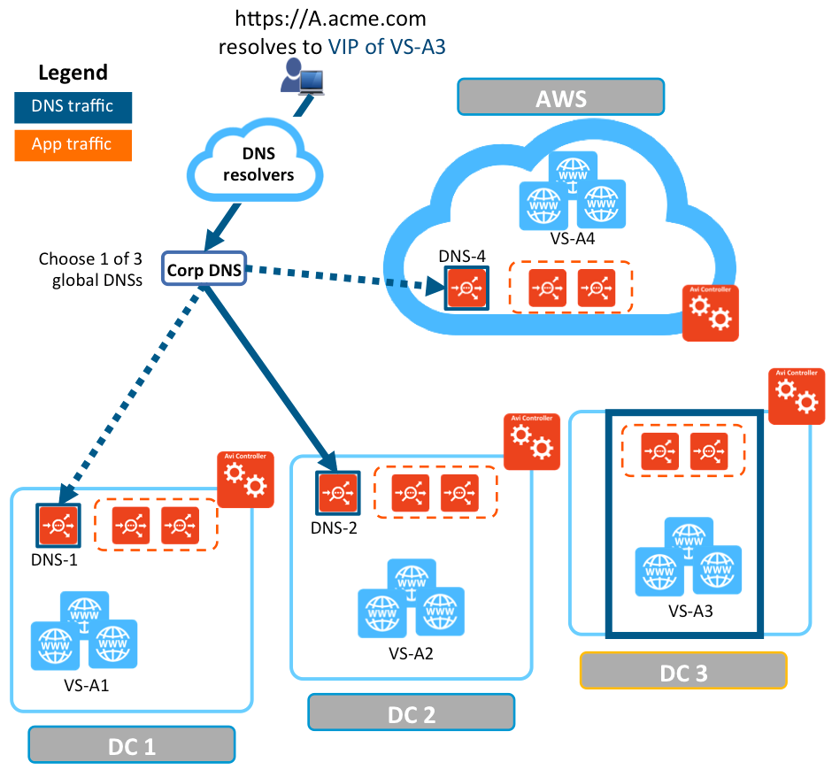
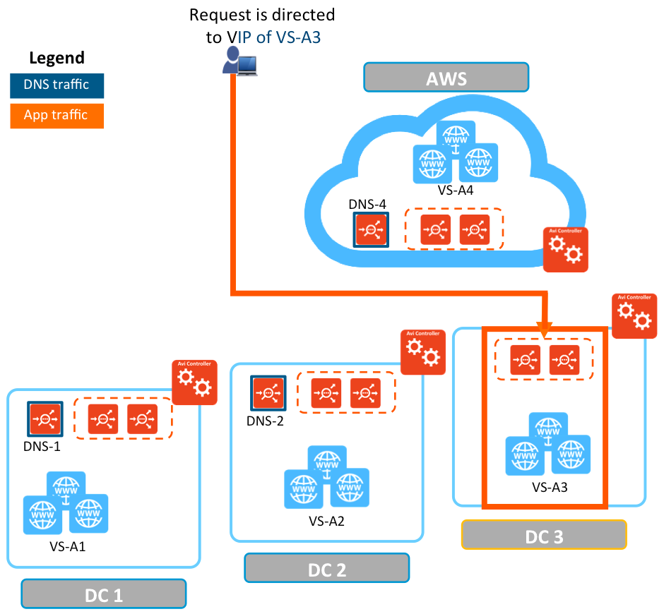
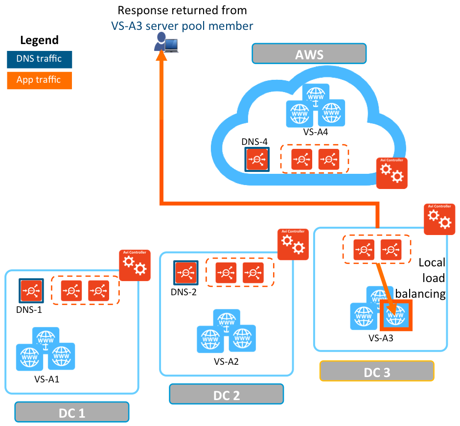
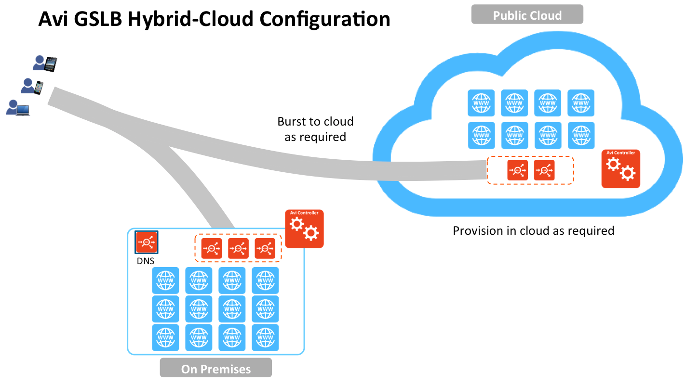

This article overviews Avi GSLB, which provides load balancing of applications across multiple geographically dispersed locations, while providing centralized configuration, application monitoring, and analytics.

### What is GSLB?

**Global server loading balancing (GSLB)** is the act of balancing an application's load across instances of the application that have been deployed to multiple locations (typically, multiple data centers and/or public clouds). Application load at any one of those locations is usually managed by a "local" load balancer, which could be Avi Vantage or a third-party ADC solution.

GSLB is usually implemented to achieve one or more of the following goals for an application:

* Provide optimal application experience to users/clients who are in geographically distributed areas
* Offer resilience to loss of a data center or a network connection
* Perform non-disruptive migration to or addition of another data center 

### GSLB Functionality

To achieve these goals Avi GSLB performs the following functions:
<ol> 
 <li>It chooses the location (data center/cloud) to which to steer the client's requests</li> 
 <li>It monitors health of the virtual services so that it can choose the best location (i.e., rule out unhealthy ones)</li> 
 <li>It synchronizes configuration and state across GSLB sites, so that #1 and #2 can continue despite certain failures</li> 
</ol> 

Functions /#2 and /#3 are performed by Avi GSLB in a fashion that is totally opaque to end-users. Avi uses the Domain Name System (DNS) for providing the optimal destination information to the user clients. When a client (typically a browser) performs a DNS query on fully qualified domain names (FQDNs), Avi GSLB responds with the IP address (VIP) of the *optimal* application instance. The optimal address can and will change based on the load balancing algorithm, health of the application instances, and the location of the clients.

### How Avi GSLB Works

As an example, refer to the setup in figure 1:

* Avi Vantage is running in four locations (GSLB sites), three on-premises and one in AWS. Each site has its own Avi Controller cluster (represented by a single Controller icon).
* Application "A" has virtual services running in all four locations. These virtual services are identified by VS-A1 through VS-A4.
* Three of the four locations (DC-1, DC-2, and AWS) have global DNS services that are synchronized. They are all equally authoritative for the subdomain A.acme.com.
* The fourth site (DC3) does not run a global DNS service and therefore can't provide request-steering information. 

### Request Flow

### Step 1: FQDN Address Resolution

In figure 1 the client is shown sending an HTTPS request to download the home page of application A. Its FQDN (A.acme.com) needs to be mapped to an IP address not yet known to the client. A hierarchical tree of DNS resolvers eventually identifies the corporate DNS for acme.com.

Because domain A.acme.com has been delegated to Avi's global DNS, the corporate DNS forwards the request to one of the three GSLB DNS instances (in this case to DNS-2).

DNS-2 has four candidates for the optimal VS choice: VS-A1, VS-A2, VS-A3, and VS-A4. It chooses VS-A3 based on the load balancing algorithm, health, client location, etc. DNS-2 responds to the DNS query with the VIP of VS-A3, which eventually makes it to the original client.

<figure class="thumbnail wp-caption aligncenter">   
<figcapture> Figure 1. FQDN address resolution 
</figcapture>
</figure> 

### Step 2: Application Traffic Flows to Optimal Virtual Service

As shown in figure 2, the client uses the VIP of VS-A3 to send its HTTP request.

 

<figure class="thumbnail wp-caption aligncenter">   
<figcapture> Figure 2. Application traffic is directed to the optimal VIP 
</figcapture>
</figure> 

 

### Step 3: Local Load Balancing

As shown in figure 3, one of the SEs in the 2-SE group receives the request that has been directed to the VIP of VS-A3. It then load-balances it to one of VS-A3's 3 servers. VS-A3 responds directly to the client.

<figure class="thumbnail wp-caption aligncenter">   
<figcapture> Figure 3. Local load balancing 
</figcapture>
</figure> 

### GSLB Use Cases

Here are a few use cases for Avi GSLB:

* Optimal application experience for geographically distributed users  
    * Applications are deployed in multiple data centers.
    * Avi GSLB can steer user traffic to the most optimal location.
* Application high availability across data center failures  
    * Applications are deployed in multiple data centers.
    * In case of a data center failure, application instances running in the remaining data center(s) can take over the user traffic.
* Disaster recovery  
    * Applications are deployed in two data centers.
    * While both are healthy, all traffic is directed to the primary DC.
    * If the primary DC fails, the global DNS directs all user traffic to the other.
* Hybrid cloud with "cloud bursting" (depicted below)  
    * Applications are deployed across private and public clouds.
    * When/if an application experience an unusually high request load, Avi GSLB "bursts" to the public cloud site to absorb the load. 

### Avi GSLB Benefits

* Centralized provisioning with automated discovery of applications across sites
* Centralized application monitoring, logs, and analytics across sites
* Hybrid cloud support
* Unified solution for local and global load balancing 

### Feature Support

### Avi Vantage 16.3 and higher

* DNS-based load balancing
* Active/DR GSLB
* Active/active GSLB with consistent hash
* Hybrid cloud support
* Centralized provisioning and visibility
* Control-plane and data-plane health monitoring
* Multitenancy support
* 3rd party load balancers support 

### Avi Vantage 17.1 and higher

* Active/active GSLB based on load, geographic location, and site-cookie persistence
* Centralized application logs 

### Recommended Reading

The following KB articles provide more detailed information on Avi GSLB:

* <a href="/gslb-architecture-and-object-model/">Avi GSLB Architecture and Object Model</a>
* <a href="/avi-gslb-site-configuration-and-operations/">Avi GSLB Site Configuration and Operations</a>
* <a href="/avi-gslb-service-and-health-monitors/">Avi GSLB Service and Health Monitors</a> 